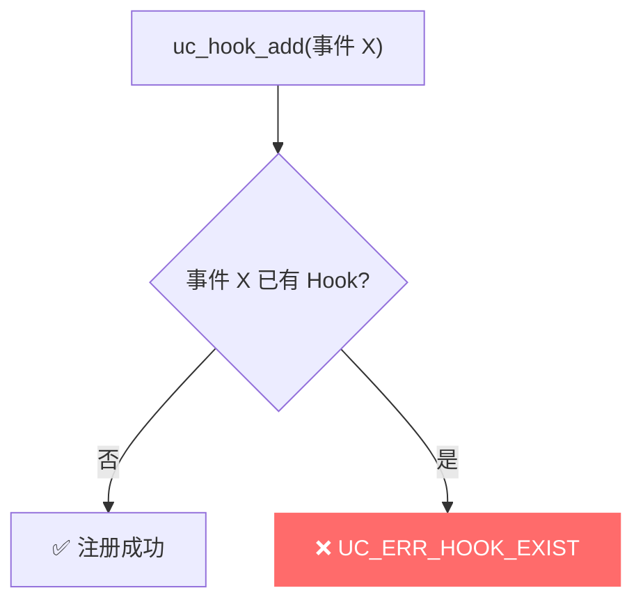
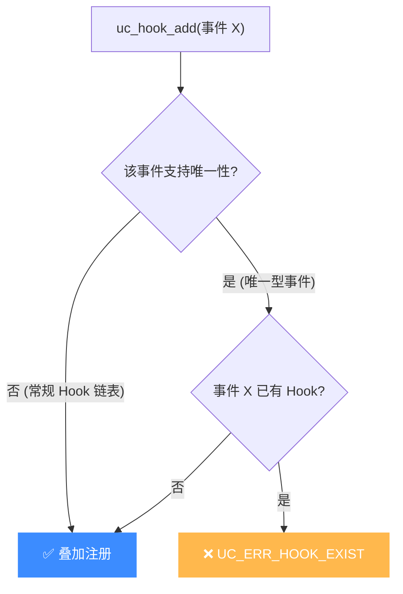

# UC_ERR_HOOK_EXIST — Hook 已存在

本页讲清 `UC_ERR_HOOK_EXIST` 的成因：为同一事件重复注册了已存在的 Hook。

## 🧠 含义

头文件注释：`hook for this event already existed`。 枚举定义见 [`unicorn.h#L192`](https://github.com/android-security-engineer/unicorn-skills/blob/master/include/unicorn/unicorn.h#L192)。表示你尝试注册的 Hook 与某个已注册项冲突——该事件已经有对应 Hook。

## 🎯 触发场景

- 对某些**唯一性**事件重复调用 `uc_hook_add`（例如某些指令级或全局唯一的 Hook 类型）。
- 循环/初始化逻辑意外多次注册同一 Hook。
- 未先 `uc_hook_del` 就重装同类 Hook。



## 🧪 复现/处理示例

```c
uc_hook h1, h2;
uc_hook_add(uc, &h1, UC_HOOK_INSN, cb, NULL, 1, 0, UC_X86_INS_SYSCALL);
// 再次为同一事件注册可能返回 UC_ERR_HOOK_EXIST
uc_err err = uc_hook_add(uc, &h2, UC_HOOK_INSN, cb, NULL, 1, 0,
                         UC_X86_INS_SYSCALL);
if (err == UC_ERR_HOOK_EXIST) {
    printf("该事件已有 Hook: %s\n", uc_strerror(err));
    // 先删除旧的再装
    uc_hook_del(uc, h1);
    uc_hook_add(uc, &h2, UC_HOOK_INSN, cb, NULL, 1, 0, UC_X86_INS_SYSCALL);
}
```

## ⚠️ 触发时机

`UC_ERR_HOOK_EXIST` 目前**只在 `unicorn.h` 枚举中定义**（[L192](https://github.com/android-security-engineer/unicorn-skills/blob/master/include/unicorn/unicorn.h#L192)），C 核心代码中尚无 `return` 点——它为「同一事件重复注册」这一类冲突预留。实际多数 `UC_HOOK_*` 允许多次注册（Hook 以链表形式叠加），故该码在当前核心版本极少触发；若你的绑定或未来版本返回它，按「重复注册」语义排查即可。



## 💻 典型场景

::: warning 常见错误
初始化函数被重复调用，同类 Hook 被多次注册：
```c
// ❌ init() 在循环里被调多次，重复装同一 Hook
void init(uc_engine *uc) {
    uc_hook_add(uc, &h, UC_HOOK_INSN, cb, NULL, 1, 0, UC_X86_INS_SYSCALL);
}
```
:::

```c
// ✅ 正确：用静态标志保证只装一次，或先 del 再 add
static bool installed = false;
if (!installed) { uc_hook_add(...); installed = true; }
```

## 🔧 排查思路

1. 确认该 Hook 类型是否本就唯一——常规 Hook（code/mem 等）支持链式叠加，不应报此错。
2. 检查初始化代码是否被重复执行（多次进入初始化函数/循环里 add）。
3. 需要替换时先 [uc_hook_del](/api/hook-del) 旧句柄，再 add 新的。
4. 保存好每个 `uc_hook` 句柄，便于精确删除而非盲清。

## 📂 相关源码

| 文件 | 角色 |
|------|------|
| [`include/unicorn/unicorn.h`](https://github.com/android-security-engineer/unicorn-skills/blob/master/include/unicorn/unicorn.h#L192) | [L192](https://github.com/android-security-engineer/unicorn-skills/blob/master/include/unicorn/unicorn.h#L192) `UC_ERR_HOOK_EXIST` 枚举定义（`uc_hook_add` 重复注册时返回） |

## 相关页面

- [错误码总览](/errors/)
- [uc_hook_add — 注册 Hook](/api/hook-add)
- [uc_hook_del — 删除 Hook](/api/hook-del)
- [UC_ERR_HOOK — 无效 Hook 类型](/errors/hook)
