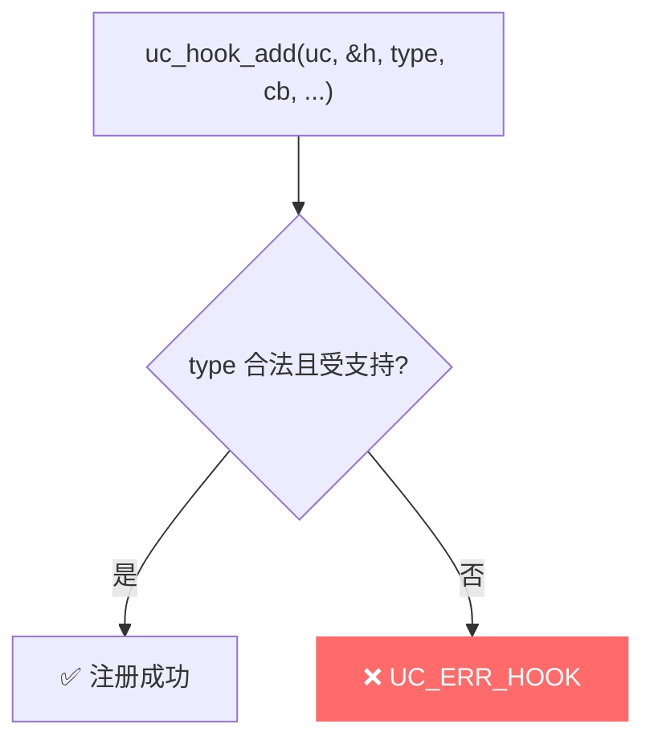
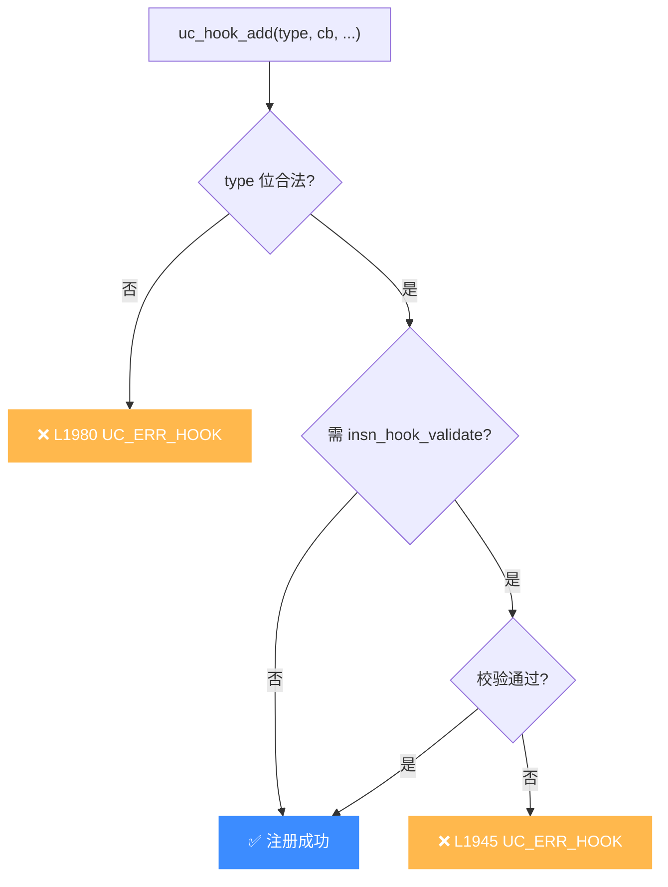

# UC_ERR_HOOK — 无效 Hook 类型

本页讲清 `UC_ERR_HOOK` 的成因：`uc_hook_add` 时传入了非法或与回调不匹配的 Hook 类型。

## 🧠 含义

头文件注释：`Invalid hook type: uc_hook_add()`。 枚举定义见 [`unicorn.h#L177`](https://github.com/android-security-engineer/unicorn-skills/blob/master/include/unicorn/unicorn.h#L177)。表示注册 Hook 时给出的 `UC_HOOK_*` 类型无效、组合非法，或与所选架构/回调不兼容。

## 🎯 触发场景

| 情形 | 说明 |
|------|------|
| 非法类型值 | 传入了非 `UC_HOOK_*` 常量或越界值 |
| 架构不支持 | 某些 Hook（如 `UC_HOOK_INSN` 特定指令）仅部分架构可用 |
| 参数错配 | `UC_HOOK_INSN` 未提供合法的指令 ID（变参） |
| 组合非法 | 用 `|` 合并了互不兼容的 Hook 位 |



## 🧪 复现/处理示例

```c
uc_hook h;
// UC_HOOK_INSN 需要通过变参指定具体指令 ID
uc_err err = uc_hook_add(uc, &h, UC_HOOK_INSN, on_syscall, NULL,
                         1, 0, UC_X86_INS_SYSCALL);
if (err == UC_ERR_HOOK)
    printf("Hook 类型无效或不受支持: %s\n", uc_strerror(err));
```

## ⚠️ 触发时机

`uc_hook_add`（`uc.c`）在两处返回 `UC_ERR_HOOK`：

- [`uc.c` L1945](https://github.com/android-security-engineer/unicorn-skills/blob/master/uc.c#L1945)：`UC_HOOK_INSN` 的 `insn_hook_validate` 校验失败——传入的指令 ID 在当前架构不合法或不受支持。
- [`uc.c` L1980](https://github.com/android-security-engineer/unicorn-skills/blob/master/uc.c#L1980)：Hook 类型位本身非法（非 `UC_HOOK_*` 常量、越界或组合冲突）。



## 💻 典型场景

::: warning 常见错误
`UC_HOOK_INSN` 漏传指令 ID 变参，或传了当前架构没有的指令码：
```c
// ❌ 在 ARM 上传 x86 专属的 UC_X86_INS_SYSCALL
uc_hook_add(uc, &h, UC_HOOK_INSN, cb, NULL, 1, 0, UC_X86_INS_SYSCALL);
```
:::

```c
// ✅ 正确：架构匹配 + 变参齐全
// x86 上钩 SYSCALL；ARM 上改钩对应指令或用 UC_HOOK_INTR
uc_hook_add(uc, &h, UC_HOOK_INSN, cb, NULL, 1, 0, UC_X86_INS_SYSCALL);
```

## 🔧 排查思路

1. 核对 `UC_HOOK_*` 常量拼写，参见 [Hook 类型总览](/hooks/)。
2. `UC_HOOK_INSN` / `UC_HOOK_TCG_OPCODE` 等需额外变参（指令 ID / 操作码），别漏传。
3. 确认该 Hook 在目标架构可用：指令级 Hook 多为 x86 专属。
4. 多 Hook 位用 `|` 合并时，确保各分支回调签名一致，否则走 L1980。

## 📂 相关源码

| 文件 | 角色 |
|------|------|
| [`uc.c`](https://github.com/android-security-engineer/unicorn-skills/blob/master/uc.c#L1945) | [L1945](https://github.com/android-security-engineer/unicorn-skills/blob/master/uc.c#L1945) `uc_hook_add` 校验 Hook 类型、[L1980](https://github.com/android-security-engineer/unicorn-skills/blob/master/uc.c#L1980) Hook 类型非法 |

## 相关页面

- [错误码总览](/errors/)
- [uc_hook_add — 注册 Hook](/api/hook-add)
- [Hook 类型总览](/hooks/)
- [UC_ERR_HOOK_EXIST — Hook 已存在](/errors/hook-exist)
