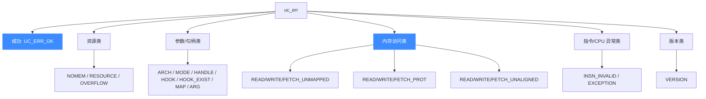

# 错误码总览 uc_err — Unicorn 全部错误码速查

本页汇总 Unicorn Engine `uc_err` 枚举的**全部取值**：每个值的含义、常见触发 API、可否被对应 Hook 拦截修复，以及 `uc_strerror` / `uc_errno` 的正确用法。读完你能看到任意 `uc_err` 返回值就立刻定位问题。

## 🧠 uc_err 是什么

几乎所有 `uc_*` 函数都返回 `uc_err`（`uc_open`、`uc_mem_map`、`uc_emu_start`……）。`UC_ERR_OK`（值为 `0`）表示成功，其余为具体错误。仿真过程中的内存/指令异常也会作为 `uc_emu_start` 的返回值报出来。 枚举完整定义见 [`unicorn.h`](https://github.com/android-security-engineer/unicorn-skills/blob/master/include/unicorn/unicorn.h#L165)。

```c
uc_err err = uc_emu_start(uc, 0x1000, 0x2000, 0, 0);
if (err != UC_ERR_OK) {
    fprintf(stderr, "emu failed: %s\n", uc_strerror(err));
}
```

## 📋 完整错误码表

| 枚举值 | 值 | 含义 | 常见触发 API | 可拦截 Hook |
|--------|----|------|--------------|-------------|
| [UC_ERR_OK](/errors/ok) [`L165`](https://github.com/android-security-engineer/unicorn-skills/blob/master/include/unicorn/unicorn.h#L165) | 0 | 成功，无错误 | 全部 | — |
| [UC_ERR_NOMEM](/errors/nomem) [`L166`](https://github.com/android-security-engineer/unicorn-skills/blob/master/include/unicorn/unicorn.h#L166) | 1 | 内存不足 | `uc_open` `uc_emu_start` | — |
| [UC_ERR_ARCH](/errors/arch) [`L167`](https://github.com/android-security-engineer/unicorn-skills/blob/master/include/unicorn/unicorn.h#L167) | 2 | 不支持的架构 | `uc_open` | — |
| [UC_ERR_HANDLE](/errors/handle) [`L168`](https://github.com/android-security-engineer/unicorn-skills/blob/master/include/unicorn/unicorn.h#L168) | 3 | 无效句柄 | 任意接收 `uc_engine*` 的函数 | — |
| [UC_ERR_MODE](/errors/mode) [`L169`](https://github.com/android-security-engineer/unicorn-skills/blob/master/include/unicorn/unicorn.h#L169) | 4 | 无效/不支持的模式 | `uc_open` | — |
| [UC_ERR_VERSION](/errors/version) [`L170`](https://github.com/android-security-engineer/unicorn-skills/blob/master/include/unicorn/unicorn.h#L170) | 5 | 版本不匹配（绑定） | 绑定层 | — |
| [UC_ERR_READ_UNMAPPED](/errors/read-unmapped) [`L171`](https://github.com/android-security-engineer/unicorn-skills/blob/master/include/unicorn/unicorn.h#L171) | 6 | 读未映射内存 | `uc_emu_start` | [mem-read-unmapped](/hooks/mem-read-unmapped) |
| [UC_ERR_WRITE_UNMAPPED](/errors/write-unmapped) [`L173`](https://github.com/android-security-engineer/unicorn-skills/blob/master/include/unicorn/unicorn.h#L173) | 7 | 写未映射内存 | `uc_emu_start` | [mem-write-unmapped](/hooks/mem-write-unmapped) |
| [UC_ERR_FETCH_UNMAPPED](/errors/fetch-unmapped) [`L175`](https://github.com/android-security-engineer/unicorn-skills/blob/master/include/unicorn/unicorn.h#L175) | 8 | 取指未映射内存 | `uc_emu_start` | [mem-fetch-unmapped](/hooks/mem-fetch-unmapped) |
| [UC_ERR_HOOK](/errors/hook) [`L177`](https://github.com/android-security-engineer/unicorn-skills/blob/master/include/unicorn/unicorn.h#L177) | 9 | 无效 Hook 类型 | `uc_hook_add` | — |
| [UC_ERR_INSN_INVALID](/errors/insn-invalid) [`L179`](https://github.com/android-security-engineer/unicorn-skills/blob/master/include/unicorn/unicorn.h#L179) | 10 | 无效指令 | `uc_emu_start` | [insn-invalid](/hooks/insn-invalid) |
| [UC_ERR_MAP](/errors/map) [`L180`](https://github.com/android-security-engineer/unicorn-skills/blob/master/include/unicorn/unicorn.h#L180) | 11 | 内存映射参数非法 | `uc_mem_map` `uc_mem_unmap` | — |
| [UC_ERR_WRITE_PROT](/errors/write-prot) [`L181`](https://github.com/android-security-engineer/unicorn-skills/blob/master/include/unicorn/unicorn.h#L181) | 12 | 写保护违规 | `uc_emu_start` | [mem-write-prot](/hooks/mem-write-prot) |
| [UC_ERR_READ_PROT](/errors/read-prot) [`L183`](https://github.com/android-security-engineer/unicorn-skills/blob/master/include/unicorn/unicorn.h#L183) | 13 | 读保护违规 | `uc_emu_start` | [mem-read-prot](/hooks/mem-read-prot) |
| [UC_ERR_FETCH_PROT](/errors/fetch-prot) [`L185`](https://github.com/android-security-engineer/unicorn-skills/blob/master/include/unicorn/unicorn.h#L185) | 14 | 取指保护违规 | `uc_emu_start` | [mem-fetch-prot](/hooks/mem-fetch-prot) |
| [UC_ERR_ARG](/errors/arg) [`L187`](https://github.com/android-security-engineer/unicorn-skills/blob/master/include/unicorn/unicorn.h#L187) | 15 | 参数非法 | 众多 `uc_*` | — |
| [UC_ERR_READ_UNALIGNED](/errors/read-unaligned) [`L189`](https://github.com/android-security-engineer/unicorn-skills/blob/master/include/unicorn/unicorn.h#L189) | 16 | 读未对齐 | `uc_emu_start` | — |
| [UC_ERR_WRITE_UNALIGNED](/errors/write-unaligned) [`L190`](https://github.com/android-security-engineer/unicorn-skills/blob/master/include/unicorn/unicorn.h#L190) | 17 | 写未对齐 | `uc_emu_start` | — |
| [UC_ERR_FETCH_UNALIGNED](/errors/fetch-unaligned) [`L191`](https://github.com/android-security-engineer/unicorn-skills/blob/master/include/unicorn/unicorn.h#L191) | 18 | 取指未对齐 | `uc_emu_start` | — |
| [UC_ERR_HOOK_EXIST](/errors/hook-exist) [`L192`](https://github.com/android-security-engineer/unicorn-skills/blob/master/include/unicorn/unicorn.h#L192) | 19 | Hook 已存在 | `uc_hook_add` | — |
| [UC_ERR_RESOURCE](/errors/resource) [`L193`](https://github.com/android-security-engineer/unicorn-skills/blob/master/include/unicorn/unicorn.h#L193) | 20 | 资源不足 | `uc_emu_start` | — |
| [UC_ERR_EXCEPTION](/errors/exception) [`L194`](https://github.com/android-security-engineer/unicorn-skills/blob/master/include/unicorn/unicorn.h#L194) | 21 | 未处理 CPU 异常 | `uc_emu_start` | [intr](/hooks/intr) |
| [UC_ERR_OVERFLOW](/errors/overflow) [`L195`](https://github.com/android-security-engineer/unicorn-skills/blob/master/include/unicorn/unicorn.h#L195) | 22 | 缓冲区太小 | `uc_reg_read2` 等 | — |

::: tip 枚举值顺序即整数值
表中「值」列按 `unicorn.h` 中枚举声明顺序从 0 递增。可以直接把 `uc_err` 当整数打印，但排查时优先用 `uc_strerror` 拿到可读字符串。
:::

## 🧩 错误分类图



- **内存访问类**是仿真中最常见的一组，且**大多可被对应 Hook 拦截修复**（补映射、改权限后继续）。
- **参数/句柄类**多是编程/配置错误，应在开发期修掉。
- **资源/版本类**较少见，多与环境相关。

## 🔧 uc_strerror：错误码转字符串

```c
const char *uc_strerror(uc_err code);
```

传入任意 `uc_err`，返回一段**静态只读**的英文描述字符串（无需释放）。适合直接打印日志。详见 [uc_strerror](/api/strerror)。

## 📌 uc_errno：取最近一次错误

```c
uc_err uc_errno(uc_engine *uc);
```

类似 glibc 的 `errno`：当某个 `uc_*` 函数失败时，可用 `uc_errno` 取回该引擎最近的错误码。注意它**可能在被读取后不再保留旧值**，所以要在失败后尽快读取。详见 [uc_errno](/api/errno)。

```c
if (uc_mem_write(uc, 0x1000, code, sizeof(code)) != UC_ERR_OK) {
    uc_err e = uc_errno(uc);
    printf("write failed: %s\n", uc_strerror(e));
}
```

::: warning 直接返回值优先
大多数 `uc_*` 函数**直接返回** `uc_err`，直接判断返回值即可，无需再调 `uc_errno`。`uc_errno` 主要用于返回值不是 `uc_err` 的场景，或跨调用回溯。
:::

## 📂 相关源码

| 文件 | 角色 |
|------|------|
| [`include/unicorn/unicorn.h`](https://github.com/android-security-engineer/unicorn-skills/blob/master/include/unicorn/unicorn.h#L165) | `uc_err` 枚举完整定义（`UC_ERR_OK` … `UC_ERR_OVERFLOW`） |
| [`uc.c`](https://github.com/android-security-engineer/unicorn-skills/blob/master/uc.c#L150) | `uc_strerror` 实现（错误码 → 描述字符串），以及多数错误码的抛出位置 |
| [`qemu/accel/tcg/cpu-exec.c`](https://github.com/android-security-engineer/unicorn-skills/blob/master/qemu/accel/tcg/cpu-exec.c#L358) | 仿真主循环设置 `invalid_error`（`UC_ERR_INSN_INVALID` / `UC_ERR_EXCEPTION`） |


## 相关页面

- [uc_strerror — 错误码转字符串](/api/strerror)
- [uc_errno — 取最近错误码](/api/errno)
- [uc_emu_start — 启动仿真](/api/emu-start)
- [Hook 体系](/features/hooks)
