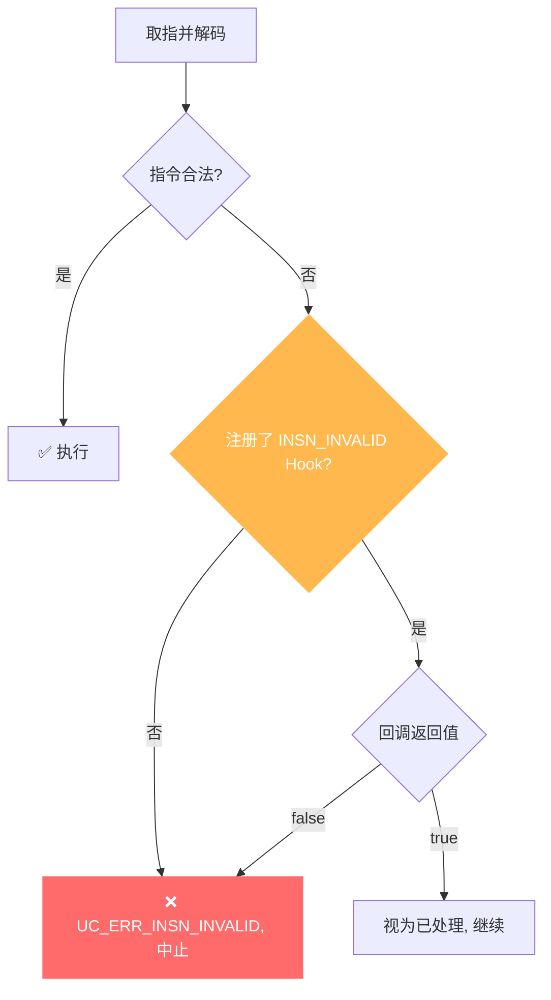

# UC_ERR_INSN_INVALID — 无效指令

本页讲清 `UC_ERR_INSN_INVALID` 的成因：CPU 解码到一条非法/未定义指令；并说明如何用 Hook 拦截处理。

## 🧠 含义

头文件注释：`Quit emulation due to invalid instruction: uc_emu_start()`。 枚举定义见 [`unicorn.h#L179`](https://github.com/android-security-engineer/unicorn-skills/blob/master/include/unicorn/unicorn.h#L179)。仿真时遇到当前架构/模式下无法解码执行的指令，引擎中止。

## 🎯 触发场景

- 起始地址或跳转目标其实不是代码（是数据、全 0 页、或未写入指令的映射页）。
- 架构/模式选错：把 Thumb 代码当 ARM 解码，或位宽不符。
- 代码损坏、自修改写坏了指令、控制流跑飞。



## 🧪 复现/处理示例

```c
uc_err err = uc_emu_start(uc, code, code_end, 0, 0);
if (err == UC_ERR_INSN_INVALID)
    printf("非法指令 @PC: %s\n", uc_strerror(err));

// Hook 处理非法指令（例如模拟未实现指令后返回 true 继续）
static bool on_invalid(uc_engine *uc, void *ud) {
    uint64_t pc;
    uc_reg_read(uc, UC_X86_REG_RIP, &pc);
    printf("invalid insn @0x%" PRIx64 "\n", pc);
    return false;     // 返回 false 让引擎照常中止
}
uc_hook h;
uc_hook_add(uc, &h, UC_HOOK_INSN_INVALID, on_invalid, NULL, 1, 0);
```

::: tip 排查建议
- 核对架构/模式：ARM vs Thumb、32 vs 64 位、端序是否正确。
- 确认 PC 指向真实指令，而非数据或未初始化页（常与 [取指未映射](/errors/fetch-unmapped) 连带出现）。
- 用 [UC_HOOK_INSN_INVALID](/hooks/insn-invalid) 拦截：回调返回 `true` 表示已处理并继续，`false` 则中止。
:::

## 📂 相关源码

| 文件 | 角色 |
|------|------|
| [`qemu/accel/tcg/cpu-exec.c`](https://github.com/android-security-engineer/unicorn-skills/blob/master/qemu/accel/tcg/cpu-exec.c#L358) | [L358](https://github.com/android-security-engineer/unicorn-skills/blob/master/qemu/accel/tcg/cpu-exec.c#L358) 解码到非法指令时设置 `invalid_error` |

## 相关页面

- [错误码总览](/errors/)
- [UC_HOOK_INSN_INVALID — 拦截非法指令](/hooks/insn-invalid)
- [UC_ERR_FETCH_UNMAPPED — 取指未映射](/errors/fetch-unmapped)
- [UC_ERR_MODE — 无效模式](/errors/mode)
