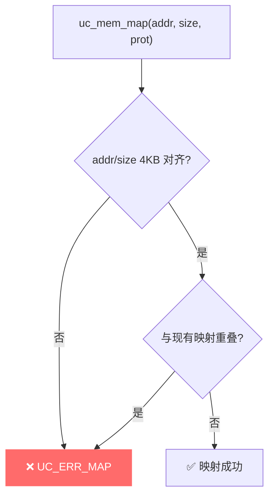

# UC_ERR_MAP — 内存映射参数非法

本页讲清 `UC_ERR_MAP` 的成因：`uc_mem_map` / `uc_mem_unmap` / `uc_mem_map_ptr` 的映射参数非法，如地址/大小未 4KB 对齐或区域重叠。

## 🧠 含义

头文件注释：`Invalid memory mapping: uc_mem_map()`。 枚举定义见 [`unicorn.h#L180`](https://github.com/android-security-engineer/unicorn-skills/blob/master/include/unicorn/unicorn.h#L180)。表示这次映射操作本身的参数不合规，或与已有映射冲突。

## 🎯 触发场景

| 情形 | 说明 |
|------|------|
| 地址未对齐 | 起始地址不是 4KB（`0x1000`）对齐 |
| 大小非法 | 大小不是 4KB 的整数倍，或为 0 |
| 区域重叠 | 与已存在的映射范围相交 |
| unmap 越界 | `uc_mem_unmap` 的范围超出已映射区 |

::: warning UC_ERR_MAP vs UC_ERR_ARG
权限位（`UC_PROT_*`）非法通常返回 [UC_ERR_ARG](/errors/arg)；而**对齐/大小/重叠**这类映射结构问题返回 `UC_ERR_MAP`。两者都指向 `uc_mem_map` 的参数错误。
:::



## 🧪 复现/处理示例

```c
// 错误：地址与大小都未 4KB 对齐
uc_err err = uc_mem_map(uc, 0x1234, 0x100, UC_PROT_ALL);
// err == UC_ERR_MAP

// 正确：对齐到 4KB
err = uc_mem_map(uc, 0x1000, 0x1000, UC_PROT_ALL);

// 错误：与上面区域重叠
err = uc_mem_map(uc, 0x1000, 0x2000, UC_PROT_ALL);
// err == UC_ERR_MAP
```

::: tip 排查建议
- 地址与大小都按 4KB 对齐：`addr & 0xfff == 0`，`size % 0x1000 == 0`。
- 映射前用 [uc_mem_regions](/api/mem-regions) 查已有映射，避免重叠。
- 需要重映射时先 `uc_mem_unmap` 再 `uc_mem_map`。
:::

## 📂 相关源码

| 文件 | 角色 |
|------|------|
| [`uc.c`](https://github.com/android-security-engineer/unicorn-skills/blob/master/uc.c#L1383) | [L1383](https://github.com/android-security-engineer/unicorn-skills/blob/master/uc.c#L1383) `uc_mem_map` 参数校验、[L3029](https://github.com/android-security-engineer/unicorn-skills/blob/master/uc.c#L3029) 映射重叠/非法 |

## 相关页面

- [错误码总览](/errors/)
- [uc_mem_map — 映射内存](/api/mem-map)
- [uc_mem_unmap — 解除映射](/api/mem-unmap)
- [uc_mem_regions — 列出映射](/api/mem-regions)
