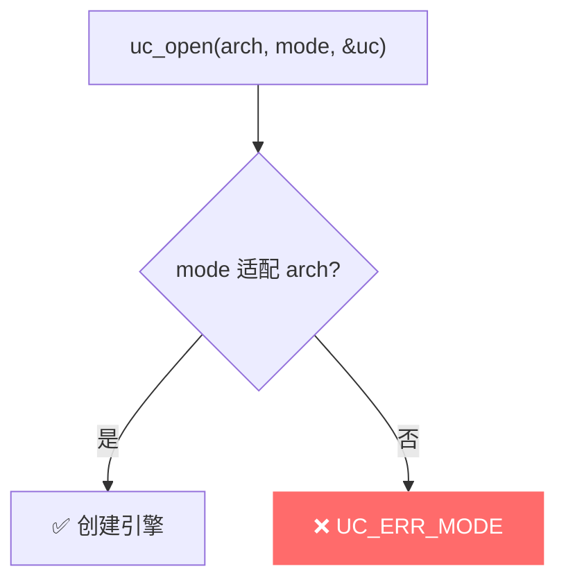
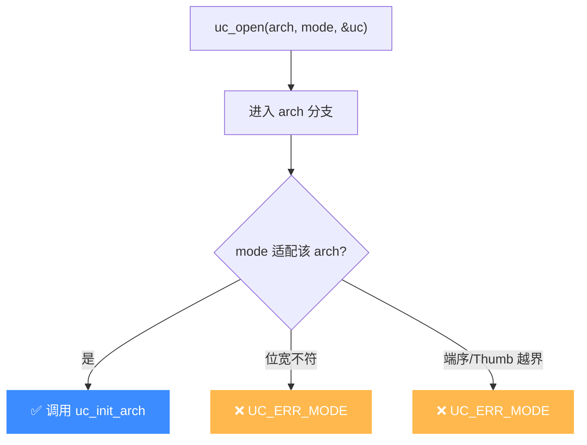

# UC_ERR_MODE — 无效/不支持的模式

本页讲清 `UC_ERR_MODE` 的成因：`uc_open` 时 `uc_mode` 与所选架构不匹配或非法。

## 🧠 含义

头文件注释：`Invalid/unsupported mode: uc_open()`。 枚举定义见 [`unicorn.h#L169`](https://github.com/android-security-engineer/unicorn-skills/blob/master/include/unicorn/unicorn.h#L169)。表示传给 `uc_open` 的模式标志与目标架构不兼容，或组合非法。

## 🎯 触发场景

模式（`uc_mode`）与架构必须**成对匹配**，常见错配：

| 架构 | 合法模式（举例） | 错配示例 |
|------|------------------|----------|
| `UC_ARCH_X86` | `UC_MODE_16` / `UC_MODE_32` / `UC_MODE_64` | 传 `UC_MODE_ARM` |
| `UC_ARCH_ARM` | `UC_MODE_ARM` / `UC_MODE_THUMB` | 传 `UC_MODE_64` |
| `UC_ARCH_ARM64` | `UC_MODE_ARM` | 传 `UC_MODE_THUMB` |
| `UC_ARCH_MIPS` | `UC_MODE_MIPS32` / `UC_MODE_MIPS64` + 端序 | 位宽/架构不符 |



## 🧪 复现/处理示例

```c
uc_engine *uc;
// 错误：ARM64 不支持 THUMB 模式
uc_err err = uc_open(UC_ARCH_ARM64, UC_MODE_THUMB, &uc);
if (err == UC_ERR_MODE) {
    printf("模式与架构不匹配: %s\n", uc_strerror(err));
}
// 正确：ARM64 用 UC_MODE_ARM
err = uc_open(UC_ARCH_ARM64, UC_MODE_ARM, &uc);
```

## ⚠️ 触发时机

`uc_open` 在各架构分支里校验 `uc_mode`，不匹配即 `return UC_ERR_MODE`。grep 显示 `uc.c` 中该返回点遍布 L343/L353/L362/L375/L387/L420/L434/L448/L456/L464/L473 等——每个架构的 `uc_init_*` 前置校验都各有一处。典型：

- [`uc.c` L343/L353/L362](https://github.com/android-security-engineer/unicorn-skills/blob/master/uc.c#L343)：x86 分支拒绝与 16/32/64 位宽不符的模式组合。
- [`uc.c` L375/L387](https://github.com/android-security-engineer/unicorn-skills/blob/master/uc.c#L375)：ARM/ARM64 分支拒绝越界模式（如 ARM64 传 `UC_MODE_THUMB`）。
- [`uc.c` L420/L434/L448](https://github.com/android-security-engineer/unicorn-skills/blob/master/uc.c#L420)：MIPS 分支校验位宽与端序。



## 💻 典型场景

::: warning 常见错误
把 `UC_MODE_*` 跨架构混用，或漏传端序：
```c
// ❌ ARM64 没有 THUMB 模式
uc_open(UC_ARCH_ARM64, UC_MODE_THUMB, &uc);
// ❌ MIPS 漏端序，位宽也不匹配
uc_open(UC_ARCH_MIPS, UC_MODE_64, &uc); // 应为 UC_MODE_MIPS64 | UC_MODE_BIG_ENDIAN
```
:::

```c
// ✅ 正确：架构与模式成对匹配
uc_open(UC_ARCH_ARM64, UC_MODE_ARM, &uc);
uc_open(UC_ARCH_MIPS, UC_MODE_MIPS32 | UC_MODE_LITTLE_ENDIAN, &uc);
```

## 🔧 排查思路

1. 对照各架构合法模式表（见上「触发场景」），确认位宽一致。
2. 端序属于模式位：MIPS/PPC/S390x 等需显式 `UC_MODE_BIG_ENDIAN`/`LITTLE_ENDIAN`。
3. ARM 的 Thumb 在**运行时**靠 PC 最低位切换，但 `uc_open` 时模式必须合法。
4. 用 `uc_open` 返回值 + `uc_strerror` 定位是哪一项不匹配。

## 📂 相关源码

| 文件 | 角色 |
|------|------|
| [`uc.c`](https://github.com/android-security-engineer/unicorn-skills/blob/master/uc.c#L343) | [L343](https://github.com/android-security-engineer/unicorn-skills/blob/master/uc.c#L343) `uc_open` 校验模式、[L353](https://github.com/android-security-engineer/unicorn-skills/blob/master/uc.c#L353) 模式不匹配、[L362](https://github.com/android-security-engineer/unicorn-skills/blob/master/uc.c#L362) 模式非法 |

## 相关页面

- [错误码总览](/errors/)
- [uc_open — 创建引擎](/api/open)
- [UC_ERR_ARCH — 不支持的架构](/errors/arch)
