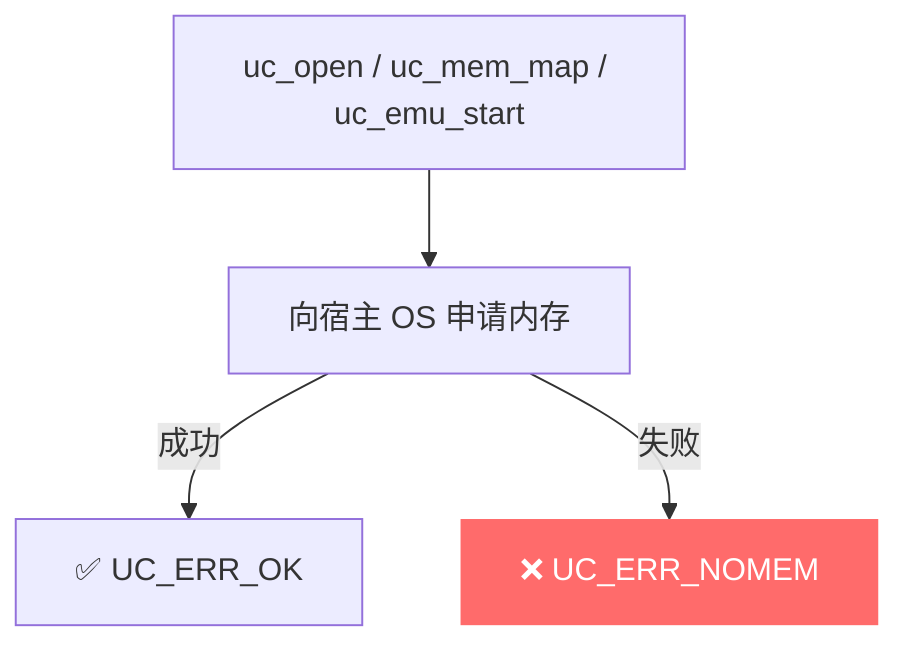
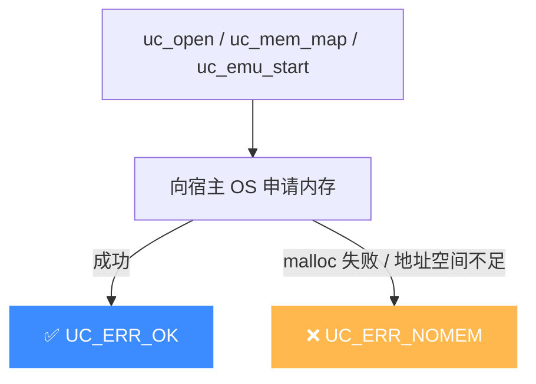

# UC_ERR_NOMEM — 内存不足

本页讲清 `UC_ERR_NOMEM`（Out-Of-Memory）的触发场景与排查思路：什么时候 Unicorn 会因申请不到内存而失败。

## 🧠 含义

头文件注释：`Out-Of-Memory error: uc_open(), uc_emulate()`。 枚举定义见 [`unicorn.h#L166`](https://github.com/android-security-engineer/unicorn-skills/blob/master/include/unicorn/unicorn.h#L166)。表示 Unicorn 在**分配宿主机内存**时失败——不是被仿真程序的内存，而是引擎自身运行所需的宿主内存。

## 🎯 触发场景

| API | 情形 |
|-----|------|
| `uc_open` | 创建引擎实例时分配失败 |
| `uc_emu_start` | 仿真过程中（如 JIT 翻译缓存、内部结构）分配失败 |
| `uc_mem_map` | 为映射区域分配宿主后备内存失败 |

常见诱因：进程已耗尽地址空间、映射了过大的内存区域、系统整体内存压力大、32 位进程地址空间不足。



## 🧪 复现/处理示例

```c
// 一次性映射超大区域，容易触发 NOMEM
uc_err err = uc_mem_map(uc, 0, (size_t)8 * 1024 * 1024 * 1024, UC_PROT_ALL);
if (err == UC_ERR_NOMEM) {
    printf("映射区域过大，宿主内存不足\n");
    // 改为按需分页：只映射真正会访问的页
}
```

## ⚠️ 触发时机

`uc.c` 中多处 `return UC_ERR_NOMEM`，典型返回点：

- [`uc_open` L318](https://github.com/android-security-engineer/unicorn-skills/blob/master/uc.c#L318)：分配 `uc_struct` 失败。
- [`uc_emu_start` L982](https://github.com/android-security-engineer/unicorn-skills/blob/master/uc.c#L982)：仿真启动阶段内部结构分配失败。
- [`uc_mem_map` L1328](https://github.com/android-security-engineer/unicorn-skills/blob/master/uc.c#L1328)/[L1336](https://github.com/android-security-engineer/unicorn-skills/blob/master/uc.c#L1336)：为映射区域分配宿主后备内存失败。
- [`uc.c` L1759/L2182/L2251/L2570](https://github.com/android-security-engineer/unicorn-skills/blob/master/uc.c#L1759)：Hook 注册、上下文保存、寄存器读写等路径的内存分配失败。

注意 `libunicorn` 默认对 `uc_mem_map` 的区域**按需落页**，但映射表项本身仍占内存；过大的区域并非立即吃满物理内存，而是一旦实际写入触发缺页才可能 OOM。



## 💻 典型场景

::: warning 常见错误
32 位宿主进程映射超大区域，地址空间被瞬间耗尽：
```c
// ❌ 32 位进程映射 8GB，地址空间只有 4GB（甚至更小）
uc_mem_map(uc, 0, (size_t)8 << 30, UC_PROT_ALL);
```
:::

```c
// ✅ 正确：按需分页——只在缺页时映射小块
uc_hook_add(uc, &h, UC_HOOK_MEM_READ_UNMAPPED, on_fault, NULL, 1, 0);
// 回调里 uc_mem_map(uc, fault_addr & ~0xFFF, 0x1000, UC_PROT_ALL)
```

## 🔧 排查思路

1. 32 位宿主进程优先改 64 位构建，地址空间是最先撞墙的资源。
2. 别一次 `uc_mem_map` 巨大区域；改用按需分页（配 [mem-read-unmapped](/hooks/mem-read-unmapped) Hook 惰性映射）。
3. 排查映射泄漏：每次仿真结束核对 `uc_mem_unmap`，避免映射累积。
4. 真机内存压力下，调小 TCG 翻译缓存或减少并发引擎实例数。

## 📂 相关源码

| 文件 | 角色 |
|------|------|
| [`uc.c`](https://github.com/android-security-engineer/unicorn-skills/blob/master/uc.c#L318) | [L318](https://github.com/android-security-engineer/unicorn-skills/blob/master/uc.c#L318) `uc_open` 分配失败、[L982](https://github.com/android-security-engineer/unicorn-skills/blob/master/uc.c#L982) `uc_emu_start` 中分配失败、[L1328](https://github.com/android-security-engineer/unicorn-skills/blob/master/uc.c#L1328) `uc_mem_map` 分配宿主内存失败 |

## 相关页面

- [错误码总览](/errors/)
- [uc_mem_map — 映射内存](/api/mem-map)
- [mem-read-unmapped Hook — 按需分页](/hooks/mem-read-unmapped)
