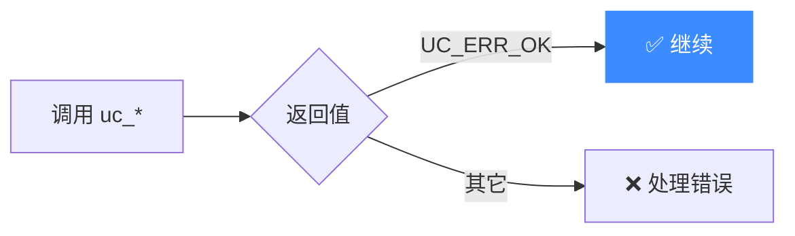
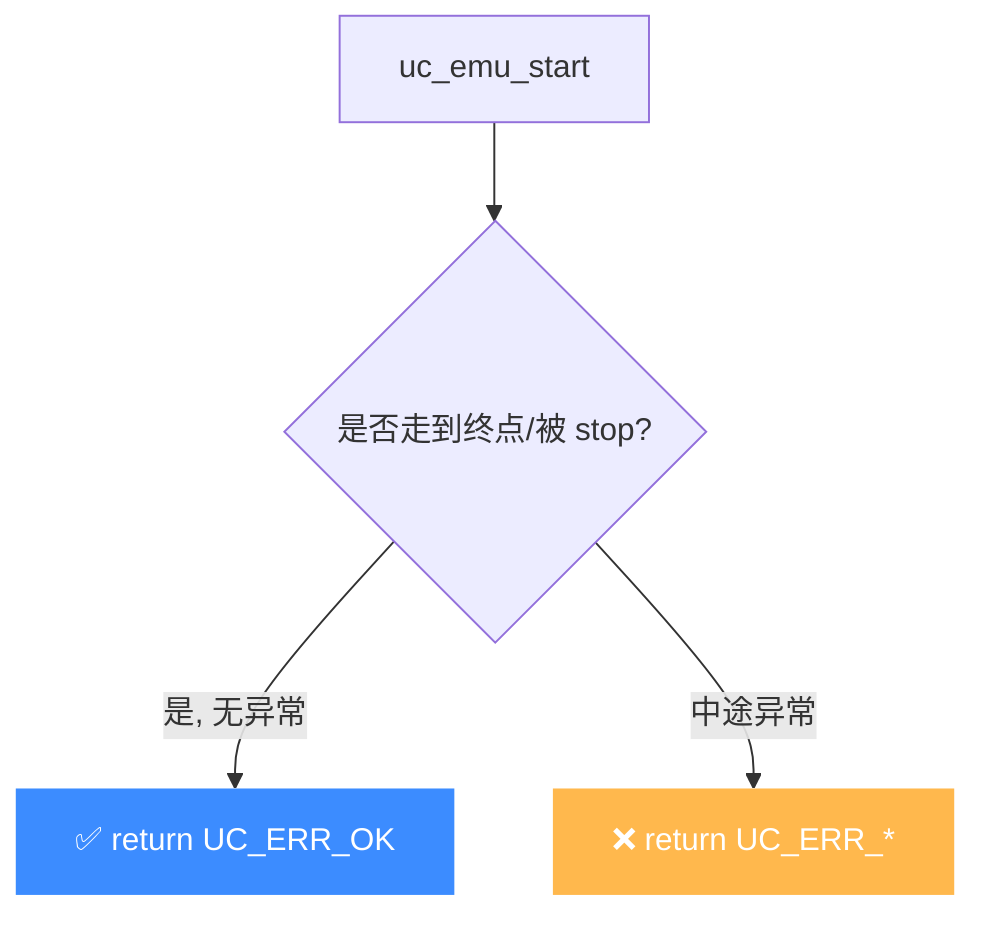

# UC_ERR_OK — 一切正常

本页讲清 `UC_ERR_OK`（值 `0`）作为成功返回值的语义，以及为什么每次 `uc_*` 调用后都应显式判断它。

## ✅ 含义

`UC_ERR_OK` 是 `uc_err` 枚举的第一个值，整数值为 `0`，表示**函数成功、无错误**。头文件注释：`No error: everything was fine`。 枚举定义见 [`unicorn.h#L165`](https://github.com/android-security-engineer/unicorn-skills/blob/master/include/unicorn/unicorn.h#L165)。

## 🎯 触发场景

任何 `uc_*` 函数正常完成时都返回它。对于 `uc_emu_start`，返回 `UC_ERR_OK` 表示仿真跑到了终止地址或被 `uc_emu_stop` 正常停止，且期间没有未处理的内存/指令异常。



## ⚠️ 触发时机

`UC_ERR_OK` 是绝大多数 `uc_*` 函数的**成功返回值**。在 `uc.c` 中，每个公开 API 在校验通过、操作完成后 `return UC_ERR_OK`（例如 [`uc_open` L490](https://github.com/android-security-engineer/unicorn-skills/blob/master/uc.c#L490) 成功创建引擎后返回它）。对 `uc_emu_start` 而言，返回 `UC_ERR_OK` 意味着仿真走到了终止地址、或被 `uc_emu_stop` 正常停止，且全程未触发未处理的内存/指令异常——**这只代表仿真层无错，不代表被仿真程序的逻辑正确**。



## 🧪 处理示例

```c
uc_engine *uc;
uc_err err = uc_open(UC_ARCH_ARM64, UC_MODE_ARM, &uc);
if (err != UC_ERR_OK) {
    printf("open failed: %s\n", uc_strerror(err));
    return 1;
}
// 后续每一步都应同样判断
err = uc_mem_map(uc, 0x1000, 0x1000, UC_PROT_ALL);
if (err != UC_ERR_OK) { /* ... */ }
```

## 💻 典型场景

```c
// ✅ 正确：逐次判 != UC_ERR_OK，兼容未来新增错误码
if (uc_emu_start(uc, BEGIN, END, 0, 0) != UC_ERR_OK) { handle(); }
```

::: warning 常见错误
只判 `== UC_ERR_OK` 才进成功分支，其余全当异常——能跑通，但语义模糊。更稳妥的做法是判 `!= UC_ERR_OK` 走错误分支，让成功路径天然覆盖未来新增码：
```c
// ❌ 只认成功，把未知的非零码也当 OK 处理
if (uc_emu_start(...) == UC_ERR_OK) { ok(); }
```
:::

## 🔧 排查思路

1. 若你「以为成功」却行为异常：先打印 `uc_strerror(err)`，确认 `err` 确实是 `0` 而非被忽略的非零码。
2. `uc_emu_start` 返回 `UC_ERR_OK` 仅表示**仿真层无异常**，不代表被仿真的程序逻辑正确——需配合 [code Hook](/hooks/code) 验证 PC 流转。
3. 若绑定时偶发拿到非 OK：检查句柄是否已 `uc_close`、映射是否齐全、起始地址是否对齐（见 [UC_ERR_FETCH_UNALIGNED](/errors/fetch-unaligned)）。

## 📂 相关源码

| 文件 | 角色 |
|------|------|
| [`include/unicorn/unicorn.h`](https://github.com/android-security-engineer/unicorn-skills/blob/master/include/unicorn/unicorn.h#L165) | [L165](https://github.com/android-security-engineer/unicorn-skills/blob/master/include/unicorn/unicorn.h#L165) `UC_ERR_OK` 枚举定义（值为 0） |
| [`uc.c`](https://github.com/android-security-engineer/unicorn-skills/blob/master/uc.c#L490) | [L490](https://github.com/android-security-engineer/unicorn-skills/blob/master/uc.c#L490) `uc_open` 成功路径返回 `UC_ERR_OK` |

## 相关页面

- [错误码总览](/errors/)
- [uc_strerror — 错误码转字符串](/api/strerror)
- [uc_emu_start — 启动仿真](/api/emu-start)
