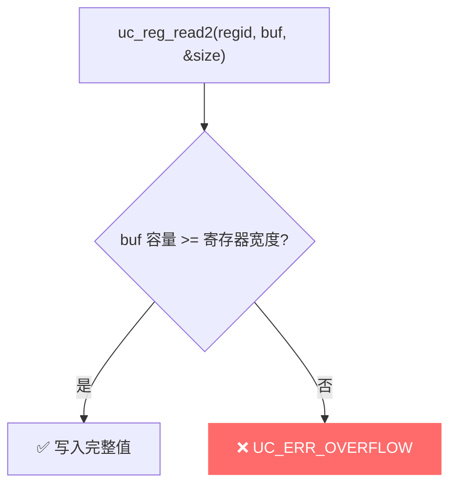

# UC_ERR_OVERFLOW — 缓冲区太小

本页讲清 `UC_ERR_OVERFLOW` 的成因：读取寄存器时提供的缓冲区不足以容纳该寄存器的完整值。

## 🧠 含义

头文件注释：`Provided buffer is not large enough: uc_reg_*2()`。 枚举定义见 [`unicorn.h#L195`](https://github.com/android-security-engineer/unicorn-skills/blob/master/include/unicorn/unicorn.h#L195)。多见于 `uc_reg_read2` / `uc_reg_write2` 这类带大小参数的接口：当你给的缓冲区/长度小于寄存器实际所需时返回此错误。

## 🎯 触发场景

- 用 [uc_reg_read2](/api/reg-read) 读取宽寄存器（如 x86 的 512 位 ZMM、ARM 的 128 位 Q 寄存器），却只给了过小的 `size`。
- 误用普通 `uint64_t` 去接一个大于 64 位的向量寄存器。
- `size` 指针传入的初值太小。

头文件中相关返回值说明：`uc_reg_read2` 在值不够大时返回 `UC_ERR_OVERFLOW`（"if value is not large enough to hold the register"）。



## 🧪 复现/处理示例

```c
// 读 128 位 NEON 寄存器，缓冲区必须够大
uint8_t q0[16];
size_t size = sizeof(q0);
uc_err err = uc_reg_read2(uc, UC_ARM64_REG_Q0, q0, &size);
if (err == UC_ERR_OVERFLOW) {
    // 缓冲区不足；size 可能提示所需大小
    printf("缓冲区太小: %s\n", uc_strerror(err));
}

// 错误示范：用 8 字节接 16 字节寄存器
uint64_t small; size_t s = sizeof(small);
err = uc_reg_read2(uc, UC_ARM64_REG_Q0, &small, &s);  // 可能 UC_ERR_OVERFLOW
```

::: tip 排查建议
- 为宽/向量寄存器（ZMM/YMM/Q/V 等）准备与其位宽相符的缓冲区。
- 使用 `uc_reg_read2` 时正确初始化 `size` 为缓冲区容量，并检查返回。
- 不确定寄存器宽度时查对应架构头文件 `include/unicorn/<arch>.h`。
:::

## 📂 相关源码

| 文件 | 角色 |
|------|------|
| [`qemu/unicorn_common.h`](https://github.com/android-security-engineer/unicorn-skills/blob/master/qemu/unicorn_common.h#L219) | [L219](https://github.com/android-security-engineer/unicorn-skills/blob/master/qemu/unicorn_common.h#L219) `uc_reg_read2/write2` 缓冲区过小返回 |

## 相关页面

- [错误码总览](/errors/)
- [uc_reg_read — 读寄存器](/api/reg-read)
- [uc_reg_write — 写寄存器](/api/reg-write)
- [UC_ERR_ARG — 参数非法](/errors/arg)
