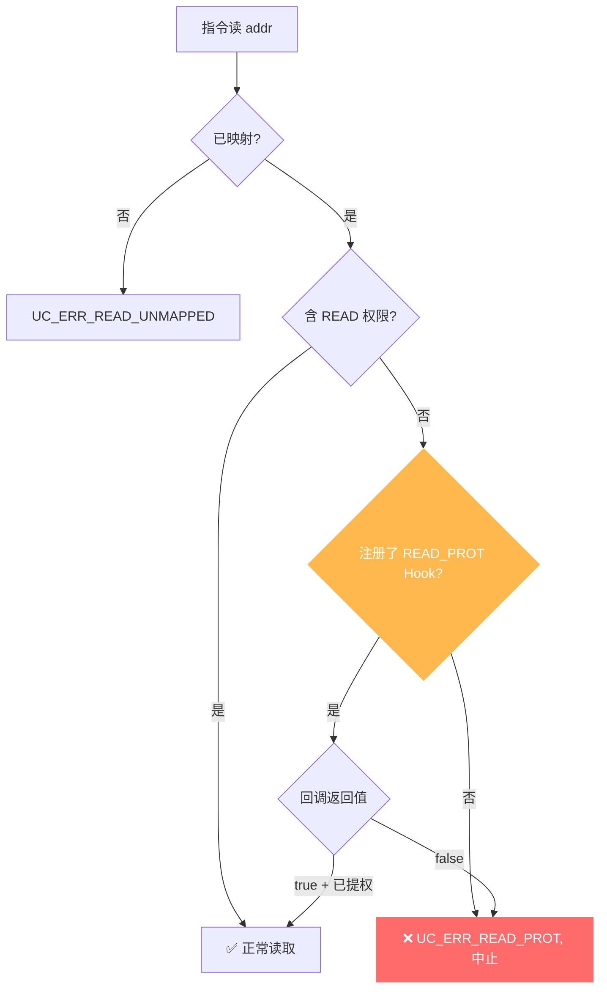

# UC_ERR_READ_PROT — 读保护违规

本页讲清 `UC_ERR_READ_PROT` 的成因：被仿真代码读取了一处**已映射但不含读权限**的内存。

## 🧠 含义

头文件注释：`Quit emulation due to UC_MEM_READ_PROT violation: uc_emu_start()`。 枚举定义见 [`unicorn.h#L183`](https://github.com/android-security-engineer/unicorn-skills/blob/master/include/unicorn/unicorn.h#L183)。目标页有映射，但权限里没有 `UC_PROT_READ`，读操作被拒绝，引擎中止。

## 🎯 触发场景

- 映射时只给了 `UC_PROT_WRITE` 或 `UC_PROT_EXEC`，却去读取。
- 用 [uc_mem_protect](/api/mem-protect) 把某页改为不可读后仍读取（如模拟 guard page）。
- 权限模型比预期更严。

::: warning 与「读未映射」的区别
`UC_ERR_READ_PROT` 是**已映射但无读权限**；[UC_ERR_READ_UNMAPPED](/errors/read-unmapped) 是**没有映射**。
:::



## 🧪 复现/处理示例

```c
uc_mem_map(uc, 0x1000, 0x1000, UC_PROT_WRITE);  // 只写不可读
// 代码读 0x1000 -> UC_ERR_READ_PROT

static bool on_rp(uc_engine *uc, uc_mem_type t, uint64_t addr,
                  int size, int64_t val, void *ud) {
    uint64_t page = addr & ~0xfffULL;
    if (uc_mem_protect(uc, page, 0x1000,
                       UC_PROT_READ | UC_PROT_WRITE) != UC_ERR_OK)
        return false;
    return true;
}
uc_hook h;
uc_hook_add(uc, &h, UC_HOOK_MEM_READ_PROT, on_rp, NULL, 1, 0);
```

::: tip 排查建议
- 检查映射时是否遗漏 `UC_PROT_READ`；数据页一般需要读权限。
- 需要读的页用 [uc_mem_protect](/api/mem-protect) 补上读权限。
- 用 [UC_HOOK_MEM_READ_PROT](/hooks/mem-read-prot) 拦截并按需提权后继续。
:::

## 📂 相关源码

| 文件 | 角色 |
|------|------|
| [`uc.c`](https://github.com/android-security-engineer/unicorn-skills/blob/master/uc.c#L801) | [L801](https://github.com/android-security-engineer/unicorn-skills/blob/master/uc.c#L801) 读保护违规返回、[L850](https://github.com/android-security-engineer/unicorn-skills/blob/master/uc.c#L850) TLB 读保护命中 |

## 相关页面

- [错误码总览](/errors/)
- [UC_HOOK_MEM_READ_PROT — 拦截修复](/hooks/mem-read-prot)
- [uc_mem_protect — 修改权限](/api/mem-protect)
- [UC_ERR_READ_UNMAPPED — 读未映射](/errors/read-unmapped)
