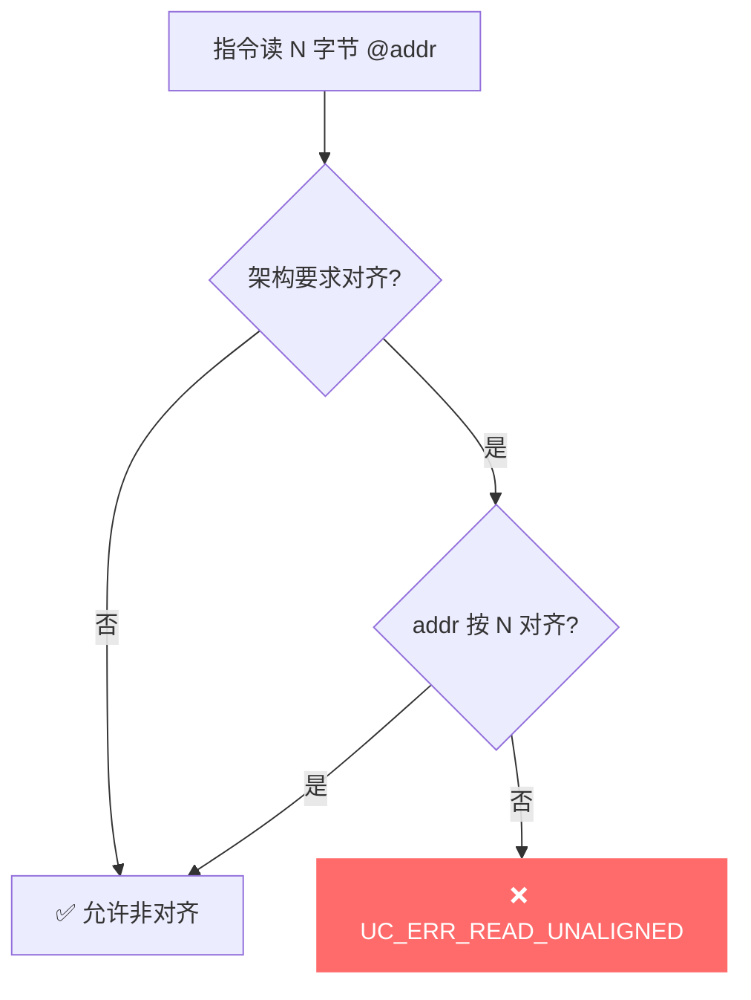
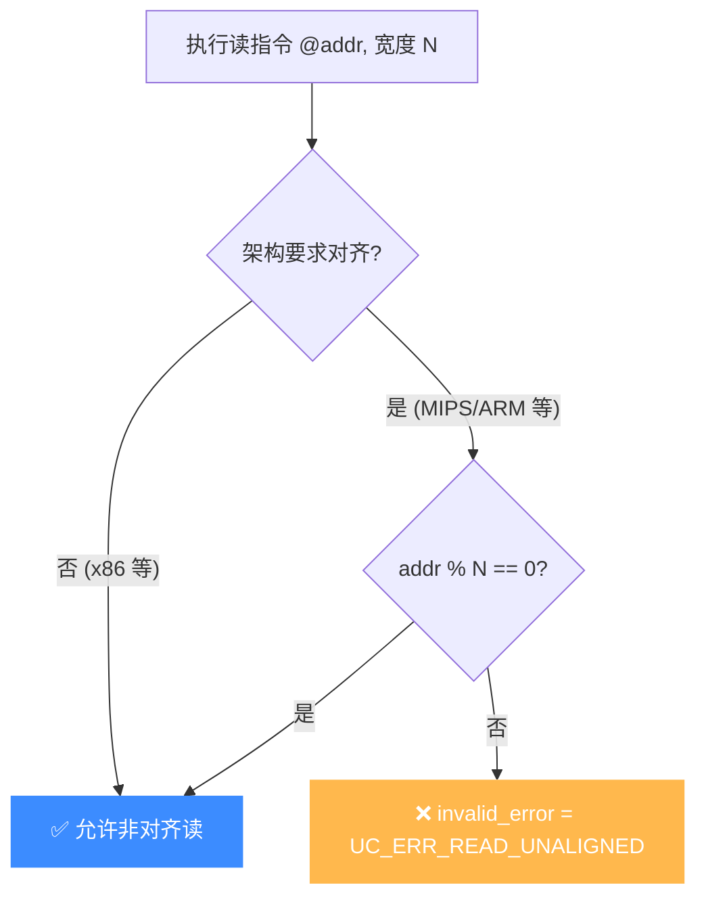

# UC_ERR_READ_UNALIGNED — 读未对齐

本页讲清 `UC_ERR_READ_UNALIGNED` 的成因：在要求对齐访问的架构上，读操作的地址未按数据宽度对齐。

## 🧠 含义

头文件注释：`Unaligned read`。 枚举定义见 [`unicorn.h#L189`](https://github.com/android-security-engineer/unicorn-skills/blob/master/include/unicorn/unicorn.h#L189)。某些架构（如部分 ARM/MIPS 配置）要求内存访问地址按数据宽度对齐；当读取地址不满足对齐要求时返回此错误。

## 🎯 触发场景

- 在**强制对齐**的架构/模式下，用未对齐地址读 2/4/8 字节。
- 例如在对齐敏感配置上从奇数地址读 4 字节整数。
- 指针运算导致对齐被破坏。

| 数据宽度 | 对齐要求（对齐架构） |
|----------|----------------------|
| 2 字节 | 地址 % 2 == 0 |
| 4 字节 | 地址 % 4 == 0 |
| 8 字节 | 地址 % 8 == 0 |



## 🧪 复现/处理示例

```c
// 在对齐敏感架构上，从未对齐地址读 4 字节
uc_err err = uc_emu_start(uc, code, code_end, 0, 0);
if (err == UC_ERR_READ_UNALIGNED)
    printf("非对齐读: %s\n", uc_strerror(err));
```

## ⚠️ 触发时机

C 核心不直接 `return UC_ERR_READ_UNALIGNED`，而由各架构访存助手在未对齐读时写入引擎的 `invalid_error`，再由仿真循环抛出。MIPS 设置点见 [`qemu/target/mips/op_helper.c` L1103](https://github.com/android-security-engineer/unicorn-skills/blob/master/qemu/target/mips/op_helper.c#L1103)：`EXCP_AdEL`（地址错—加载/取指）分支把 `invalid_error` 置为 `UC_ERR_READ_UNALIGNED`。

**各架构对齐宽松度差异**：

| 架构 | 读未对齐处理 |
|------|-------------|
| x86 (i386/x86_64) | 默认允许非对齐读，**几乎不触发**本错误 |
| MIPS | 严格；`LW`/`LH` 等要求地址按宽度对齐，否则 AdEL |
| ARM (A-profile) | 由 `SCTLR.A` 位控制；置位时 trap 未对齐访问 |
| ARMv7-M | `CCR.UNALIGN_TRP` 置位时才报，否则多数允许 |



## 💻 典型场景

::: warning 常见错误
被仿真的 MIPS 代码从奇数地址读 4 字节整数：
```c
// ❌ addr=0x1001，LW 要求 4 对齐
uint32_t v;
uc_mem_read(uc, 0x1001, &v, 4); // 若由 MIPS LW 语义触发 → 报错
```
:::

```c
// ✅ 正确：保证读地址按宽度对齐，或拆成逐字节读再装配
uint32_t v;
uc_mem_read(uc, 0x1000, &v, 4); // 4 对齐
```

## 🔧 排查思路

1. 先确认目标架构是否要求对齐（x86 基本不会报；MIPS/ARM 才需警惕）。
2. 用 [mem-read Hook](/hooks/mem-read) 打印每次读的 `address` 与 `size`，核验 `address % size != 0`。
3. 检查被仿真二进制的指针运算、`packed` 结构体是否破坏了对齐。
4. ARM 上检查 `SCTLR.A` / `CCR.UNALIGN_TRP` 是否被目标代码置位。

## 📂 相关源码

| 文件 | 角色 |
|------|------|
| [`qemu/target/mips/op_helper.c`](https://github.com/android-security-engineer/unicorn-skills/blob/master/qemu/target/mips/op_helper.c#L1103) | [L1103](https://github.com/android-security-engineer/unicorn-skills/blob/master/qemu/target/mips/op_helper.c#L1103) MIPS 未对齐读设置 `invalid_error` |

## 相关页面

- [错误码总览](/errors/)
- [UC_ERR_WRITE_UNALIGNED — 写未对齐](/errors/write-unaligned)
- [UC_ERR_FETCH_UNALIGNED — 取指未对齐](/errors/fetch-unaligned)
- [uc_emu_start — 启动仿真](/api/emu-start)
