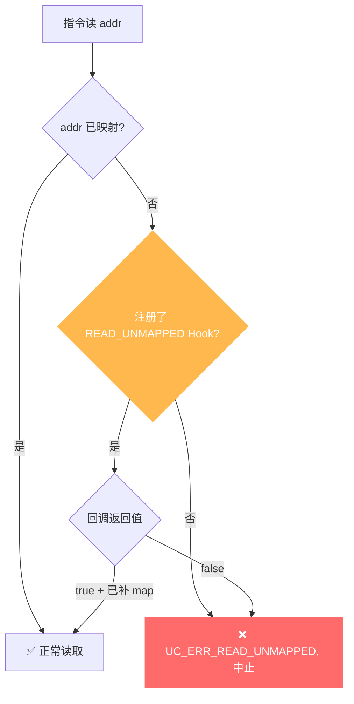

# UC_ERR_READ_UNMAPPED — 读未映射内存

本页讲清 `UC_ERR_READ_UNMAPPED` 的成因：被仿真代码读取了一处从未 `uc_mem_map` 的地址；并说明如何用 Hook 补映射后继续。

## 🧠 含义

头文件注释：`Quit emulation due to READ on unmapped memory: uc_emu_start()`。 枚举定义见 [`unicorn.h#L171`](https://github.com/android-security-engineer/unicorn-skills/blob/master/include/unicorn/unicorn.h#L171)。仿真中一条指令**读取**了没有任何内存映射的地址，引擎中止 `uc_emu_start` 并返回此错误。

## 🎯 触发场景

- 代码访问了未预先映射的数据区（如栈、堆、全局变量所在页未 map）。
- 指针计算错误，读到了越界或野地址。
- 忘了为 MMIO 区域用 [uc_mmio_map](/api/mmio-map) 建立映射。



## 🧪 复现/处理示例

```c
// 未映射数据页就读取 -> UC_ERR_READ_UNMAPPED
uc_err err = uc_emu_start(uc, code_addr, code_end, 0, 0);
if (err == UC_ERR_READ_UNMAPPED) {
    printf("读到未映射地址: %s\n", uc_strerror(err));
}

// 用 Hook 实现按需分页：读到缺页时补 map 并继续
static bool on_ru(uc_engine *uc, uc_mem_type t, uint64_t addr,
                  int size, int64_t val, void *ud) {
    uint64_t page = addr & ~0xfffULL;
    if (uc_mem_map(uc, page, 0x1000, UC_PROT_READ) != UC_ERR_OK)
        return false;         // 补映射失败 -> 仍中止
    return true;              // 已映射 -> 继续执行
}
uc_hook h;
uc_hook_add(uc, &h, UC_HOOK_MEM_READ_UNMAPPED, on_ru, NULL, 1, 0);
```

::: tip 排查建议
- 用 [UC_HOOK_MEM_READ_UNMAPPED](/hooks/mem-read-unmapped) 拦截：回调里 `uc_mem_map` 好目标页再 `return true` 即可继续。
- 若非按需分页需求，说明有 bug：在 Hook 里打印 PC、访问地址与寄存器定位越界来源。
- 确认所有数据/栈/堆区在 `uc_emu_start` 前都已映射。
:::

## 📂 相关源码

| 文件 | 角色 |
|------|------|
| [`uc.c`](https://github.com/android-security-engineer/unicorn-skills/blob/master/uc.c#L922) | [L922](https://github.com/android-security-engineer/unicorn-skills/blob/master/uc.c#L922) 读访问未映射时设置、[L947](https://github.com/android-security-engineer/unicorn-skills/blob/master/uc.c#L947) 读未映射错误返回 |

## 相关页面

- [错误码总览](/errors/)
- [UC_HOOK_MEM_READ_UNMAPPED — 拦截修复](/hooks/mem-read-unmapped)
- [uc_mem_map — 映射内存](/api/mem-map)
- [UC_ERR_WRITE_UNMAPPED](/errors/write-unmapped)
