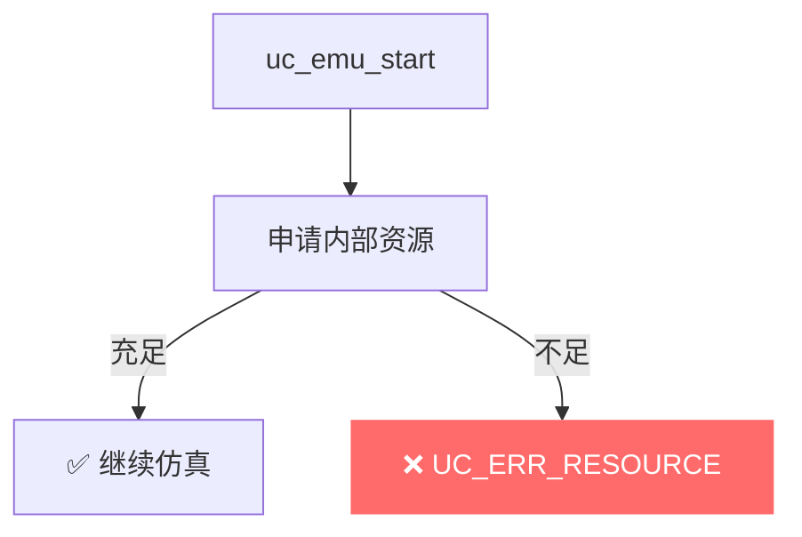
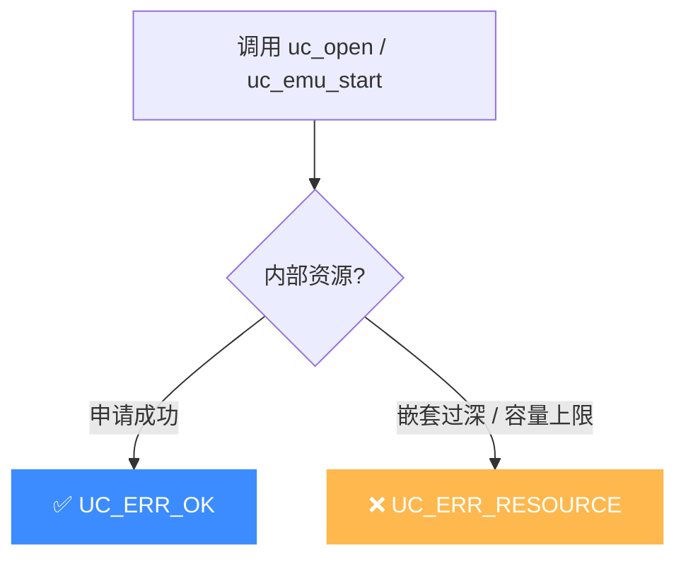

# UC_ERR_RESOURCE — 资源不足

本页讲清 `UC_ERR_RESOURCE` 的成因：仿真运行所需的某种内部资源不足。

## 🧠 含义

头文件注释：`Insufficient resource: uc_emu_start()`。 枚举定义见 [`unicorn.h#L193`](https://github.com/android-security-engineer/unicorn-skills/blob/master/include/unicorn/unicorn.h#L193)。表示引擎在仿真过程中缺少某类内部资源而无法继续——不同于纯粹的内存耗尽（[UC_ERR_NOMEM](/errors/nomem)），它指向更广义的资源限制。

## 🎯 触发场景

- 仿真中触及引擎内部结构/表项的容量上限。
- 极端负载下宿主资源（句柄、映射数量等）受限。
- 与 TCG 翻译、内部缓冲相关的资源约束。



## 🧪 处理示例

```c
uc_err err = uc_emu_start(uc, code, code_end, 0, 0);
if (err == UC_ERR_RESOURCE) {
    printf("资源不足: %s\n", uc_strerror(err));
    // 尝试减小仿真规模、分批执行，或释放不再需要的映射/上下文
}
```

## ⚠️ 触发时机

在 `uc.c` 中有两处返回 `UC_ERR_RESOURCE`：

- [`uc_open` L285](https://github.com/android-security-engineer/unicorn-skills/blob/master/uc.c#L285)：创建引擎实例时内部资源/表项申请失败。
- [`uc_emu_start` L1098](https://github.com/android-security-engineer/unicorn-skills/blob/master/uc.c#L1098)：仿真嵌套层级超限（`uc_emu_start` 不可递归套太深）。
- [`uc.c` L2993](https://github.com/android-security-engineer/unicorn-skills/blob/master/uc.c#L2993)：内部缓冲/翻译资源耗尽。

它与 [UC_ERR_NOMEM](/errors/nomem) 的差别：NOMEM 是宿主 `malloc` 失败（纯内存），RESOURCE 指向引擎**自有结构**的容量上限或递归深度限制。



## 💻 典型场景

::: warning 常见错误
在 Hook 回调里又调 `uc_emu_start`，递归层数堆积，最终撞上 L1098 的嵌套上限：
```c
// ❌ Hook 内部再启动仿真，递归过深
void hook_code(uc_engine *uc, ...) {
    uc_emu_start(uc, sub_begin, sub_end, 0, 0); // 资源耗尽
}
```
:::

```c
// ✅ 正确：拆分仿真区间，串行执行而非嵌套
for (size_t i = 0; i < n; i += STEP) {
    if (uc_emu_start(uc, base+i, base+i+STEP, 0, 0) != UC_ERR_OK) break;
}
```

## 🔧 排查思路

1. 是否在 Hook 回调里又调了 `uc_emu_start`？改成串行分段执行，避免递归。
2. 释放不再用的映射（[uc_mem_unmap](/api/mem-unmap)）与上下文（[uc_context_free](/api/context-free)）。
3. 检查宿主系统资源上限：`ulimit -n`（文件句柄）、`vm.max_map_count`（映射数）。
4. 若仍报 RESOURCE 而非 NOMEM，多半是引擎内部表项/嵌套上限，与宿主内存总量无关。

## 📂 相关源码

| 文件 | 角色 |
|------|------|
| [`uc.c`](https://github.com/android-security-engineer/unicorn-skills/blob/master/uc.c#L285) | [L285](https://github.com/android-security-engineer/unicorn-skills/blob/master/uc.c#L285) `uc_open` 资源不足、[L1098](https://github.com/android-security-engineer/unicorn-skills/blob/master/uc.c#L1098) `uc_emu_start` 嵌套层级超限、[L2993](https://github.com/android-security-engineer/unicorn-skills/blob/master/uc.c#L2993) 资源耗尽 |

## 相关页面

- [错误码总览](/errors/)
- [UC_ERR_NOMEM — 内存不足](/errors/nomem)
- [uc_emu_start — 启动仿真](/api/emu-start)
