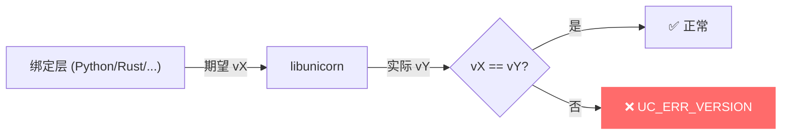
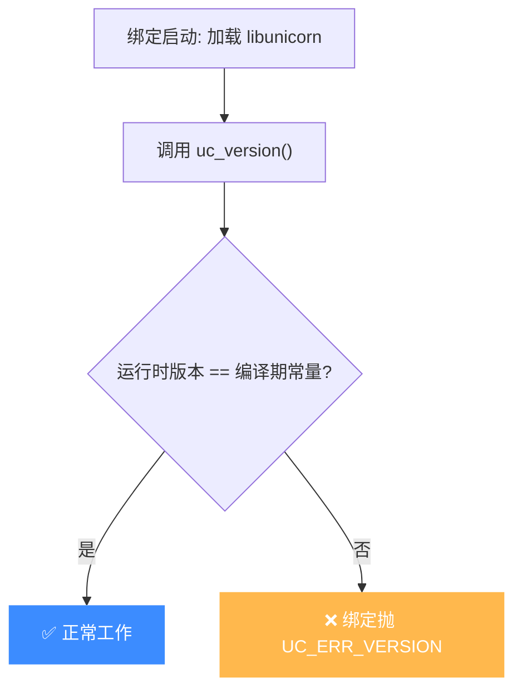

# UC_ERR_VERSION — 版本不匹配

本页讲清 `UC_ERR_VERSION` 的成因：多见于语言绑定层，绑定期望的 Unicorn 版本与实际加载的核心库不一致。

## 🧠 含义

头文件注释：`Unsupported version (bindings)`。 枚举定义见 [`unicorn.h#L170`](https://github.com/android-security-engineer/unicorn-skills/blob/master/include/unicorn/unicorn.h#L170)。表示**绑定（bindings）**所期望的 API 版本与实际链接到的 Unicorn 核心库版本不兼容。

## 🎯 触发场景

- Python / Rust / Java 等绑定编译或声明的版本，与系统里安装的 `libunicorn` 版本对不上。
- 升级了核心库但绑定未同步升级（或反之）。
- 同一进程内混用了两个不同版本的 Unicorn。



## 🧪 处理示例

```c
// C 侧可用 uc_version 读取运行时版本，与编译期常量比对
unsigned int major, minor;
uc_version(&major, &minor);
printf("runtime unicorn %u.%u\n", major, minor);
// 若与 UC_VERSION_MAJOR/MINOR 编译期常量不符，绑定层可能报 UC_ERR_VERSION
```

## ⚠️ 触发时机

`UC_ERR_VERSION` **不由 Unicorn C 核心主动 return**——在 `uc.c` 中它只出现在 `uc_strerror` 的字符串表（[uc.c#L160](https://github.com/android-security-engineer/unicorn-skills/blob/master/uc.c#L160)）。该错误由**语言绑定层**在加载 `libunicorn` 时自行检测并抛出：绑定编译期记录的 `UC_VERSION_MAJOR/MINOR` 与运行时 `uc_version()` 返回值不符，即判定为版本不兼容。



## 💻 典型场景

::: warning 常见错误
核心库升级后绑定未重装，版本号对不上：
```python
# ❌ Python 绑定期望 2.0，但系统里是旧版 1.x
import unicorn
uc = unicorn.Uc(unicorn.UC_ARCH_X86, unicorn.UC_MODE_64)  # 抛 UcError: version
```
:::

```python
# ✅ 正确：把绑定与核心库钉到同一版本
# pip install unicorn==2.x.x   (与已安装的 libunicorn 主次版本一致)
```

## 🔧 排查思路

1. 先用 `uc_version()` 打印运行时版本，再查绑定期望的 `UC_VERSION_MAJOR/MINOR`。
2. 重装/重编绑定使其与核心库版本一致（Python 用 `pip install unicorn==<核心库版本>`）。
3. 清理 `LD_LIBRARY_PATH` / 系统库目录下残留的旧版 `libunicorn.so*`，避免绑定加载到错误版本。
4. 同一进程不要混用两份 Unicorn（静态链接 + 动态加载）。

## 📂 相关源码

| 文件 | 角色 |
|------|------|
| [`include/unicorn/unicorn.h`](https://github.com/android-security-engineer/unicorn-skills/blob/master/include/unicorn/unicorn.h#L170) | [L170](https://github.com/android-security-engineer/unicorn-skills/blob/master/include/unicorn/unicorn.h#L170) `UC_ERR_VERSION` 枚举定义 |
| [`uc.c`](https://github.com/android-security-engineer/unicorn-skills/blob/master/uc.c#L160) | [L160](https://github.com/android-security-engineer/unicorn-skills/blob/master/uc.c#L160) `uc_strerror` 中 `UC_ERR_VERSION` 文案（核心不主动 return，由绑定抛出） |

## 相关页面

- [错误码总览](/errors/)
- [uc_version — 查询版本](/api/version)
