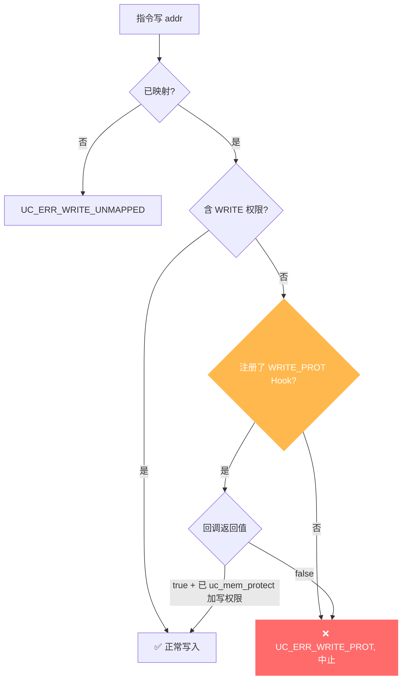

# UC_ERR_WRITE_PROT — 写保护违规

本页讲清 `UC_ERR_WRITE_PROT` 的成因：被仿真代码写入了一处**已映射但不含写权限**的内存；并说明如何用 Hook 处理。

## 🧠 含义

头文件注释：`Quit emulation due to UC_MEM_WRITE_PROT violation: uc_emu_start()`。 枚举定义见 [`unicorn.h#L181`](https://github.com/android-security-engineer/unicorn-skills/blob/master/include/unicorn/unicorn.h#L181)。目标页存在映射，但其权限里没有 `UC_PROT_WRITE`，写操作被拒绝，引擎中止。

## 🎯 触发场景

- 向只读数据段（`UC_PROT_READ`）或只读只执行代码段写入。
- 自修改代码但代码页未给写权限。
- 权限设置比预期更严（漏了 `UC_PROT_WRITE`）。

::: warning 与「写未映射」的区别
`UC_ERR_WRITE_PROT` 是**已映射但无写权限**；[UC_ERR_WRITE_UNMAPPED](/errors/write-unmapped) 是**根本没有映射**。两者对应不同的 Hook。
:::



## 🧪 复现/处理示例

```c
uc_mem_map(uc, 0x1000, 0x1000, UC_PROT_READ);   // 只读
// 代码写 0x1000 -> UC_ERR_WRITE_PROT

// Hook 里提权后继续
static bool on_wp(uc_engine *uc, uc_mem_type t, uint64_t addr,
                  int size, int64_t val, void *ud) {
    uint64_t page = addr & ~0xfffULL;
    if (uc_mem_protect(uc, page, 0x1000,
                       UC_PROT_READ | UC_PROT_WRITE) != UC_ERR_OK)
        return false;
    return true;               // 已加写权限 -> 继续
}
uc_hook h;
uc_hook_add(uc, &h, UC_HOOK_MEM_WRITE_PROT, on_wp, NULL, 1, 0);
```

::: tip 排查建议
- 用 [uc_mem_protect](/api/mem-protect) 为需要写的页加 `UC_PROT_WRITE`。
- 自修改代码通常需要 `UC_PROT_ALL`（读写执行）。
- 用 [UC_HOOK_MEM_WRITE_PROT](/hooks/mem-write-prot) 拦截并按需提权后继续。
:::

## 📂 相关源码

| 文件 | 角色 |
|------|------|
| [`uc.c`](https://github.com/android-security-engineer/unicorn-skills/blob/master/uc.c#L803) | [L803](https://github.com/android-security-engineer/unicorn-skills/blob/master/uc.c#L803) 写保护违规返回、[L897](https://github.com/android-security-engineer/unicorn-skills/blob/master/uc.c#L897) TLB 写保护命中、[L901](https://github.com/android-security-engineer/unicorn-skills/blob/master/uc.c#L901) 写保护错误返回 |

## 相关页面

- [错误码总览](/errors/)
- [UC_HOOK_MEM_WRITE_PROT — 拦截修复](/hooks/mem-write-prot)
- [uc_mem_protect — 修改权限](/api/mem-protect)
- [UC_ERR_WRITE_UNMAPPED — 写未映射](/errors/write-unmapped)
