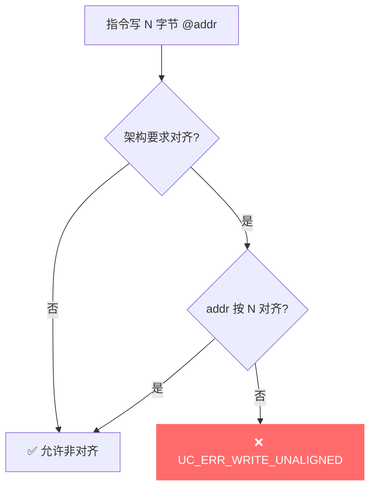
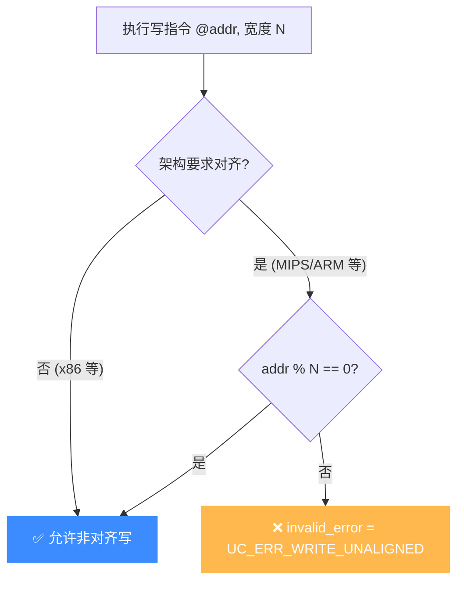

# UC_ERR_WRITE_UNALIGNED — 写未对齐

本页讲清 `UC_ERR_WRITE_UNALIGNED` 的成因：在要求对齐访问的架构上，写操作的地址未按数据宽度对齐。

## 🧠 含义

头文件注释：`Unaligned write`。 枚举定义见 [`unicorn.h#L190`](https://github.com/android-security-engineer/unicorn-skills/blob/master/include/unicorn/unicorn.h#L190)。在对齐敏感的架构/模式下，写入地址不满足数据宽度对齐要求时返回此错误。

## 🎯 触发场景

- 在**强制对齐**的架构上用未对齐地址写 2/4/8 字节。
- 结构体成员因打包（packed）落在未对齐偏移后被整字写入。
- 指针错位导致存储地址失去对齐。



## 🧪 复现/处理示例

```c
uc_err err = uc_emu_start(uc, code, code_end, 0, 0);
if (err == UC_ERR_WRITE_UNALIGNED)
    printf("非对齐写: %s\n", uc_strerror(err));
```

## ⚠️ 触发时机

Unicorn C 核心不直接 `return UC_ERR_WRITE_UNALIGNED`——它由各架构的访存助手在检测到未对齐写时，写入引擎的 `invalid_error` 字段，再由仿真循环抛出。MIPS 设置点见 [`qemu/target/mips/op_helper.c` L1106](https://github.com/android-security-engineer/unicorn-skills/blob/master/qemu/target/mips/op_helper.c#L1106)：`EXCP_AdES`（地址错—存储）分支把 `invalid_error` 置为 `UC_ERR_WRITE_UNALIGNED`。

**各架构对齐宽松度差异**：

| 架构 | 写未对齐处理 |
|------|-------------|
| x86 (i386/x86_64) | 默认允许非对齐写，**不会**触发本错误 |
| MIPS | 严格；`SW`/`SH` 等带对齐要求的指令未对齐即报错 |
| ARM (A-profile) | 视 `SCTLR.A` 位与指令而定，多数 Load/Store 要求对齐 |
| ARMv7-M | `CCR.UNALIGN_TRP` 置位时 trap 未对齐访问 |



## 💻 典型场景

::: warning 常见错误
被仿真的 MIPS 代码用 `packed` 结构体，整字成员落在奇数偏移，`SW` 写入触发对齐异常：
```c
// ❌ packed 结构 + 4 字节写，地址未 4 对齐
struct __attribute__((packed)) P { uint8_t a; uint32_t b; } p;
uc_mem_write(uc, addr_of_b, &val, 4); // 被 MIPS SW 语义判定未对齐
```
:::

```c
// ✅ 正确：在被仿真代码侧保证成员自然对齐，或改用逐字节写再由 CPU 装配
uc_mem_write(uc, aligned_addr, &val, 4);
```

## 🔧 排查思路

1. 先确认目标架构是否本就要求对齐（x86 几乎不会报此错；MIPS/ARM 才需警惕）。
2. 用 [mem-write Hook](/hooks/mem-write) 打印每次写的 `address` 与 `size`，验证 `address % size != 0`。
3. 检查被仿真二进制的结构体是否 `packed`、指针运算是否破坏了对齐。
4. 若业务允许，把整字写拆成多次 1 字节写，绕开硬件对齐要求。

## 📂 相关源码

| 文件 | 角色 |
|------|------|
| [`qemu/target/mips/op_helper.c`](https://github.com/android-security-engineer/unicorn-skills/blob/master/qemu/target/mips/op_helper.c#L1106) | [L1106](https://github.com/android-security-engineer/unicorn-skills/blob/master/qemu/target/mips/op_helper.c#L1106) MIPS 未对齐写设置 `invalid_error` |

## 相关页面

- [错误码总览](/errors/)
- [UC_ERR_READ_UNALIGNED — 读未对齐](/errors/read-unaligned)
- [UC_ERR_FETCH_UNALIGNED — 取指未对齐](/errors/fetch-unaligned)
- [uc_emu_start — 启动仿真](/api/emu-start)
