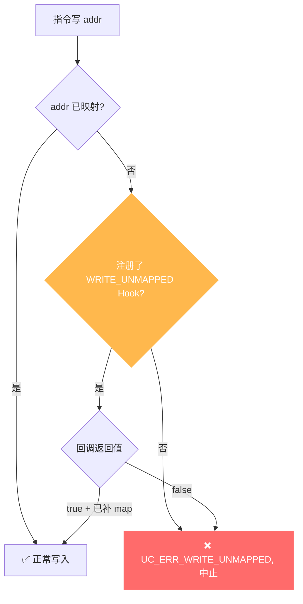

# UC_ERR_WRITE_UNMAPPED — 写未映射内存

本页讲清 `UC_ERR_WRITE_UNMAPPED` 的成因：被仿真代码写入了一处从未 `uc_mem_map` 的地址；并说明如何用 Hook 补映射后继续。

## 🧠 含义

头文件注释：`Quit emulation due to WRITE on unmapped memory: uc_emu_start()`。 枚举定义见 [`unicorn.h#L173`](https://github.com/android-security-engineer/unicorn-skills/blob/master/include/unicorn/unicorn.h#L173)。仿真中一条指令**写入**了没有任何映射的地址，引擎中止并返回此错误。

## 🎯 触发场景

- 栈还没映射就 `push`/写栈；或栈溢出到未映射页。
- 写入未 map 的全局/堆区。
- 指针错误导致写到野地址。



## 🧪 复现/处理示例

```c
// 常见：忘了映射栈
uc_err err = uc_emu_start(uc, code, code_end, 0, 0);
if (err == UC_ERR_WRITE_UNMAPPED)
    printf("写到未映射地址: %s\n", uc_strerror(err));

// Hook 补映射后继续
static bool on_wu(uc_engine *uc, uc_mem_type t, uint64_t addr,
                  int size, int64_t val, void *ud) {
    uint64_t page = addr & ~0xfffULL;
    if (uc_mem_map(uc, page, 0x1000, UC_PROT_READ | UC_PROT_WRITE) != UC_ERR_OK)
        return false;
    return true;              // 已映射为可写 -> 继续，写入随后完成
}
uc_hook h;
uc_hook_add(uc, &h, UC_HOOK_MEM_WRITE_UNMAPPED, on_wu, NULL, 1, 0);
```

::: warning 补映射须带写权限
写场景补映射时权限必须包含 `UC_PROT_WRITE`，否则映射成功但写仍会触发 [UC_ERR_WRITE_PROT](/errors/write-prot)。
:::

::: tip 排查建议
- 用 [UC_HOOK_MEM_WRITE_UNMAPPED](/hooks/mem-write-unmapped) 拦截并按需分页。
- 检查栈是否在 `uc_emu_start` 前映射并把 SP 指向栈中。
- 非预期写地址往往是 bug，Hook 里打印上下文定位来源。
:::

## 📂 相关源码

| 文件 | 角色 |
|------|------|
| [`uc.c`](https://github.com/android-security-engineer/unicorn-skills/blob/master/uc.c#L962) | [L962](https://github.com/android-security-engineer/unicorn-skills/blob/master/uc.c#L962) 写访问未映射时设置、[L1008](https://github.com/android-security-engineer/unicorn-skills/blob/master/uc.c#L1008) 写未映射错误返回 |

## 相关页面

- [错误码总览](/errors/)
- [UC_HOOK_MEM_WRITE_UNMAPPED — 拦截修复](/hooks/mem-write-unmapped)
- [UC_ERR_WRITE_PROT — 写保护违规](/errors/write-prot)
- [uc_mem_map — 映射内存](/api/mem-map)
