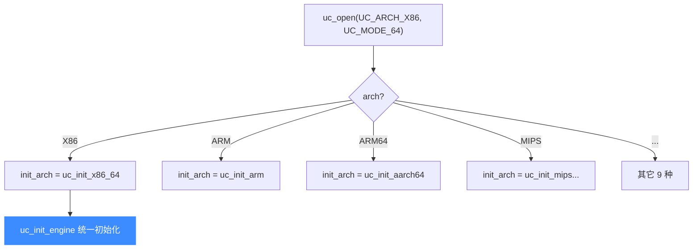
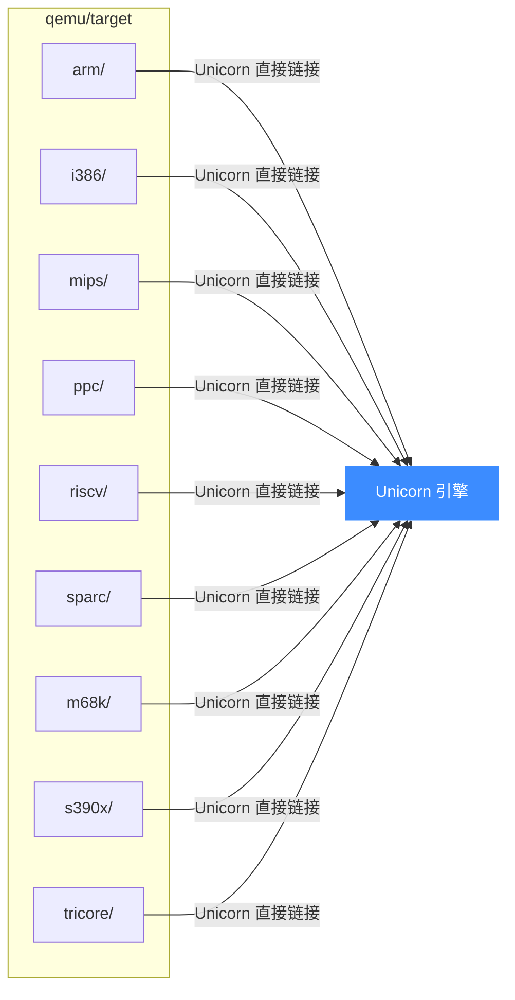
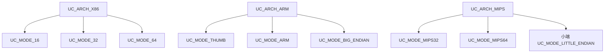
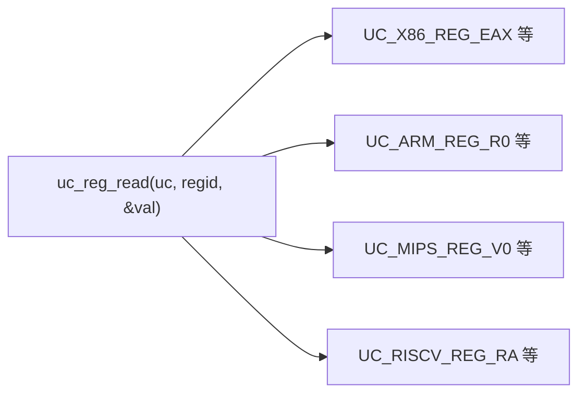

# 多架构支持

Unicorn 最显著的能力是"一套 API 仿真十种 CPU"。本页讲清楚它支持哪些架构、切换架构时内部发生了什么、以及为什么能这么"省事"。

## 支持的架构一览

| 架构枚举 | 名称 | 模式示例 |
|---------|------|---------|
| `UC_ARCH_ARM` | ARM（含 Thumb/Thumb-2） | `UC_MODE_ARM` / `UC_MODE_THUMB` / 大小端 |
| `UC_ARCH_ARM64` | AArch64 | `UC_MODE_ARM` / 大端 |
| `UC_ARCH_MIPS` | MIPS | `UC_MODE_MIPS32` / `MIPS64` / 大小端 |
| `UC_ARCH_X86` | X86（16/32/64 位） | `UC_MODE_16` / `32` / `64` |
| `UC_ARCH_PPC` | PowerPC | `UC_MODE_PPC32` / `PPC64` / 大端 |
| `UC_ARCH_SPARC` | SPARC | `UC_MODE_SPARC32` / `SPARC64` |
| `UC_ARCH_M68K` | Motorola 68K | 大端 |
| `UC_ARCH_RISCV` | RISC-V | `UC_MODE_RISCV32` / `RISCV64` |
| `UC_ARCH_S390X` | s390x（IBM Z） | 大端 |
| `UC_ARCH_TRICORE` | TriCore（英飞凌） | `UC_MODE_TRICORE_*` |

## 切换架构 = 切换前端

`uc_open(arch, mode, &uc)` 的本质是：根据 `arch`，把引擎内部的 `init_arch` 函数指针指向**对应架构的初始化函数**。

每种 `uc_init_<arch>` 会注册该架构的：

- **寄存器读写函数**（`reg_read` / `reg_write`）
- **指令翻译前端**（target-specific translator）
- **寄存器枚举表**（如 `UC_X86_REG_*`、`UC_ARM_REG_*`）

之后所有架构相关操作，都通过这些函数指针分发——这就是"统一 API 通吃多架构"的实现根基。

## 为什么能省事：复用 QEMU 前端

Unicorn 不自己实现指令解码器，而是**直接复用 QEMU 的 [qemu/target/&lt;arch&gt;/](https://github.com/android-security-engineer/unicorn-skills/blob/master/qemu/target) 目录**：

QEMU 社区多年积累的、经过真实硬件验证的指令解码逻辑，Unicorn 一字不改地拿来用。这是它能"快速、准确"支持这么多架构的根本原因——也是为何有些很新的指令集它暂时不支持（受限于所 fork 的 QEMU 版本，详见 [FAQ](../guide/faq.md)）。

## 编译期裁剪：按需减小体积

并非所有场景都需要全部 10 种架构。Unicorn 通过 CMake 开关 `UNICORN_ARCH_*` 允许你在编译期裁剪：

被关闭的架构在 `uc_open` 时会走到 `default: break`，`init_arch` 不被设置，从而 `uc_init_engine` 返回 `UC_ERR_ARCH`。这样既省体积，又能在运行时给出明确错误。

## 模式（mode）：同一架构的变体

`mode` 参数处理同一架构下的位宽、大小端、指令集变体：

::: tip ARM Thumb 起始地址
仿真 Thumb 指令时，`uc_emu_start` 的 `begin` 地址须为**奇数**（最低位 1 表示 Thumb 模式），否则会按 ARM 解码导致 "Invalid Instruction"。这是 ARM 架构本身的约定。
:::

## 统一的寄存器抽象

不同架构寄存器千差万别，Unicorn 用**每架构一套枚举 + 统一读写函数**抹平差异：

`regid` 是个 `int`，其值在各架构头文件中定义。这种"枚举 + 统一接口"的设计让上层绑定（Python/Rust/...）可以写出与架构无关的通用代码。

## 设计权衡

| 优点 | 代价 |
|------|------|
| 复用 QEMU，支持广、解码准 | 受 fork 的 QEMU 版本限制，新指令滞后 |
| 统一 API，学习成本低 | 部分架构特性需手动配置（CSR/VFP 等） |
| 编译期可裁剪体积 | 不能在运行时动态增删架构支持 |

## 📂 相关源码

| 文件 | 角色 |
|------|------|
| [`include/unicorn/unicorn.h`](https://github.com/android-security-engineer/unicorn-skills/blob/master/include/unicorn/unicorn.h#L735) | `uc_open` / `uc_close` 声明、`UC_ARCH_*` 枚举 |
| [`uc.c`](https://github.com/android-security-engineer/unicorn-skills/blob/master/uc.c#L310) | `uc_open` 按 `arch` 设置 `init_arch` 函数指针 |
| [`include/uc_priv.h`](https://github.com/android-security-engineer/unicorn-skills/blob/master/include/uc_priv.h) | `uc_struct` 与各架构 `uc_init_<arch>` 函数指针 |
| [`qemu/target/`](https://github.com/android-security-engineer/unicorn-skills/blob/master/qemu/target) | 各架构 QEMU 前端（arm/i386/mips/ppc/riscv/sparc/m68k/s390x/tricore） |
| [`CMakeLists.txt`](https://github.com/android-security-engineer/unicorn-skills/blob/master/CMakeLists.txt) | `UNICORN_ARCH` 编译期架构裁剪 |

---

下一节：[JIT 编译（TCG）](./jit.md)——性能从何而来。
