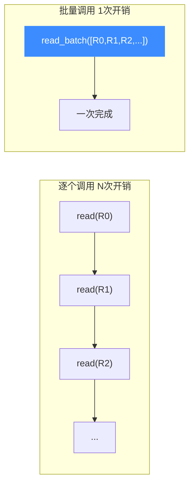
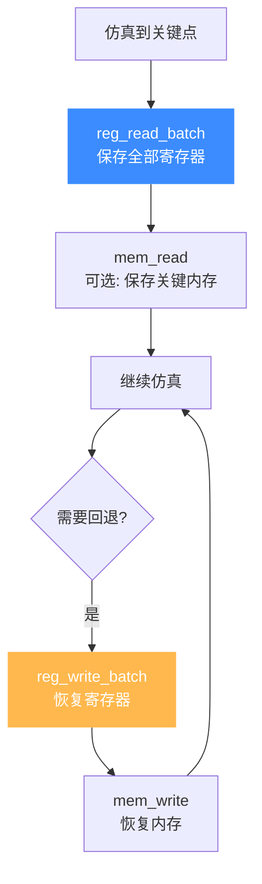
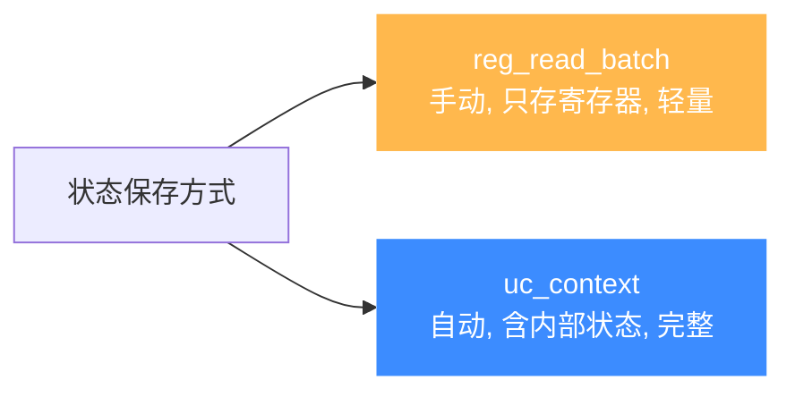
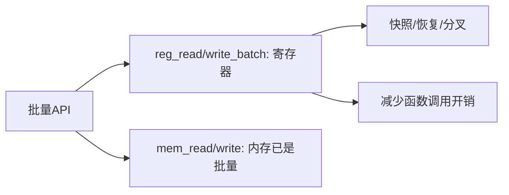

# 批量 API

当需要一次性读写大量寄存器或大块内存时，逐个调用 API 会有不可忽视的函数调用开销。Unicorn 提供批量 API，把多次操作合并为一次。

## 逐个 vs 批量



每次 `uc_reg_read` 都要：参数校验 → 查寄存器表 → 调架构后端 → 写回。批量 API 把这些固定开销摊到 N 个寄存器上，N 越大收益越明显。

## 寄存器批量 API

```c
// 批量读
uc_err uc_reg_read_batch(uc_engine *uc, int const *regs,
                         void **vals, int count);

// 批量写
uc_err uc_reg_write_batch(uc_engine *uc, int const *regs,
                          void *const *vals, int count);

// 带显式宽度的版本 (应对不同位宽寄存器)
uc_err uc_reg_read_batch2(uc_engine *uc, int const *regs,
                          void *const *vals, size_t *sizes, int count);
uc_err uc_reg_write_batch2(uc_engine *uc, int const *regs,
                           void *const *vals, size_t const *sizes, int count);
```

### 用法示例

```c
int regs[] = {UC_X86_REG_EAX, UC_X86_REG_EBX, UC_X86_REG_ECX, UC_X86_REG_EDX};
uint32_t vals[4];
void *ptrs[4] = {&vals[0], &vals[1], &vals[2], &vals[3]};

// 一次读出 4 个寄存器
uc_reg_read_batch(uc, regs, ptrs, 4);
```

::: tip 指针数组
`vals` 是**指针数组**——每个元素指向一个存放该寄存器值的变量。这是因为不同寄存器宽度不同，不能简单用统一类型数组。
:::

## 典型场景：上下文快照与恢复

批量 API 最大的价值是**保存/恢复完整 CPU 状态**，实现快照、分叉、回滚：



这是**模糊测试、符号执行、状态空间搜索**等场景的核心原语——从一个快照分叉出多条执行路径，而不必重新初始化整个引擎。

## 内存批量操作

内存本身已是批量语义（`uc_mem_read/write` 一次处理 `size` 字节）。但若要操作**多块不连续**内存，可在循环中调用，或用 `uc_mem_map_ptr` 共享宿主缓冲区避免拷贝。

## 性能取舍

| 操作 | 何时用批量 |
|------|-----------|
| 读 1-2 个寄存器 | 直接 `uc_reg_read` 即可，批量无收益 |
| 读全部通用寄存器 | 用批量，显著省时 |
| 高频快照（每条指令存状态） | 必须用批量 + 仅存必要寄存器 |
| 大块内存拷贝 | `uc_mem_read/write` 已是批量 |

::: warning 别过度优化
批量 API 在 N 较小时收益有限，反而增加代码复杂度。建议在 profiling 显示寄存器读写是热点时再用。
:::

## 与上下文控制的配合

批量寄存器读写是手动版的"上下文保存"。Unicorn 还提供更高层的 `uc_context` 机制，能保存包括内部 JIT 状态在内的完整上下文——详见 [上下文控制](./context.md)。



## 总结



## 📂 相关源码

| 文件 | 角色 |
|------|------|
| [`include/unicorn/unicorn.h`](https://github.com/android-security-engineer/unicorn-skills/blob/master/include/unicorn/unicorn.h#L866) | `uc_reg_read_batch` / `uc_reg_write_batch` / `*_batch2` 声明 |
| [`uc.c`](https://github.com/android-security-engineer/unicorn-skills/blob/master/uc.c#L578) | 批量寄存器读写实现 |
| [`uc.c`](https://github.com/android-security-engineer/unicorn-skills/blob/master/uc.c#L950) | `uc_mem_read` 批量内存读取 |

---

下一节：[上下文控制](./context.md)。
