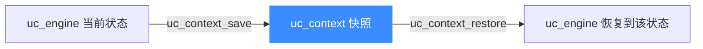
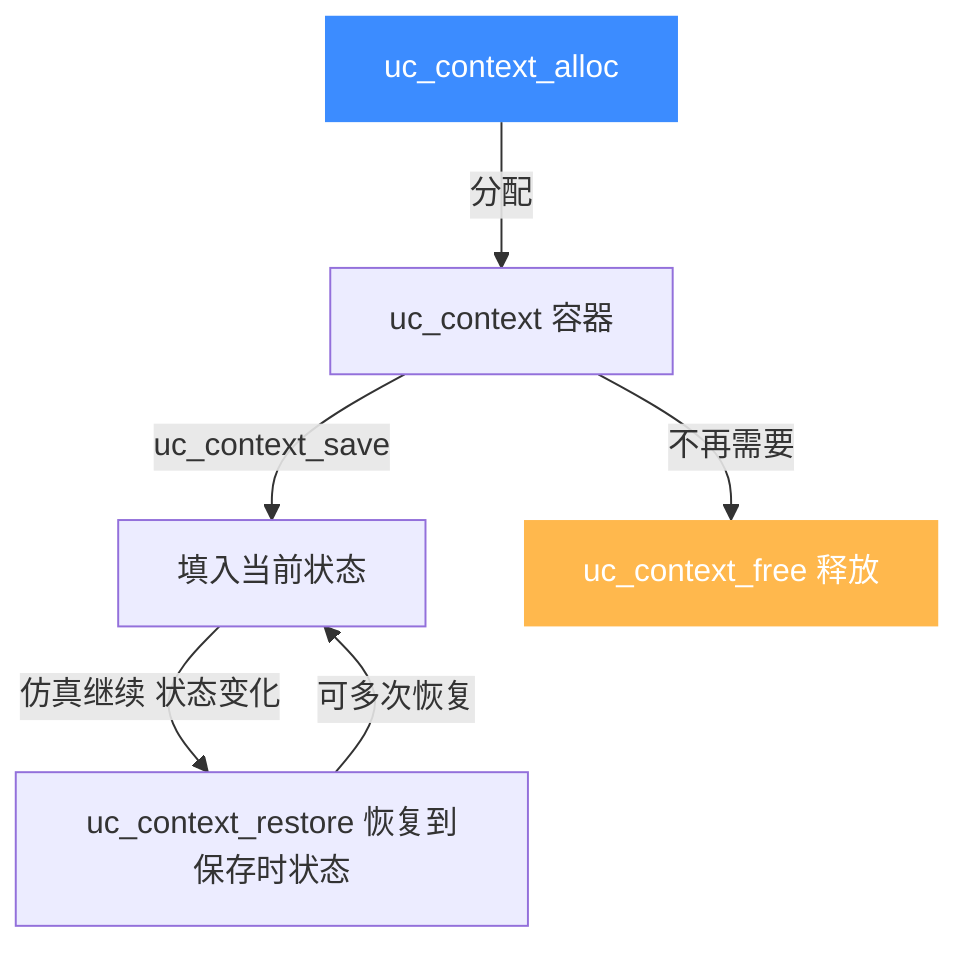
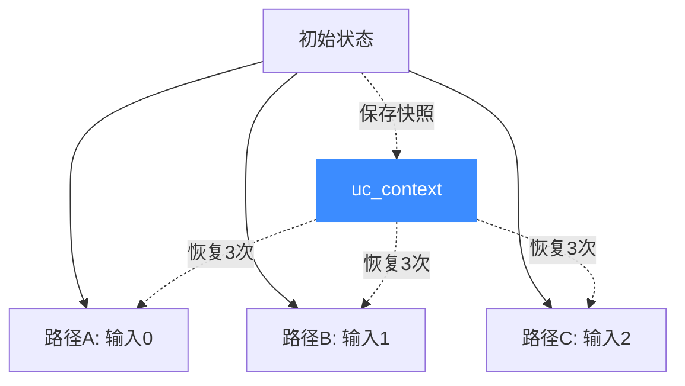
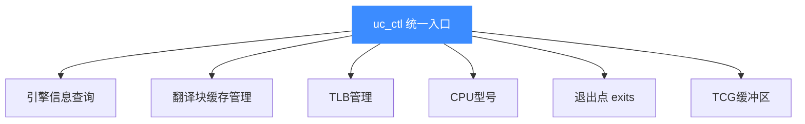
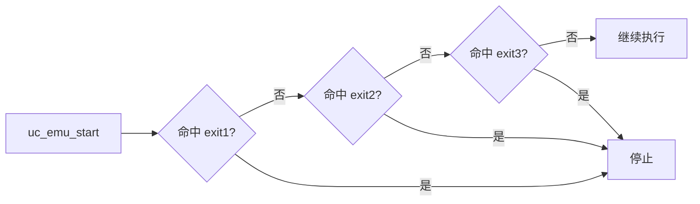
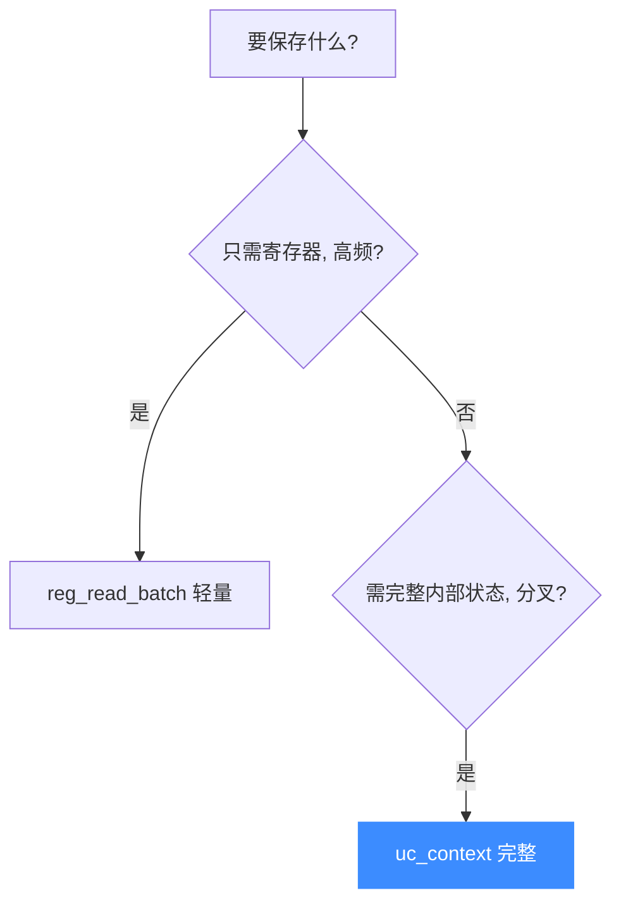
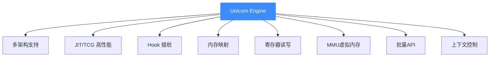

# 上下文控制

本页讲两件事：**`uc_context` 机制**（保存/恢复完整 CPU 状态）和 **`uc_ctl` 统一控制接口**（运行时调优引擎行为）。它们都是进阶能力，但理解后能解锁快照、分叉、性能调优等高级场景。

## 上下文（uc_context）

`uc_context` 是一个**不透明的状态容器**，能保存引擎的完整 CPU 状态——比手动 `reg_read_batch` 更完整，还包含内部仿真状态。



### 生命周期



### 核心 API

| API | 作用 |
|-----|------|
| `uc_context_alloc(uc, &ctx)` | 分配一个上下文容器 |
| `uc_context_save(uc, ctx)` | 把当前引擎状态存入 ctx |
| `uc_context_restore(uc, ctx)` | 把 ctx 的状态恢复到引擎 |
| `uc_context_free(ctx)` | 释放容器（**不要**用 `uc_free`） |
| `uc_context_reg_read/write(ctx, ...)` | 直接读写上下文中的寄存器 |

::: warning 释放方式
`uc_context_alloc` 分配的内存**必须用 `uc_context_free` 释放**，不要用旧的 `uc_free`（虽可能仍工作，但不保证）。
:::

### 典型场景：执行分叉

符号执行、模糊测试中，常需"从一个状态分叉出多条路径"：



```c
uc_context *ctx;
uc_context_alloc(uc, &ctx);
uc_context_save(uc, ctx);          // 保存分叉点

// 探索路径 A
uc_emu_start(uc, ...);
// 探索路径 B：先恢复，再改输入
uc_context_restore(uc, ctx);
uc_reg_write(uc, UC_X86_REG_EAX, &input_b);
uc_emu_start(uc, ...);

uc_context_free(ctx);
```

这样避免了为每条路径重新 `uc_open` + 重新映射内存 + 重新写代码的高昂成本。

### 上下文内容模式

`uc_ctl_context_mode` 可控制上下文保存的**内容范围**——在"完整保存"与"轻量保存"间权衡，按需减少保存开销。

## uc_ctl：统一控制接口

`uc_ctl` 是一个**可变参数**的统一控制入口，用于运行时查询和调整引擎行为。每个操作用 `UC_CTL_<IO>(type, nr)` 宏标识读写属性。



### 常用控制项

| 便捷宏 | 作用 |
|--------|------|
| `uc_ctl_mode_get` | 查询当前 mode |
| `uc_ctl_page_size_get/set` | 查询/设置页大小 |
| `uc_ctl_arch_get` | 查询架构 |
| `uc_ctl_cpu_model_set/get` | 设置/查询 CPU 型号（如 ARM 的 `cortex-r5`） |
| `uc_ctl_remove_cache(addr, end)` | 清除指定地址的 TB 翻译缓存 |
| `uc_ctl_flush_tb(uc)` | 清空全部 TB 缓存 |
| `uc_ctl_flush_tlb(uc)` | 刷新 TLB |
| `uc_ctl_tlb_mode(uc, UC_TLB_VIRTUAL)` | 切换 TLB 模式 |
| `uc_ctl_exits_enable/disable` | 启用/禁用多退出点 |
| `uc_ctl_set_exits` | 设置多个仿真停止地址 |

### TB 缓存控制：处理自修改代码

这是 `uc_ctl` 最常用的场景。当**从外部**修改了已缓存地址的指令，必须清缓存才能让修改生效（见 [FAQ](../guide/faq.md)）：


```c
// 修改 0x1000 处的指令后
uc_mem_write(uc, 0x1000, new_code, sizeof(new_code));
uc_ctl_remove_cache(uc, 0x1000, 0x1000 + sizeof(new_code));
// 若在仿真中, 还需写 PC 重启翻译
uc_reg_write(uc, UC_X86_REG_EIP, &current_pc);
```

::: tip 何时需要清缓存
- **仿真执行期间**的读写：QEMU 自动处理（SMC 支持），**无需**手动清。
- **从宿主侧** `uc_mem_write` 改已执行过的地址：**需要**手动清。
:::

### CPU 型号切换

某些架构行为依赖具体 CPU 型号（如 ARM Thumb2 大端指令需 `cortex-r5` 或 `arm_max`）：

```c
uc_ctl_cpu_model_set(uc, UC_CPU_ARM_CORTEX_R5);
```

详见 [FAQ · Invalid Instruction](../guide/faq.md)。

### 多退出点（exits）

默认 `uc_emu_start` 只有一个 `until` 停止地址。启用多退出点后，可设置**多个**停止地址，任一命中即停——适合仿真有多个返回点的代码：



```c
uint64_t exits[] = {0x1000, 0x2000, 0x3000};
uc_ctl_exits_enable(uc);
uc_ctl_set_exits(uc, exits, 3);
```

## 上下文 vs 批量寄存器：怎么选



| 方式 | 保存内容 | 开销 | 适用 |
|------|---------|------|------|
| `reg_read_batch` | 仅寄存器 | 低 | 高频、轻量快照 |
| `uc_context_save` | 寄存器 + 内部状态 | 较高 | 完整恢复、分叉 |

## 总结：本站能力点回顾

到这里，你已经走完了 Unicorn 的全部核心能力：



## 📂 相关源码

| 文件 | 角色 |
|------|------|
| [`include/unicorn/unicorn.h`](https://github.com/android-security-engineer/unicorn-skills/blob/master/include/unicorn/unicorn.h#L1265) | `uc_context_alloc` / `uc_context_save` / `uc_context_restore` / `uc_context_free` 声明 |
| [`include/unicorn/unicorn.h`](https://github.com/android-security-engineer/unicorn-skills/blob/master/include/unicorn/unicorn.h#L778) | `uc_ctl` 统一控制入口声明 |
| [`uc.c`](https://github.com/android-security-engineer/unicorn-skills/blob/master/uc.c#L2234) | `uc_context_*` 系列实现 |
| [`uc.c`](https://github.com/android-security-engineer/unicorn-skills/blob/master/uc.c#L2623) | `uc_ctl` 控制项分发实现 |

回到 [首页](../) 或 [项目介绍](../guide/intro.md) 重新审视这些能力如何组合，或查阅 [常见问题](../guide/faq.md) 解决实践中的疑问。
