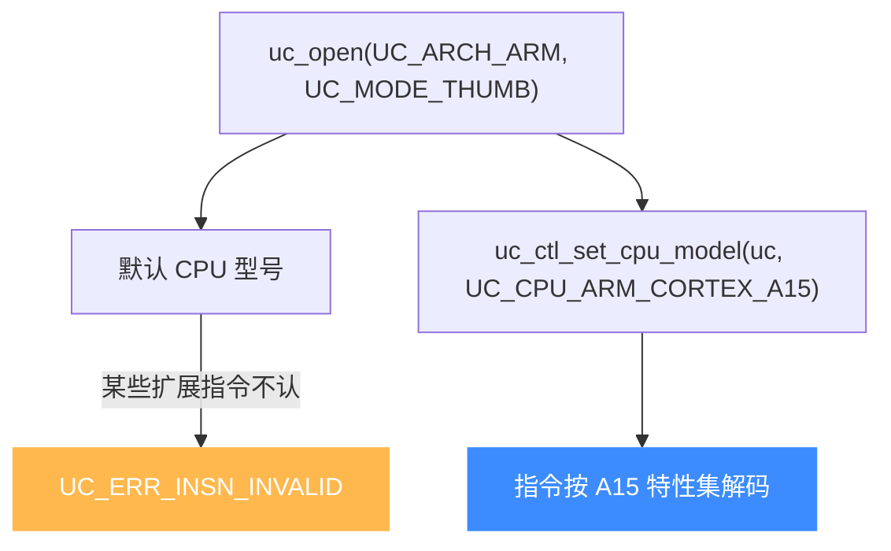
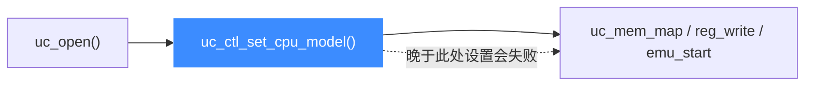
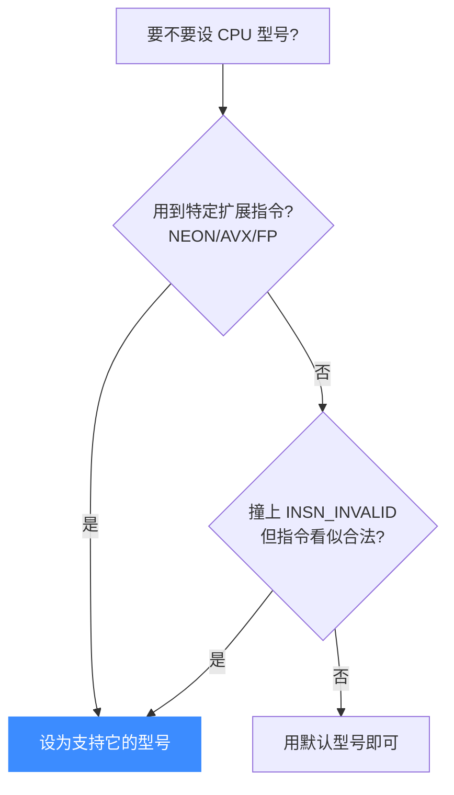

# CPU 型号选择

本页讲清如何用 `uc_ctl_get_cpu_model` / `uc_ctl_set_cpu_model` 选择具体 CPU 型号，以及为什么型号会影响**可用指令集与特性**。读完你能解决"明明指令合法却报 UC_ERR_INSN_INVALID"这类由默认型号不匹配导致的坑。

## 🧩 为什么型号很重要

`uc_open(arch, mode, ...)` 只确定了**大架构**（如 ARM）和**位宽/模式**（如 Thumb）。但同一架构下不同型号 CPU 的指令集差异巨大：Cortex-M0 没有硬件浮点，Cortex-A15 支持 NEON；老 486 不认识 AVX，Skylake 才有。Unicorn 用 **CPU model** 精确到具体型号。

若你不设，引擎用该架构的**默认型号**——它未必包含你代码里用到的扩展指令，于是你会莫名其妙地撞上 [`UC_ERR_INSN_INVALID`](/errors/exception)。



## 🔧 读写型号的 API

两个便捷宏（底层是 `UC_CTL_CPU_MODEL`，定义见 [`unicorn.h`](https://github.com/android-security-engineer/unicorn-skills/blob/master/include/unicorn/unicorn.h#L583)）：

```c
#define uc_ctl_get_cpu_model(uc, model) /* 读，model 为 int* */
#define uc_ctl_set_cpu_model(uc, model) /* 写，model 为 int */
```

```c
int model;
uc_ctl_get_cpu_model(uc, &model);        // 查询当前型号
printf("current cpu model = %d\n", model);

uc_ctl_set_cpu_model(uc, UC_CPU_ARM_CORTEX_R5); // 切换型号
```

::: danger 只能在仿真前设置
头文件明确规定：`UC_CTL_CPU_MODEL` 的**写操作只能在 `uc_open` 之后、任何其它 Unicorn API 之前**调用。一旦映射内存、写寄存器或启动仿真，就不能再改型号了。正确顺序：`uc_open` → `uc_ctl_set_cpu_model` → `uc_mem_map` → …
:::



## 📋 各架构 UC_CPU_* 常量概览

每个架构在 `include/unicorn/<arch>.h` 里定义了自己的 `uc_cpu_*` 枚举。下面是几例（**取值以头文件为准**）：

**ARM**（[`include/unicorn/arm.h`](https://github.com/android-security-engineer/unicorn-skills/blob/master/include/unicorn/arm.h#L19)，从 `UC_CPU_ARM_926 = 0` 起）：

| 常量 | 典型代表 |
|------|---------|
| `UC_CPU_ARM_926` / `946` / `1176` | 经典 ARMv5/v6 核 |
| `UC_CPU_ARM_CORTEX_M0` / `M3` / `M4` / `M7` / `M33` | Cortex-M 微控制器系列 |
| `UC_CPU_ARM_CORTEX_R5` / `R5F` | 实时 R 系列 |
| `UC_CPU_ARM_CORTEX_A7` / `A8` / `A9` / `A15` | 应用级 A 系列 |
| `UC_CPU_ARM_MAX` | 功能最全的"最大集"核 |

**ARM64**（[`include/unicorn/arm64.h`](https://github.com/android-security-engineer/unicorn-skills/blob/master/include/unicorn/arm64.h)）：`UC_CPU_ARM64_A57`、`UC_CPU_ARM64_A53`、`UC_CPU_ARM64_A72`。

**X86**（[`include/unicorn/x86.h`](https://github.com/android-security-engineer/unicorn-skills/blob/master/include/unicorn/x86.h)）：从 `UC_CPU_X86_QEMU64 = 0` 起，涵盖 `UC_CPU_X86_486`、`PENTIUM`、`CORE2DUO`、`NEHALEM`、`SANDYBRIDGE`、`HASWELL`、`SKYLAKE_CLIENT/SERVER`、`ICELAKE_SERVER`、`EPYC` 等各代微架构。

::: tip 各架构还有独立的 CPU 型号页
本页讲通用机制；每个架构自己的完整型号清单与推荐值见架构专题，如 [ARM 模式与字节序](/arch/arm/modes) 附近的型号章节。
:::

## 📌 经典用例：Thumb-2 大端指令

Unicorn 的 [FAQ](/guide/faq) 里有个著名案例：某些 ARM Thumb2 大端指令在默认核上会被判为非法指令，必须切到支持它的型号（如 `cortex-r5` 或"最大集"核）才能正确解码：

```c
uc_engine *uc;
uc_open(UC_ARCH_ARM, UC_MODE_THUMB | UC_MODE_BIG_ENDIAN, &uc);
// 关键：在任何其它 API 前设置型号
uc_ctl_set_cpu_model(uc, UC_CPU_ARM_CORTEX_R5);
// 之后再映射内存、写代码、启动仿真
uc_mem_map(uc, 0x1000, 0x1000, UC_PROT_ALL);
```

## ⚖️ 何时需要显式设置



## 📂 相关源码

| 文件 | 角色 |
|------|------|
| [`include/unicorn/unicorn.h`](https://github.com/android-security-engineer/unicorn-skills/blob/master/include/unicorn/unicorn.h#L583) | `UC_CTL_CPU_MODEL` 控制项与 `uc_ctl_get/set_cpu_model` 宏声明 |
| [`include/unicorn/arm.h`](https://github.com/android-security-engineer/unicorn-skills/blob/master/include/unicorn/arm.h#L19) | ARM `uc_cpu_arm` 枚举（`UC_CPU_ARM_*`） |
| [`include/unicorn/arm64.h`](https://github.com/android-security-engineer/unicorn-skills/blob/master/include/unicorn/arm64.h) | ARM64 `uc_cpu_arm64` 枚举 |
| [`include/unicorn/x86.h`](https://github.com/android-security-engineer/unicorn-skills/blob/master/include/unicorn/x86.h) | X86 `uc_cpu_x86` 枚举 |
| [`uc.c`](https://github.com/android-security-engineer/unicorn-skills/blob/master/uc.c#L2623) | `uc_ctl` 实现分发控制项（含 CPU 型号读写） |

## 相关页面

- [uc_ctl_set_cpu_model](/ctl/set-cpu-model) — 设置 CPU 型号控制项
- [多架构支持](/features/architectures) — 架构与模式全景
- [常见问题 FAQ](/guide/faq) — Invalid Instruction 排错
