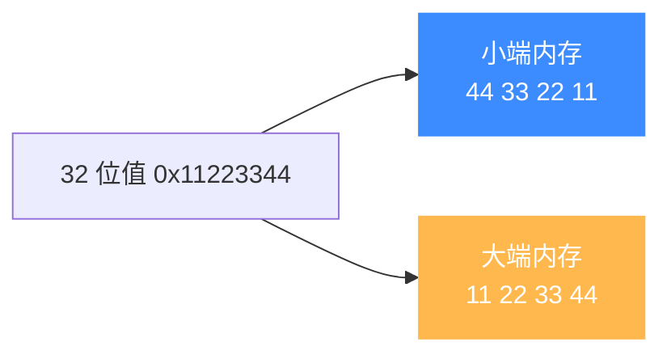
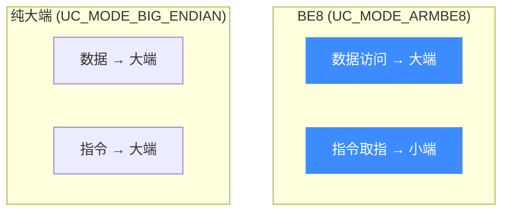

# 字节序（Endianness）

本页讲清 Unicorn 的字节序控制：`UC_MODE_LITTLE_ENDIAN` / `UC_MODE_BIG_ENDIAN` 的用法、ARM 特有的 `UC_MODE_ARMBE8`，哪些架构可以切换字节序，以及写入机器码时最容易踩的字节序陷阱。读完你能正确仿真大端目标（如许多 MIPS 固件）。

## 🧩 什么是字节序

字节序决定多字节整数在内存里的**字节排列方向**：小端（little-endian）低位字节在前，大端（big-endian）高位字节在前。x86 恒为小端；MIPS、PowerPC、部分 ARM 部署为大端。仿真时字节序选错，读出的数据和解码的指令都会错乱。

Unicorn 把字节序作为 **mode 位**，在 `uc_open` 时通过 `UC_MODE_*` 指定（定义见 [`unicorn.h`](https://github.com/android-security-engineer/unicorn-skills/blob/master/include/unicorn/unicorn.h#L114)）：

```c
// unicorn.h
UC_MODE_LITTLE_ENDIAN = 0,        // 默认
UC_MODE_BIG_ENDIAN    = 1 << 30,  // 大端
UC_MODE_ARMBE8        = 1 << 10,  // 大端数据 + 小端代码（ARM 传统 BE8）
```



## 🔧 用法

字节序位与架构/位宽位**按位或**组合：

```c
uc_engine *uc;
// 大端 MIPS32
uc_open(UC_ARCH_MIPS, UC_MODE_MIPS32 | UC_MODE_BIG_ENDIAN, &uc);

// 小端 MIPS32（默认，可不写 LITTLE_ENDIAN，因为它是 0）
uc_open(UC_ARCH_MIPS, UC_MODE_MIPS32 | UC_MODE_LITTLE_ENDIAN, &uc);
```

::: tip LITTLE_ENDIAN 的值是 0
`UC_MODE_LITTLE_ENDIAN = 0`，所以"不写它"就等于小端。只有需要大端时才必须显式 `| UC_MODE_BIG_ENDIAN`。
:::

## 📋 哪些架构可切换

字节序支持随架构而异（**以实现为准**，运行时可用 [`UC_QUERY_MODE`](/api/query) 核实）：

| 架构 | 字节序 | 说明 |
|------|--------|------|
| x86 / x86-64 | 仅小端 | 架构本身固定小端，加 BE 位无意义 |
| MIPS | 大端 / 小端 | 需在 `uc_open` 指定，见 [MIPS 模式](/arch/mips/modes) |
| ARM | 大端 / 小端 / BE8 | 支持 `UC_MODE_ARMBE8`，见 [ARM 模式](/arch/arm/modes) |
| ARM64 | 大端 / 小端 | AArch64 可配 |
| PowerPC | 大端为主 | 传统大端架构 |
| SPARC | 大端 | |

## 📱 ARM 的 BE8：数据大端、代码小端

ARMv6 之后引入 **BE8** 字节序模型：**数据是大端，但指令编码仍按小端存放**。这是 ARM 特有的怪异之处，Unicorn 用单独的 `UC_MODE_ARMBE8` 表达：

```c
// ARM BE8：大端数据 + 小端指令
uc_open(UC_ARCH_ARM, UC_MODE_ARM | UC_MODE_ARMBE8, &uc);
```



::: warning ARMBE8 是遗留支持
头文件注释指出 `UC_MODE_ARMBE8` 主要是"为 UC1 提供的遗留支持"。新代码若不是要精确复现 BE8 行为，通常用 `UC_MODE_BIG_ENDIAN` 即可。
:::

## ⚠️ 写机器码的字节序陷阱

这是最容易翻车的地方。当你在 C 里用**字节串字面量**写机器码时——比如 `"\x41\x4a"`——你写的是**逐字节**序列，它**不受** mode 字节序影响，字节按你排列的顺序原样进内存：

```c
// 逐字节字面量：无论大端小端，内存里就是 41 4a
uc_mem_write(uc, ADDRESS, "\x41\x4a", 2);
```

陷阱在于：**你必须自己保证这串字节是目标字节序下正确的机器码**。同一条指令，MIPS 大端和小端的字节排列是相反的：

```c
// MIPS 一条指令，大端与小端字节顺序相反！
// 大端固件反汇编出的字节，直接喂给小端引擎会解码成别的指令
#define MIPS_CODE_EB "\x34\x21\x34\x56"  // 大端排列
#define MIPS_CODE_EL "\x56\x34\x21\x34"  // 同一指令的小端排列
```

::: danger 反汇编器字节序要与引擎一致
从 IDA/objdump 拷字节时，务必确认它导出的字节序与你 `uc_open` 选的字节序**一致**。字节序不匹配的典型症状：仿真一开始就 [`UC_ERR_INSN_INVALID`](/errors/exception)，或执行出完全不符预期的指令流。
:::

而**寄存器值**（`uc_reg_write` 传的是宿主的 `uint64_t`）和 `uc_mem_write` 写的**多字节整数数据**，会按引擎当前字节序自动处理——需要区别对待"字节串"与"整数"。

## 📂 相关源码

| 文件 | 角色 |
|------|------|
| [`include/unicorn/unicorn.h`](https://github.com/android-security-engineer/unicorn-skills/blob/master/include/unicorn/unicorn.h#L114) | `UC_MODE_LITTLE_ENDIAN` / `UC_MODE_BIG_ENDIAN` / `UC_MODE_ARMBE8` 枚举定义 |
| [`uc.c`](https://github.com/android-security-engineer/unicorn-skills/blob/master/uc.c#L310) | `uc_open` 解析 mode 位、分发到架构初始化 |
| [`include/uc_priv.h`](https://github.com/android-security-engineer/unicorn-skills/blob/master/include/uc_priv.h) | `uc_struct` 与各架构 `uc_init_<arch>` 函数指针 |
| [`qemu/target/<arch>/`](https://github.com/android-security-engineer/unicorn-skills/blob/master/qemu/target) | 各架构前端按 mode 选择大/小端解码路径 |

## 相关页面

- [MIPS 模式与字节序](/arch/mips/modes) — MIPS 大小端配置
- [ARM 模式与字节序](/arch/arm/modes) — ARM/Thumb/BE8 细节
- [多架构支持](/features/architectures) — 架构与 mode 全景
