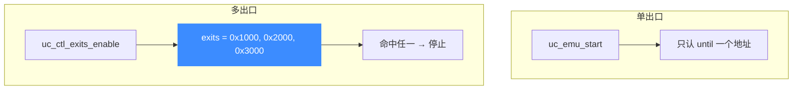
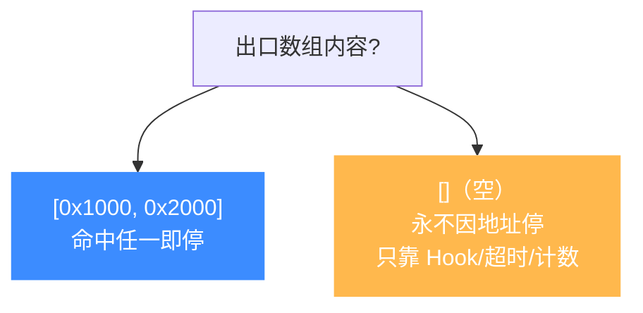

# 多出口机制（exits）

本页讲清 Unicorn 的"多退出点"机制：为什么 `uc_emu_start` 的单个 `until` 参数常常不够用，如何用 `uc_ctl_exits_enable` + `uc_ctl_set_exits` 设置**多个**停止地址。读完你能优雅地仿真"有多个返回点"的代码。

## 🎯 单出口的局限

`uc_emu_start(uc, begin, until, timeout, count)` 只接受**一个** `until` 停止地址：命中它就停。但真实代码常有多个"该停下来"的位置——多个 `ret`、多个错误分支、多个函数出口。用单出口时你只能选一个，其它出口要么靠 Hook 里 `uc_emu_stop`，要么反复重启仿真。

多出口机制（exits）正是为此设计：一次注册一组地址，命中**任意一个**即停。头文件里的说明很直白：

> In some cases, users may have multiple exits and the @until parameter of uc_emu_start is not sufficient to control the emulation. The exits mechanism is designed to solve this problem.



## 🔧 三个步骤

多出口默认**关闭**（为向后兼容）。启用后，`uc_emu_start` 的 `until` 参数会被**完全忽略**。


涉及的控制项（宏定义见 [`unicorn.h`](https://github.com/android-security-engineer/unicorn-skills/blob/master/include/unicorn/unicorn.h#L567)）：

| 便捷宏 | 底层控制项 | 作用 |
|--------|-----------|------|
| `uc_ctl_exits_enable(uc)` | `UC_CTL_UC_USE_EXITS`（写 1） | 启用多出口；此后 `until` 失效 |
| `uc_ctl_exits_disable(uc)` | `UC_CTL_UC_USE_EXITS`（写 0） | 关闭，**清空**已设出口，`until` 恢复生效 |
| `uc_ctl_set_exits(uc, buf, len)` | `UC_CTL_UC_EXITS`（写） | 设置一组停止地址 |
| `uc_ctl_get_exits(uc, buf, len)` | `UC_CTL_UC_EXITS`（读） | 读回当前出口数组 |
| `uc_ctl_get_exits_cnt(uc, &n)` | `UC_CTL_UC_EXITS_CNT`（读） | 查询当前出口数量 |

::: warning 必须先 enable
不先调用 `uc_ctl_exits_enable`，直接 `uc_ctl_set_exits` / `uc_ctl_get_exits` 会返回错误。这是刻意的向后兼容设计。
:::

## 📌 完整示例

下面改编自 [`samples/sample_ctl.c`](https://github.com/android-security-engineer/unicorn-skills/blob/master/samples/sample_ctl.c)。一段带条件跳转的 x86 代码，用两个出口分别停在不同分支：

```c
// cmp eax,0; jg lb; inc eax; nop; lb: inc ebx; nop;
#define CODE "\x83\xf8\x00\x7f\x02\x40\x90\x43\x90"
#define ADDRESS 0x10000

uc_engine *uc;
uc_open(UC_ARCH_X86, UC_MODE_32, &uc);
uc_mem_map(uc, ADDRESS, 0x1000, UC_PROT_ALL);
uc_mem_write(uc, ADDRESS, CODE, sizeof(CODE) - 1);

// 两个出口：ADDRESS+6 与 ADDRESS+8
uint64_t exits[] = {ADDRESS + 6, ADDRESS + 8};
uc_ctl_exits_enable(uc);
uc_ctl_set_exits(uc, exits, 2);

// 注意第三个参数(until)传 0，会被忽略——命中任一 exit 即停
uc_emu_start(uc, ADDRESS, 0, 0, 0);
```

::: tip until 传什么都一样
启用多出口后，下面三种写法完全等价，`until` 已无意义：
```c
uc_emu_start(uc, 0x1000, 0,  0, 0);
uc_emu_start(uc, 0x1000, 0x1000, 0, 0);
uc_emu_start(uc, 0x1000, -1, 0, 0);
```
:::

## 🧩 空出口数组的语义

设置**空数组** `uc_ctl_set_exits(uc, NULL, 0)` 是合法的，含义是："永不因地址而停"——此时仿真只会因 Hook 里的 `uc_emu_stop`、超时、指令计数用尽或错误而结束。这在"想让代码一直跑、只靠 Hook 控制停机"时很有用。



## ⚖️ 多出口 vs Hook 里 uc_emu_stop

两种方式都能实现"多个停止点"，如何取舍：

| 方式 | 开销 | 适用 |
|------|------|------|
| 多出口 exits | 低（引擎内部判断） | 停止点是**固定地址集合** |
| `UC_HOOK_CODE` + `uc_emu_stop` | 较高（每条指令回调） | 停止条件是**动态的**（依寄存器/内存状态） |

头文件也点明：exits 相比 Hook "略微更高效，也更易实现"。地址固定就优先用 exits。

## 📂 相关源码

| 文件 | 角色 |
|------|------|
| [`include/unicorn/unicorn.h`](https://github.com/android-security-engineer/unicorn-skills/blob/master/include/unicorn/unicorn.h#L567) | `UC_CTL_UC_USE_EXITS` / `UC_CTL_UC_EXITS` / `UC_CTL_UC_EXITS_CNT` 及 `uc_ctl_exits_*` 宏 |
| [`uc.c`](https://github.com/android-security-engineer/unicorn-skills/blob/master/uc.c#L1076) | `uc_emu_start` 处理 exits 命中与 `until` 忽略逻辑 |
| [`samples/sample_ctl.c`](https://github.com/android-security-engineer/unicorn-skills/blob/master/samples/sample_ctl.c) | 多出口条件跳转示例 |

## 相关页面

- [uc_ctl_exits_enable](/ctl/exits-enable) — 启用/禁用多出口
- [uc_ctl_set_exits](/ctl/set-exits) — 设置出口地址数组
- [上下文控制](/features/context) — uc_ctl 统一控制接口全景
