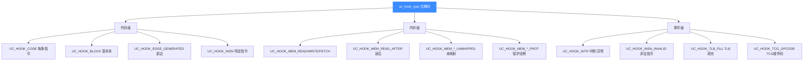
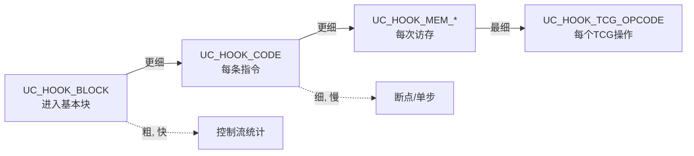
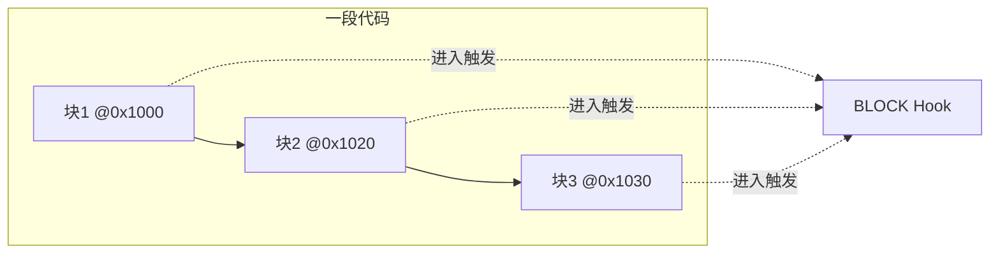
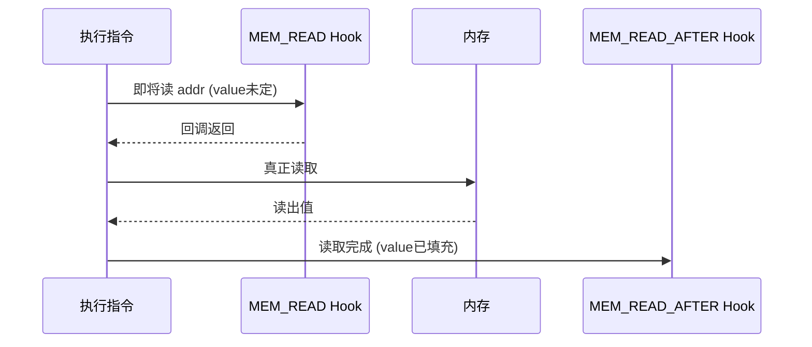
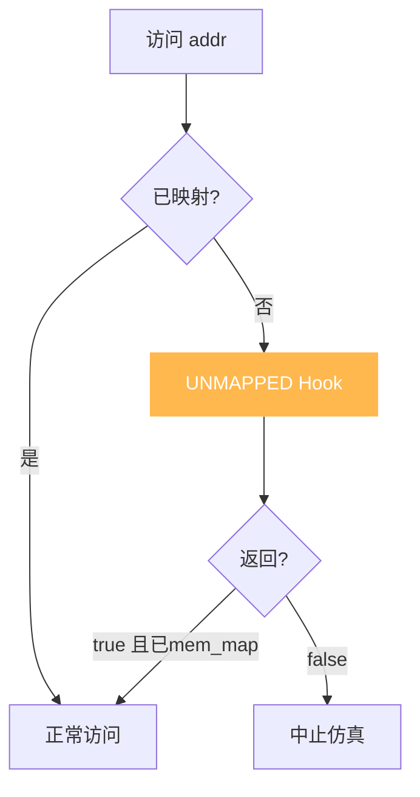
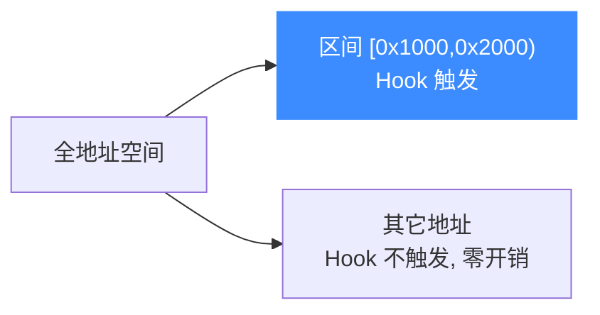
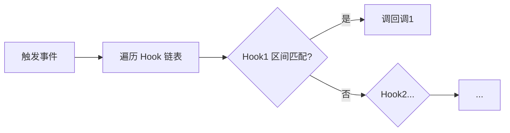
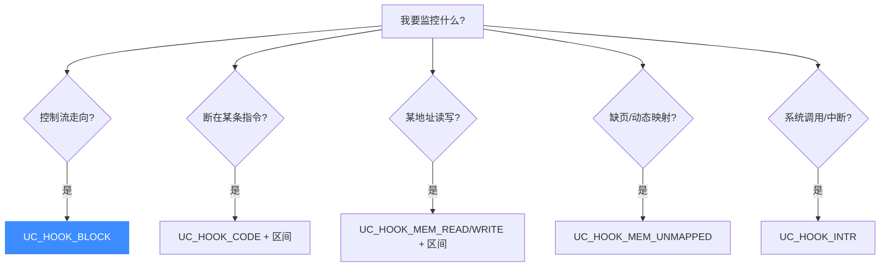

# Hook 插桩体系

Hook 是 Unicorn 最强大的能力——它让你在仿真的任意粒度插入自己的逻辑。本页系统讲清各类 Hook 的触发时机、回调签名、返回值语义与性能取舍。

## Hook 类型全景

Unicorn 的 Hook 用**位掩码（bitmask）**表示，因此可以组合（如 `UC_HOOK_MEM_UNMAPPED` 是三种 UNMAPPED 的按位或）：



## 粒度阶梯

理解 Hook 的关键是理解**触发粒度**——从粗到细，性能代价递增：



::: tip 黄金法则
**用能解决问题的最粗粒度 Hook。** 需要知道走到哪 → 用 BLOCK；需要断在某条指令 → 才用 CODE。
:::

## 代码级 Hook

### UC_HOOK_BLOCK — 基本块

- **触发**：进入每个基本块时（块首指令执行前）
- **回调**：`(uc, address, size, user_data)`，`address` 是块首地址，`size` 是块大小
- **用途**：控制流追踪、覆盖率统计、按块反汇编



循环会让同一块反复触发 BLOCK Hook——据此可统计循环次数。

### UC_HOOK_CODE — 每条指令

- **触发**：每条指令执行前
- **回调**：`(uc, address, size, user_data)`
- **用途**：断点（配合 `uc_emu_stop`）、单步、指令级追踪、寄存器观察

::: warning 性能
CODE Hook 会在每条指令边界打断 JIT 的连续执行，**显著降速**（参见 [JIT](./jit.md)）。仅在你确实需要指令级精度时使用。
:::

### UC_HOOK_EDGE_GENERATED — 新边生成

- 与 BLOCK 的区别：① 在执行前调用；② **仅在新控制流边首次生成时触发**（已走过的边不再触发）
- 用途：程序分析、构建控制流图（CFG）

### UC_HOOK_INSN — 特定指令

- 仅支持**极少数**指令（x86 上为 `in` `out` `syscall` `sysenter` `cpuid`）
- 试图 Hook 不支持的指令会得到 `UC_ERR_HOOK`

## 内存级 Hook

### UC_HOOK_MEM_READ / WRITE / FETCH — 正常访存

- **READ**：访存**前**触发，传入的 `value` 无意义
- **WRITE**：触发时 `value` 是被写入的值
- **FETCH**：取指时触发（已弃用，见下）
- **READ_AFTER**：读**完成后**触发，`value` 已填充真实读出值



::: tip 用途
- **watchpoint**：监控某地址的读写
- **MMIO 仿真**：READ Hook 里写入"设备寄存器值"，WRITE Hook 里更新你的设备状态
:::

### UC_HOOK_MEM_*_UNMAPPED — 未映射访存

- 触发于访问**未映射**地址
- 回调返回 `true` = 已处理（须先 `uc_mem_map`），继续执行；返回 `false` = 中止
- 用途：**按需分页**、动态内存映射（见 [第一个模拟程序](../guide/first-program.md)）



### UC_HOOK_MEM_*_PROT — 保护违例

- 触发于访问已映射但**保护位不允许**的地址（如写只读区、执行不可执行区）
- 可在回调里 `uc_mem_protect` 改权限，或返回 `false` 中止

### 便捷组合宏

| 宏 | 含义 |
|----|------|
| `UC_HOOK_MEM_UNMAPPED` | 三种 UNMAPPED 之和 |
| `UC_HOOK_MEM_PROT` | 三种 PROT 之和 |
| `UC_HOOK_MEM_INVALID` | UNMAPPED + PROT（所有非法访存） |
| `UC_HOOK_MEM_VALID` | READ + WRITE + FETCH（所有正常访存） |

## 事件级 Hook

| Hook | 触发 | 用途 |
|------|------|------|
| `UC_HOOK_INTR` | 中断/异常（如 `syscall`、`SVC`） | 自定义系统调用处理 |
| `UC_HOOK_INSN_INVALID` | 遇到非法指令 | 错误诊断 |
| `UC_HOOK_TLB_FILL` | TLB 未命中需填充 | 自定义虚拟内存管理（配合 `UC_TLB_VIRTUAL`） |
| `UC_HOOK_TCG_OPCODE` | 特定 TCG 操作码执行 | 极底层的指令分析 |

## 注册与地址区间

`uc_hook_add` 的最后两个参数 `begin` / `end` 限定 Hook 的**有效地址区间**：

```c
// 仅在 [0x1000, 0x2000) 范围内触发 CODE Hook
uc_hook_add(uc, &hh, UC_HOOK_CODE, hook_code, NULL, 0x1000, 0x2000);

// 全地址空间生效
uc_hook_add(uc, &hh, UC_HOOK_CODE, hook_code, NULL, 1, 0);
```



::: tip 性能关键
限定区间是 Hook 性能优化的核心手段。区间外的指令完全不进入 Hook 分发逻辑，开销几乎为零。
:::

## 回调返回值语义速查

| Hook 类型 | 返回 true | 返回 false |
|-----------|----------|-----------|
| `UC_HOOK_MEM_*_UNMAPPED` | 已映射，继续 | 中止 |
| `UC_HOOK_MEM_*_PROT` | 已处理，继续 | 中止 |
| `UC_HOOK_CODE` / `BLOCK` | （无意义） | — |
| `UC_HOOK_MEM_READ/WRITE`（`void`） | — | — |

对 CODE/BLOCK，要停止仿真请调用 `uc_emu_stop(uc)`。

## Hook 列表与开销

所有 Hook 存在一个**链表**里，每次触发要遍历匹配。Hook 越多，分发越慢。



::: warning 别滥用 Hook
"加更多 Hook"不是免费的。每个 Hook 都在每次匹配事件上增加遍历开销。优先用区间限定 + 更粗粒度。
:::

## 选型决策树



## 📂 相关源码

| 文件 | 角色 |
|------|------|
| [`include/unicorn/unicorn.h`](https://github.com/android-security-engineer/unicorn-skills/blob/master/include/unicorn/unicorn.h#L362) | `uc_hook_type` 枚举、`UC_HOOK_*` 全部位掩码与组合宏 |
| [`include/unicorn/unicorn.h`](https://github.com/android-security-engineer/unicorn-skills/blob/master/include/unicorn/unicorn.h#L206) | `uc_cb_hookcode_t` / `uc_cb_hookblock_t` 等回调签名 |
| [`include/unicorn/unicorn.h`](https://github.com/android-security-engineer/unicorn-skills/blob/master/include/unicorn/unicorn.h#L1088) | `uc_hook_add` / `uc_hook_del` 声明 |
| [`uc.c`](https://github.com/android-security-engineer/unicorn-skills/blob/master/uc.c#L1908) | `uc_hook_add` 注册 Hook 到链表、`uc_hook_del` 移除 |
| [`include/uc_priv.h`](https://github.com/android-security-engineer/unicorn-skills/blob/master/include/uc_priv.h) | Hook 链表结构与触发分发定义 |

---

下一节：[内存映射与管理](./memory.md)。
