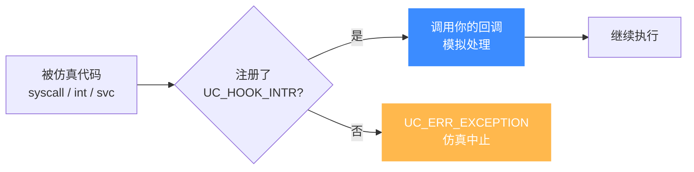
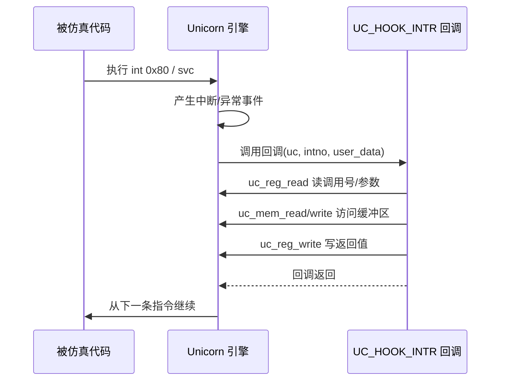

# 中断与异常

本页讲清 Unicorn 如何把 CPU 的**中断/异常/系统调用**统一交给你处理：`UC_HOOK_INTR` 的触发时机、回调签名，以及如何在回调里读出中断号、模拟一次系统调用。读完你能自己实现一个"内核系统调用层"。

## 🧩 为什么需要它

Unicorn 只模拟 **CPU**，不模拟操作系统。当被仿真代码执行 `int 0x80`、`syscall`、ARM 的 `svc #0` 时，真实机器会陷入内核；而在 Unicorn 里，**没有内核**——这些指令会产生一次 CPU 异常/中断事件。默认情况下这会让 `uc_emu_start` 以 `UC_ERR_EXCEPTION` 退出（见 [UC_ERR_EXCEPTION](/errors/exception)）。

想让代码"以为"自己在真实系统上跑，就得自己接管这些事件——这正是 `UC_HOOK_INTR` 的职责。



## 🪝 UC_HOOK_INTR 回调

在 [`include/unicorn/unicorn.h`](https://github.com/android-security-engineer/unicorn-skills/blob/master/include/unicorn/unicorn.h#L215) 中，中断回调的签名是：

```c
typedef void (*uc_cb_hookintr_t)(uc_engine *uc, uint32_t intno,
                                 void *user_data);
```

| 参数 | 含义 |
|------|------|
| `uc` | 引擎句柄，可在回调里 `uc_reg_read/write`、`uc_emu_stop` |
| `intno` | **中断号/异常号**，语义**依架构而定**（见下表） |
| `user_data` | 注册时传入的用户数据 |

::: warning intno 的含义随架构不同
`intno` 不是统一编号：x86 下 `int 0x80` 的 `intno` 是 `0x80`；`syscall` 走的是另一条路径（见下节）。ARM 的 `svc` 会给出一个 QEMU 内部异常号，**不是** SVC 立即数——SVC 号要从指令或寄存器另行解析。不要跨架构假设它的取值。
:::

## 🖥️ x86：int 与 syscall 的两条路径

x86 上"进内核"有两种指令，Unicorn 的分发方式**不同**：

| 指令 | 触发的 Hook | 如何拿参数 |
|------|-------------|-----------|
| `int N`（软中断，如 `int 0x80`） | `UC_HOOK_INTR`，`intno == N` | 读 `EAX` 等寄存器 |
| `syscall` / `sysenter` | `UC_HOOK_INSN`（指令级 Hook） | 读 `RAX` 等寄存器 |

也就是说，模拟 Linux 32 位 `int 0x80` ABI 用 `UC_HOOK_INTR`；模拟 x86-64 `syscall` ABI 则用 [`UC_HOOK_INSN`](/hooks/intr) 并指定指令 ID `UC_X86_INS_SYSCALL`。

```c
// 拦截 int 0x80，模拟一个极简的 write(1, buf, len)
static void hook_intr(uc_engine *uc, uint32_t intno, void *user_data)
{
    if (intno != 0x80) {   // 只处理 Linux 软中断
        uc_emu_stop(uc);
        return;
    }
    uint32_t eax, ebx, ecx, edx;
    uc_reg_read(uc, UC_X86_REG_EAX, &eax); // 系统调用号
    uc_reg_read(uc, UC_X86_REG_EBX, &ebx); // fd
    uc_reg_read(uc, UC_X86_REG_ECX, &ecx); // buf 地址
    uc_reg_read(uc, UC_X86_REG_EDX, &edx); // len

    if (eax == 4) {                        // __NR_write
        char buf[256] = {0};
        uc_mem_read(uc, ecx, buf, edx < 255 ? edx : 255);
        printf("[guest write] %s\n", buf);
        uint32_t ret = edx;                // 返回写入字节数
        uc_reg_write(uc, UC_X86_REG_EAX, &ret);
    }
}

// 注册：全地址空间生效
uc_hook h;
uc_hook_add(uc, &h, UC_HOOK_INTR, hook_intr, NULL, 1, 0);
```

## 📱 ARM：svc 系统调用

ARM/Thumb 的 `svc #0`（旧称 `swi`）同样触发 `UC_HOOK_INTR`。SVC 立即数常被约定携带调用号，但它不在 `intno` 里——需要从 PC 指向的指令字节中解析，或按 ABI 从寄存器（如 `r7` 存放调用号）读取：

```c
static void hook_svc(uc_engine *uc, uint32_t intno, void *user_data)
{
    uint32_t r7, r0;
    uc_reg_read(uc, UC_ARM_REG_R7, &r7);   // Linux ARM: r7 = 系统调用号
    uc_reg_read(uc, UC_ARM_REG_R0, &r0);   // 第一个参数
    printf("SVC: syscall=%u, arg0=0x%x (intno=%u)\n", r7, r0, intno);
    // 处理完把返回值写回 r0
    uint32_t ret = 0;
    uc_reg_write(uc, UC_ARM_REG_R0, &ret);
}
```

## ⏱️ 一次系统调用的时序



::: tip 让代码继续执行
中断回调**返回 void**，没有"是否继续"的布尔值——只要你不调用 `uc_emu_stop`，仿真就会从中断指令的**下一条**继续。想终止就显式调用 `uc_emu_stop(uc)`。
:::

::: danger 未处理即中止
如果没有注册 `UC_HOOK_INTR`，或回调里对未知 `intno` 不作处理，`uc_emu_start` 会返回 [`UC_ERR_EXCEPTION`](/errors/exception)。生产级 loader 通常给一个"兜底回调"，对未知调用号打印日志并优雅停机。
:::

## 📂 相关源码

| 文件 | 角色 |
|------|------|
| [`include/unicorn/unicorn.h`](https://github.com/android-security-engineer/unicorn-skills/blob/master/include/unicorn/unicorn.h#L215) | `uc_cb_hookintr_t` 回调签名、`UC_HOOK_INTR` 枚举 |
| [`uc.c`](https://github.com/android-security-engineer/unicorn-skills/blob/master/uc.c#L1908) | `uc_hook_add` 注册中断 Hook |
| [`qemu/target/<arch>/`](https://github.com/android-security-engineer/unicorn-skills/blob/master/qemu/target) | 各架构前端把 `int`/`svc`/`syscall` 翻成 CPU 异常事件 |

## 相关页面

- [UC_HOOK_INTR 参考](/hooks/intr) — 中断 Hook 的注册细节
- [UC_ERR_EXCEPTION](/errors/exception) — 未处理异常的错误码
- [Hook 插桩体系](/features/hooks) — Hook 全景与选型
