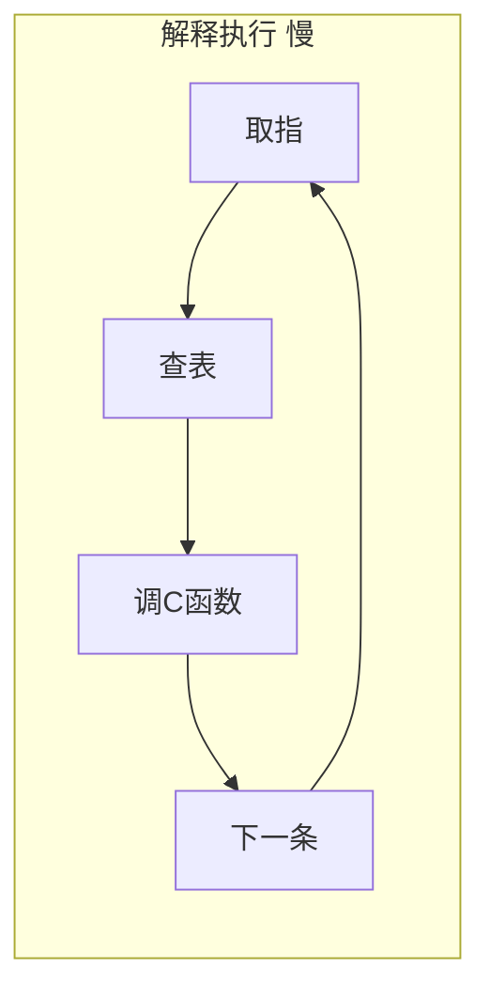
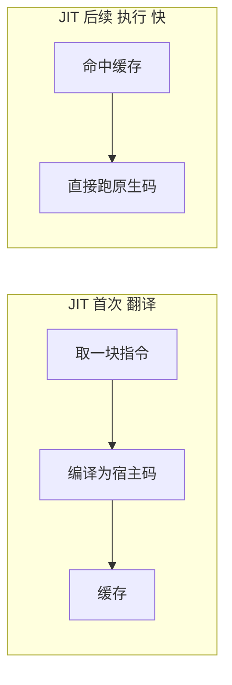
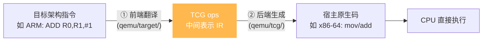
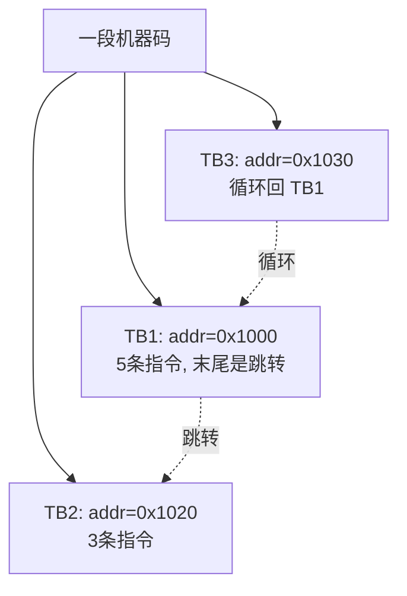
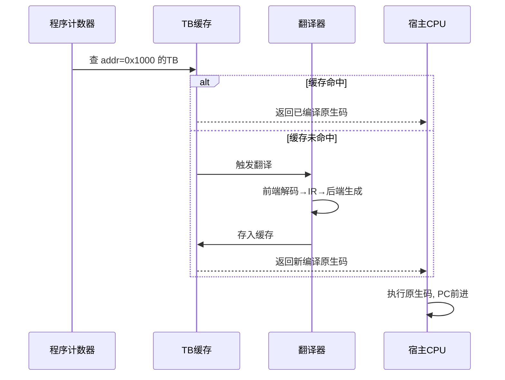
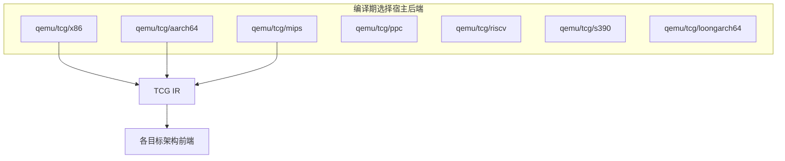

# JIT 编译（TCG）

Unicorn 的高性能来自 **TCG（Tiny Code Generator）**——QEMU 的即时编译引擎。本页讲清楚：为什么 JIT 比解释快、TCG 的两阶段翻译如何工作、以及翻译块缓存机制。

## 解释 vs JIT：为什么快

模拟一段非本机代码，最朴素的做法是**解释执行**：逐条取指、查表分发到对应的 C 处理函数。



每条指令都要付出"查表 + 函数调用"开销，且无法利用 CPU 流水线。**JIT** 的思路是：先把一整段目标指令**编译成宿主机原生码**，之后直接跑这段原生码，零分发开销。



## TCG 的两阶段翻译

TCG 不是直接"目标码 → 宿主码"，而是经过一层**架构无关的中间表示（TCG ops）**，分两个阶段：



**为什么要中间表示？** 这是经典的编译器 M×N 问题：

- 若直接目标→宿主翻译，有 M 种目标 × N 种宿主 = **M×N 个翻译器**。
- 引入 IR 后：M 个前端（目标→IR）+ N 个后端（IR→宿主）= **M+N 个模块**。

```mermaid
graph TD
    subgraph 无IR M×N
      A1[ARM→x86] --- A2[ARM→ARM64] --- A3[MIPS→x86] --- A4[MIPS→ARM64]
    end
    subgraph 有IR M+N
      B1[ARM→IR] --> IR[TCG IR]
      B2[MIPS→IR] --> IR
      B3[x86→IR] --> IR
      IR --> C1[IR→x86]
      IR --> C2[IR→ARM64]
    end
    style IR fill:#ffb84d,color:#fff,stroke:none
```

Unicorn 支持 10 目标架构 × 7 宿主后端，用 IR 把工作量从 70 降到 17。

## 翻译块（Translation Block, TB）

TCG 以**基本块**为单位翻译。一个 TB 是一段没有跳转的线性指令序列（直到遇到分支或达到上限）。



### TB 缓存与复用

翻译是最贵的操作，但同一个 TB 只需翻译**一次**，之后执行命中缓存即可：



这就解释了 [FAQ](../guide/faq.md) 里"修改指令不生效"的根因——缓存里的旧翻译还在。需要 `uc_ctl_remove_cache` 清掉才会重新翻译。

### TB Chaining

QEMU 进一步优化：相邻 TB 之间不返回调度器，而是**直接跳转**到下一个 TB 的原生码，把多个块"链"成一串连续执行，几乎消除调度开销。


## 前端、后端与宿主关系



::: tip 关键区分
- **目标架构**（前端）：运行时由 `uc_open` 决定，可任意切换。
- **宿主架构**（后端）：**编译期**固定，决定 Unicorn 自己跑在哪种机器上。
:::

## 性能特征小结

| 场景 | 性能 | 原因 |
|------|------|------|
| 首次执行某块 | 较慢 | 需翻译 |
| 重复执行同块（循环） | 很快 | 命中缓存 + TB chaining |
| 大量小基本块 | 一般 | 缓存命中率影响大 |
| 加了 `UC_HOOK_CODE` | 明显变慢 | 每条指令都要回调，破坏 JIT 连续性 |

::: warning Hook 与 JIT 的张力
`UC_HOOK_CODE` 会在**每条指令**边界插入回调，相当于把一个 TB 拆成逐条执行，JIT 的连续执行优势大打折扣。这就是为什么"装了 CODE Hook 就慢"。改用 `UC_HOOK_BLOCK` 能保留 JIT 优势。
:::

## 总结


TCG 是 Unicorn "轻量却高性能"的核心。理解了 TB、缓存、chaining，你就理解了它所有性能建议的来由。

## 📂 相关源码

| 文件 | 角色 |
|------|------|
| [`qemu/accel/tcg/translate-all.c`](https://github.com/android-security-engineer/unicorn-skills/blob/master/qemu/accel/tcg/translate-all.c) | `tb_gen_code` 翻译块生成入口、TB 缓存管理 |
| [`qemu/accel/tcg/cpu-exec.c`](https://github.com/android-security-engineer/unicorn-skills/blob/master/qemu/accel/tcg/cpu-exec.c) | `cpu_exec` 执行循环、TB 查找与 chaining |
| [`qemu/tcg/tcg.c`](https://github.com/android-security-engineer/unicorn-skills/blob/master/qemu/tcg/tcg.c) | TCG IR 后端代码生成 |
| [`qemu/tcg/`](https://github.com/android-security-engineer/unicorn-skills/blob/master/qemu/tcg) | 各宿主后端（i386/aarch64/arm/mips/ppc/riscv/s390/loongarch64） |
| [`qemu/target/`](https://github.com/android-security-engineer/unicorn-skills/blob/master/qemu/target) | 各目标架构前端：guest 指令 → TCG IR |

---

下一节：[Hook 插桩体系](./hooks.md)。
