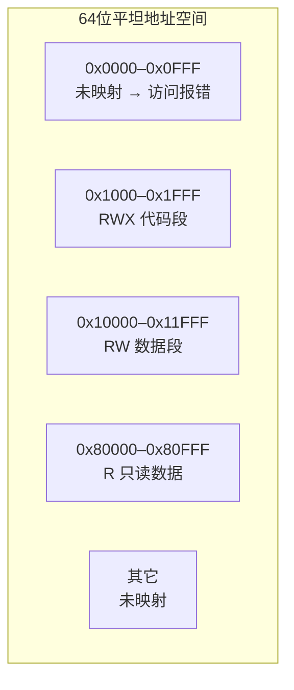
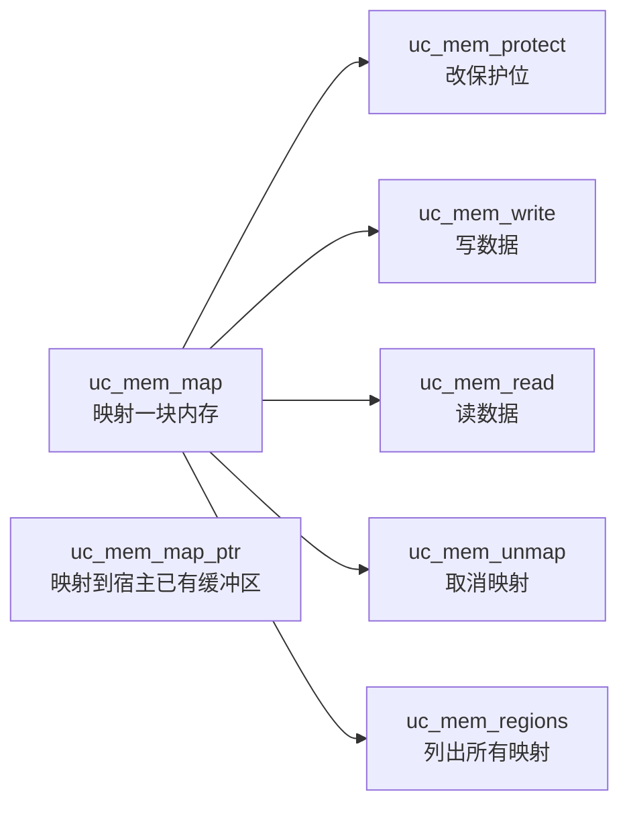
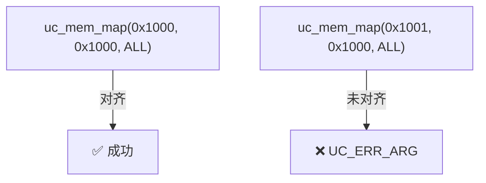
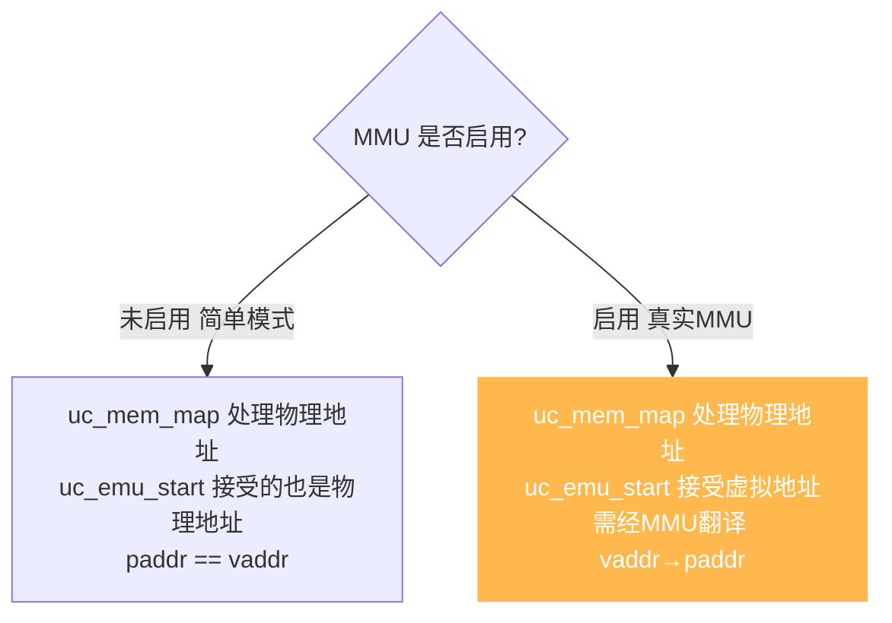
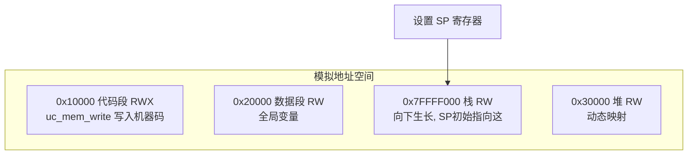
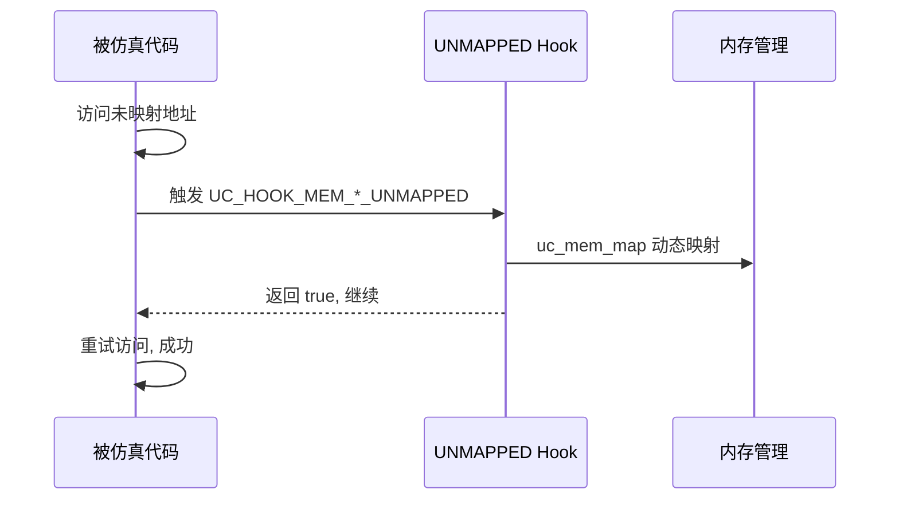
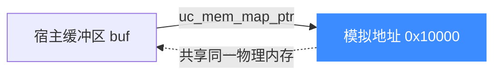

# 内存映射与管理

Unicorn 的内存不会凭空存在——你必须显式声明每一块。本页讲清内存映射 API、保护位、与 MMU 的关系，以及"物理地址 vs 虚拟地址"这个关键区分。

## 内存模型

Unicorn 模拟的是一块**裸芯片的物理内存**：地址空间是平铺的 64 位，你需要用 `uc_mem_map` 一块块"焊"上去。



访问任何**未映射**地址 → 触发 `UC_HOOK_MEM_*_UNMAPPED`；访问映射但**保护不允许**的地址 → 触发 `UC_HOOK_MEM_*_PROT`。

## 核心 API



| API | 作用 |
|-----|------|
| `uc_mem_map(addr, size, prot)` | 在 `addr` 映射 `size` 字节，权限 `prot` |
| `uc_mem_map_ptr(addr, size, prot, ptr)` | 同上，但底层用你提供的宿主指针（零拷贝共享） |
| `uc_mem_unmap(addr, size)` | 取消映射 |
| `uc_mem_protect(addr, size, prot)` | 修改已有映射的保护位 |
| `uc_mem_write(addr, bytes, size)` | 写入数据（不经过 Hook） |
| `uc_mem_read(addr, buf, size)` | 读取数据（不经过 Hook） |
| `uc_mem_regions(&regions, &count)` | 列出当前所有映射 |

::: tip mem_write/read 与 Hook
`uc_mem_write` / `uc_mem_read` 是**宿主侧**直接操作，**不会**触发 `UC_HOOK_MEM_*`。只有**被仿真代码**执行时的访存才触发内存 Hook。
:::

## 保护位

`prot` 是 `UC_PROT_*` 的按位或：

```mermaid
graph LR
    P[UC_PROT_*] --> R[UC_PROT_READ 可读]
    P --> W[UC_PROT_WRITE 可写]
    P --> X[UC_PROT_EXEC 可执行]
    P --> ALL[UC_PROT_ALL = R|W|X]
```

保护位模拟了真实 CPU 的页保护：写只读页触发 `UC_HOOK_MEM_WRITE_PROT`，执行不可执行页触发 `UC_HOOK_MEM_FETCH_PROT`。这是实现 W^X、代码段保护的基础。

## 对齐与大小要求

`uc_mem_map` 的 `addr` 和 `size` 必须**页对齐**（通常 4KB = `0x1000`）。未对齐会返回 `UC_ERR_ARG`。



## 物理地址 vs 虚拟地址

这是 Unicorn 2.x **最重要的概念之一**，也是新手最易踩的坑：



::: warning 关键差异
从 2.0.2 起，Unicorn 会按架构启用**真实 MMU**。此时：
- `uc_mem_map` 映射的是**物理地址**
- `uc_emu_start(begin, ...)` 的 `begin` 是**虚拟地址**
- 两者不再相等，必须配置好页表/TLB，否则会得到"奇怪的读写错误"（见 [FAQ](../guide/faq.md)）
:::

### 三种 TLB 模式

| 模式 | 行为 | 适用 |
|------|------|------|
| 默认（架构真实 MMU） | 完整模拟目标架构 MMU | 需要仿真真实虚拟内存系统 |
| `UC_TLB_VIRTUAL` | 实验性，跳过 MMU 细节，`paddr==vaddr` 简单映射 | 想要 v1 的简单行为、追求性能 |

切换到 `UC_TLB_VIRTUAL`：

```c
uc_ctl_tlb_mode(uc, UC_TLB_VIRTUAL);
```

并可挂 `UC_HOOK_TLB_FILL` 自定义 TLB 填充逻辑，用 `uc_ctl_flush_tlb` 刷新。详见 [MMU 与虚拟内存](./mmu.md)。

## 典型内存布局

一个常见的"加载并执行程序"场景，内存布局如下：



::: tip 栈要自己建
Unicorn 不预置栈。若你的代码用到栈（函数调用、push/pop），必须自己 `uc_mem_map` 一块并设置 SP 寄存器指向它。
:::

## 动态映射：按需分页

结合 `UC_HOOK_MEM_UNMAPPED`，可实现"访问到才映射"的按需分页（见 [第一个模拟程序](../guide/first-program.md)）：



## uc_mem_map_ptr：零拷贝共享

`uc_mem_map_ptr` 让模拟内存**直接映射到宿主进程的一块缓冲区**，双方共享同一份数据，无需 `uc_mem_read/write` 来回拷贝。适合大块数据的高效交互（如加载大固件镜像）。



## 常见陷阱

1. **忘记映射代码段** → `uc_emu_start` 取指时 `UC_HOOK_MEM_FETCH_UNMAPPED`。
2. **代码段不可执行** → 写了 `UC_PROT_READ|WRITE` 但漏了 `EXEC` → 取指失败。
3. **MIPS kseg 段** → 落在 kseg 的地址 MMU 旁路，须确保物理内存已映射（见 [FAQ](../guide/faq.md)）。
4. **MMU 启用后用 vaddr 去 mem_map** → 应该 map 物理地址。

## 📂 相关源码

| 文件 | 角色 |
|------|------|
| [`include/unicorn/unicorn.h`](https://github.com/android-security-engineer/unicorn-skills/blob/master/include/unicorn/unicorn.h#L1140) | `uc_mem_map` / `uc_mem_map_ptr` / `uc_mem_unmap` / `uc_mem_protect` / `uc_mem_regions` 声明 |
| [`include/unicorn/unicorn.h`](https://github.com/android-security-engineer/unicorn-skills/blob/master/include/unicorn/unicorn.h#L251) | `UC_PROT_READ/WRITE/EXEC/ALL` 权限位枚举 |
| [`uc.c`](https://github.com/android-security-engineer/unicorn-skills/blob/master/uc.c#L1390) | `uc_mem_map` 实现物理内存映射 |
| [`uc.c`](https://github.com/android-security-engineer/unicorn-skills/blob/master/uc.c#L1409) | `uc_mem_map_ptr` 零拷贝共享宿主缓冲区 |
| [`qemu/softmmu/memory.c`](https://github.com/android-security-engineer/unicorn-skills/blob/master/qemu/softmmu/memory.c) | 内存模型与页保护 dispatch |

---

下一节：[寄存器读写](./registers.md)。
