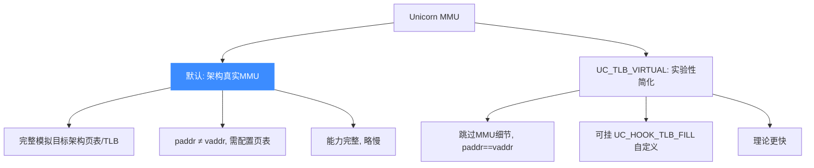
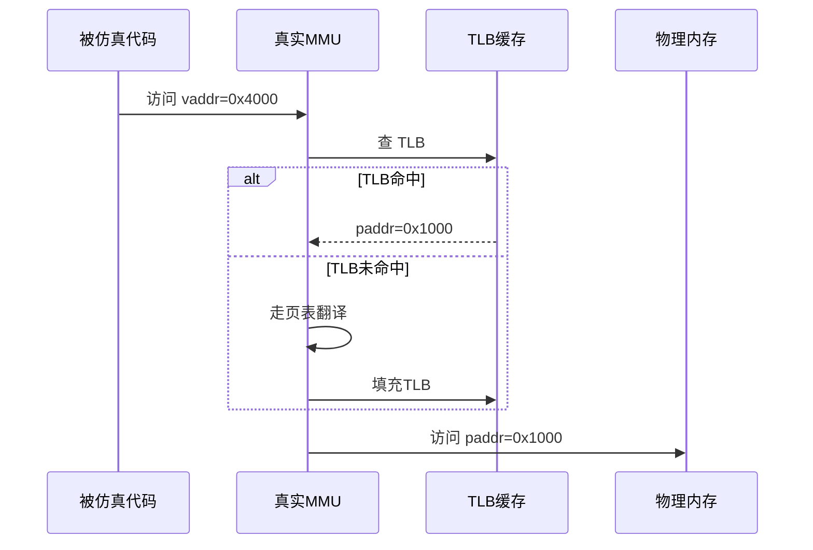
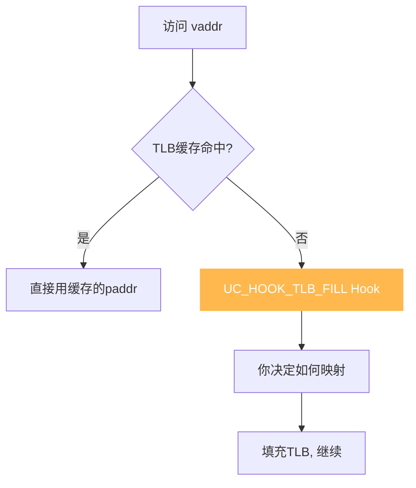
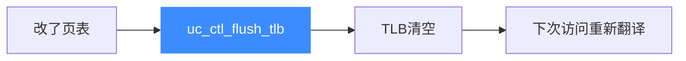
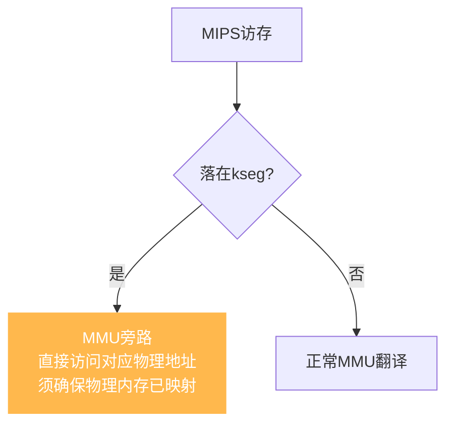
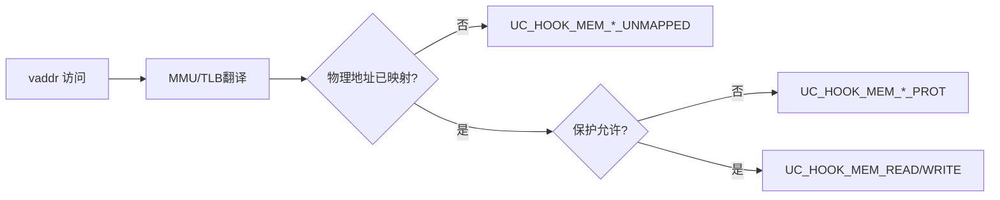
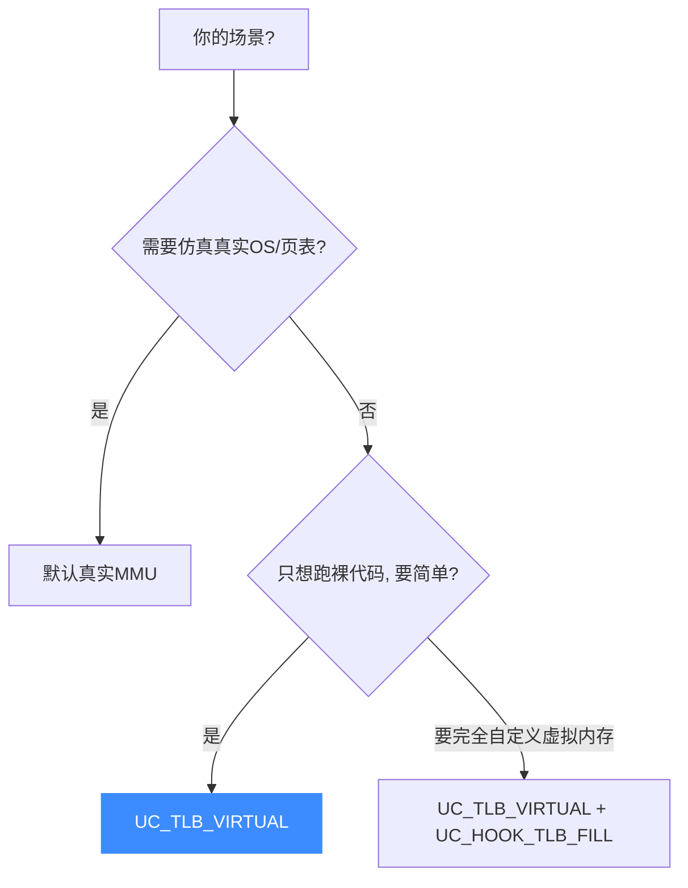
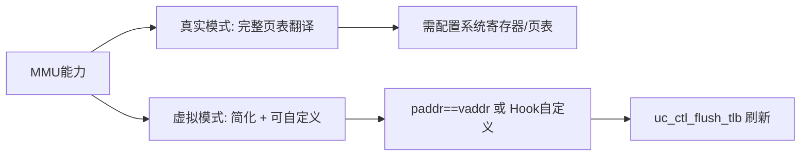

# MMU 与虚拟内存

从 2.0.2 起，Unicorn 提供了目标架构的**完整 MMU 实现**——这是它能仿真复杂操作系统、虚拟内存系统的关键。本页讲清 MMU 的工作机制、TLB 模式选择，以及物理/虚拟地址的翻译流程。

## 为什么需要 MMU

没有 MMU 时，Unicorn 是"扁平物理内存"：你 `uc_mem_map(0x1000, ...)`，代码访问 `0x1000` 就直接命中。但真实 CPU 有**虚拟地址**：

- 每个进程有自己的虚拟地址空间
- 虚拟地址经页表翻译成物理地址
- 不同虚拟地址可映射到同一物理页（共享内存）
- 页表带权限位，实现保护与隔离


启用 MMU 后，Unicorn 能忠实模拟这套机制。

## 两种模式



### 默认模式：真实 MMU

Unicorn 会按所选架构启用该架构**真实的 MMU 实现**（复用自 QEMU）。此时：

- `uc_mem_map` 处理**物理地址**
- `uc_emu_start(begin, ...)` 的 `begin` 是**虚拟地址**
- 你需要像真实 CPU 那样设置页表基址寄存器（如 x86 的 `CR3`、ARM 的 `TTBR`）



::: warning 必须检查 MMU 状态
启用真实 MMU 后，仿真前必须配置好架构特定的系统寄存器（CR0/CR3、TTBR、SATP 等）确认 MMU 已正确开启并指向有效页表，否则会得到"奇怪的读写错误"。
:::

### UC_TLB_VIRTUAL：简化模式

若你不需要真实页表，只想要 v1 那种 `paddr == vaddr` 的简单映射，可启用实验性 TLB 模式：

```c
uc_ctl_tlb_mode(uc, UC_TLB_VIRTUAL);
```

此模式下：

- 虚拟地址直接等于物理地址，跳过所有 MMU 细节
- 可挂 `UC_HOOK_TLB_FILL` 自定义 TLB 填充
- 理论上性能更好（未基准测试）

## TLB 与 UC_HOOK_TLB_FILL

TLB（Translation Lookaside Buffer）是页表项的缓存，避免每次访存都走完整页表。在 `UC_TLB_VIRTUAL` 模式下，当虚拟地址不在 TLB 缓存时，`UC_HOOK_TLB_FILL` 被调用：



这给了你**完全的虚拟内存控制权**——你可以实现自己的"页表"逻辑，按需把虚拟页映射到物理页。

## TLB 刷新

修改了页表后，必须刷新 TLB 让旧映射失效：

```c
uc_ctl_flush_tlb(uc);
```

否则 TLB 里缓存的旧翻译还在用，导致访问到错误的物理地址。



## MIPS kseg 段的特殊性

MIPS 架构有 `kseg` 段（如 `kseg0`、`kseg1`），访问这些地址时 **MMU 被旁路**——虚拟地址直接对应固定物理地址，不走页表。



::: warning 常见陷阱
若 MIPS 代码访问 kseg 段但对应物理内存未 `uc_mem_map`，会报错——且因为 MMU 旁路，你无法用 `UC_HOOK_MEM_UNMAPPED` 配合页表来"翻译"绕过。必须直接映射物理内存。详见 [FAQ](../guide/faq.md)。
:::

## 与内存 Hook 的交互

MMU 翻译后，访问最终落到物理内存。一次访存可能触发：



::: tip 访存可能被拆分
若地址**未对齐**，MMU 可能把一次访问拆成多次对齐访问，导致内存 Hook 对单条指令被调用多次（见 [FAQ](../guide/faq.md)）。`UC_TLB_VIRTUAL` 提供更细粒度的访存控制。
:::

## 选型建议



## 总结



MMU 是 Unicorn 从"指令仿真器"升级为"系统级仿真器"的关键能力。

## 📂 相关源码

| 文件 | 角色 |
|------|------|
| [`include/unicorn/unicorn.h`](https://github.com/android-security-engineer/unicorn-skills/blob/master/include/unicorn/unicorn.h#L536) | `uc_tlb_type` 枚举（`UC_TLB_CPU` / `UC_TLB_VIRTUAL`） |
| [`include/unicorn/unicorn.h`](https://github.com/android-security-engineer/unicorn-skills/blob/master/include/unicorn/unicorn.h#L599) | `UC_CTL_TLB_TYPE` / `UC_CTL_TLB_FLUSH` 控制项 |
| [`uc.c`](https://github.com/android-security-engineer/unicorn-skills/blob/master/uc.c#L1390) | `uc_mem_map` 映射**物理地址**内存 |
| [`qemu/softmmu/memory.c`](https://github.com/android-security-engineer/unicorn-skills/blob/master/qemu/softmmu/memory.c) | 内存模型与物理内存 dispatch |
| [`qemu/softmmu/unicorn_vtlb.c`](https://github.com/android-security-engineer/unicorn-skills/blob/master/qemu/softmmu/unicorn_vtlb.c) | `UC_TLB_VIRTUAL` 模式的虚拟 TLB 实现 |
| [`qemu/target/<arch>/`](https://github.com/android-security-engineer/unicorn-skills/blob/master/qemu/target) | 各架构真实 MMU/页表翻译代码 |

---

下一节：[批量 API](./batch-api.md)。
