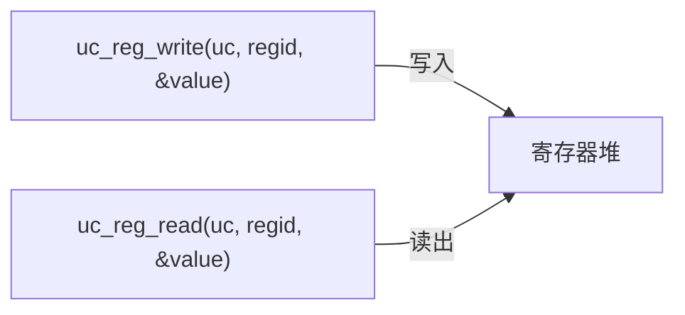
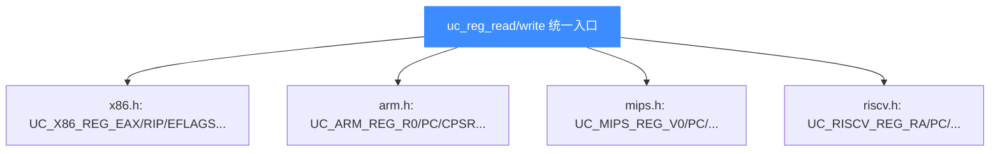
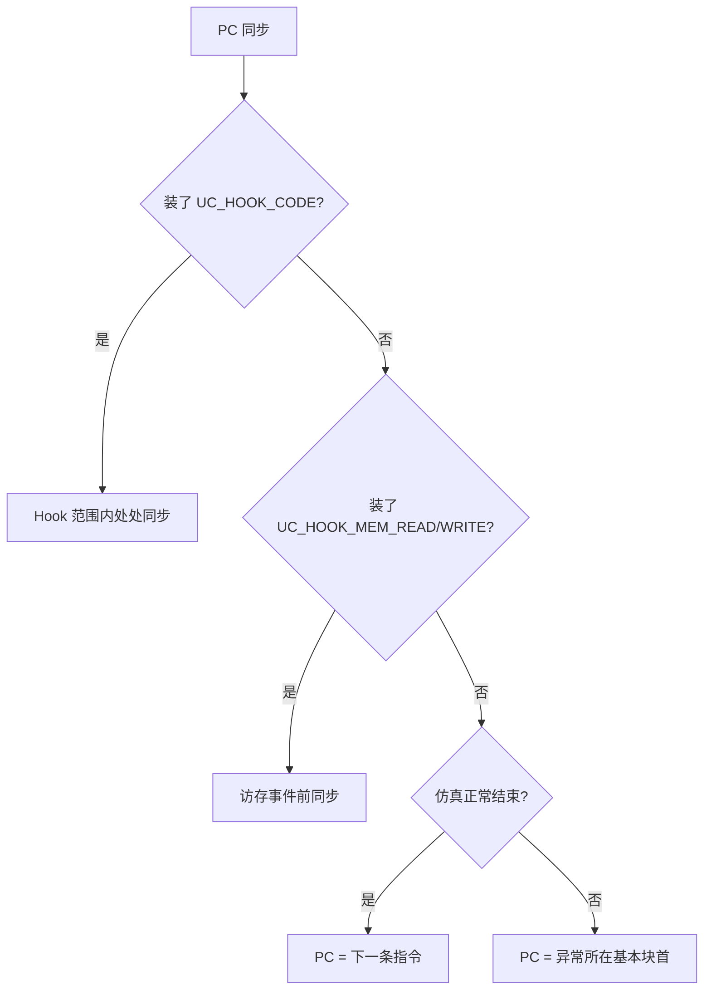
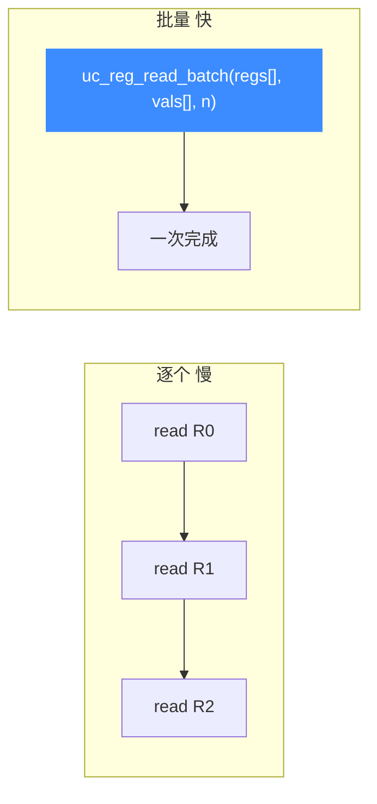
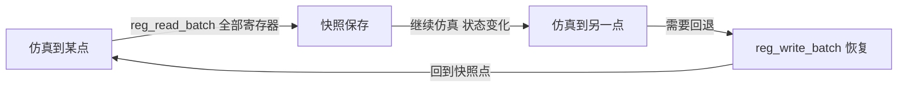
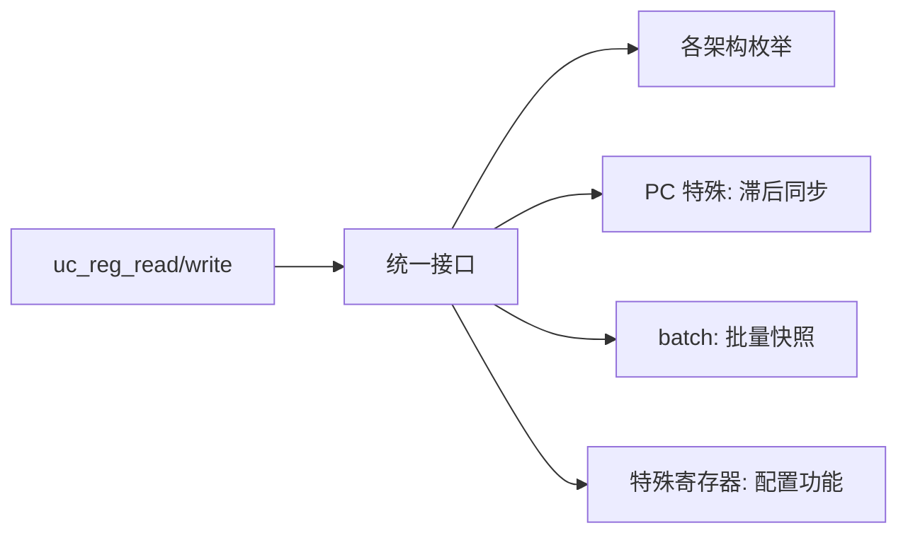

# 寄存器读写

寄存器是 CPU 的"手"。Unicorn 用统一接口读写所有架构的寄存器，差异封装在枚举与架构后端里。本页讲清基本用法、PC 同步的微妙之处、以及批量 API。

## 统一接口

无论什么架构，读写寄存器永远是这两步：



`regid` 是个 `int`，取值在各架构头文件定义：



## 基本用法（C）

```c
int val = 0x42;
uc_reg_write(uc, UC_X86_REG_ECX, &val);   // 写 ECX = 0x42

uc_reg_read(uc, UC_X86_REG_ECX, &val);    // 读 ECX 到 val
```

注意：`value` 参数是**指针**，指向的整数宽度须与寄存器匹配（32 位寄存器用 `int`/`uint32_t`，64 位用 `uint64_t`）。

## Python 等绑定更直观

```python
mu.reg_write(UC_X86_REG_ECX, 0x42)
val = mu.reg_read(UC_X86_REG_ECX)   # 直接返回值, 无需预声明
```

## PC（程序计数器）的特殊性

PC 是最特殊的寄存器——它是仿真循环的"游标"。但 Unicorn **不会每条指令都同步 PC**，这是为性能刻意为之。



::: warning 为什么 PC 可能"滞后"
若没装 CODE/MEM Hook 且仿真异常停止，PC 会停在**异常所在基本块的第一条指令**，而非真正出错的指令。因为同步只在基本块边界发生。

```
mov x0, #1   <--- PC 停在这（块首）
mov x1, #2
ldr x0,[x1]  <--- 异常实际发生在这
```
:::

详见 [FAQ · PC 不对](../guide/faq.md)。2.1.4+ 版本已改善此问题。

## 写 PC 的副作用

`uc_reg_write` 写 PC 会**改变下一条要执行的指令地址**。这可用于：

- 实现跳转（在 Hook 里改 PC 实现自定义分支）
- 重启当前块翻译（配合 `uc_ctl_remove_cache` 处理自修改代码，见 [FAQ](../guide/faq.md)）


## 寄存器宽度与 reg_read2/write2

不同寄存器宽度不同（x86 的 AL 是 8 位，RAX 是 64 位）。`uc_reg_read2` / `uc_reg_write2` 额外接受 `size` 参数，显式指定读写宽度，避免类型不匹配：

```c
size_t size = sizeof(uint64_t);
uc_reg_write2(uc, UC_X86_REG_RAX, &val, &size);
```

::: tip v2 变体一览
带 `size` 的「2 系列」函数共 8 个，单寄存器与批量、引擎侧与上下文侧各成对：

| 场景 | 引擎侧 | 上下文侧 |
|------|--------|---------|
| 单个读 | [uc_reg_read2](/api/reg-read2) | [uc_context_reg_read2](/api/context-reg-read2) |
| 单个写 | [uc_reg_write2](/api/reg-write2) | [uc_context_reg_write2](/api/context-reg-write2) |
| 批量读 | [uc_reg_read_batch2](/api/reg-read-batch2) | [uc_context_reg_read_batch2](/api/context-reg-read-batch2) |
| 批量写 | [uc_reg_write_batch2](/api/reg-write-batch2) | [uc_context_reg_write_batch2](/api/context-reg-write-batch2) |
:::

## 批量读写

逐个读写寄存器每次都是一次函数调用开销。批量 API 一次性处理多个寄存器，适合需要快照/恢复完整状态的场景：



```c
int regs[] = {UC_X86_REG_EAX, UC_X86_REG_EBX, UC_X86_REG_ECX};
void *vals[3];
uc_reg_read_batch(uc, regs, vals, 3);
```

### 典型用途：上下文快照



详见 [批量 API](./batch-api.md) 与 [上下文控制](./context.md)。

## 特殊寄存器

除通用寄存器外，各架构还有大量特殊寄存器，Unicorn 同样支持：

| 架构 | 特殊寄存器示例 | 用途 |
|------|--------------|------|
| x86 | `EFLAGS`、段寄存器、`CR0/CR3` | 标志位、分段、分页 |
| ARM | `CPSR`、`VFP`、协处理器 | 模式、浮点、系统控制 |
| RISC-V | `CSR`（如 `mstatus`） | 特权级、中断使能 |

::: tip 浮点/向量指令需先配置
仿真 ARM VFP 或 RISC-V 浮点指令前，须先设置对应特殊寄存器开启功能，否则报 "Invalid Instruction"（见 [FAQ](../guide/faq.md)）。
:::

## ARM64 系统寄存器写法

ARM64 的系统寄存器（如 `SCR_EL3`）用 `uc_arm64_cp_reg` 结构按字段定位：

```c
uc_arm64_cp_reg reg;
reg.op0 = 0b11; reg.op1 = 0b110;
reg.crn = 0b0001; reg.crm = 0b0001; reg.op2 = 0b000;
// 对应 SCR_EL3
uc_reg_write(uc, UC_ARM64_REG_CP_REG, &reg);
```

这是启用 ARM PAC（指针认证）等高级特性的入口。

## 总结



## 📂 相关源码

| 文件 | 角色 |
|------|------|
| [`include/unicorn/unicorn.h`](https://github.com/android-security-engineer/unicorn-skills/blob/master/include/unicorn/unicorn.h#L812) | `uc_reg_read` / `uc_reg_write` / `uc_reg_read2` / `uc_reg_write2` / 批量 API 声明 |
| [`uc.c`](https://github.com/android-security-engineer/unicorn-skills/blob/master/uc.c#L687) | 寄存器读写实现（分发到架构 `reg_read/reg_write`） |
| [`include/unicorn/x86.h`](https://github.com/android-security-engineer/unicorn-skills/blob/master/include/unicorn/x86.h) | `UC_X86_REG_*` 枚举 |
| [`include/unicorn/arm.h`](https://github.com/android-security-engineer/unicorn-skills/blob/master/include/unicorn/arm.h) | `UC_ARM_REG_*` 枚举 |
| [`include/unicorn/mips.h`](https://github.com/android-security-engineer/unicorn-skills/blob/master/include/unicorn/mips.h) | `UC_MIPS_REG_*` 枚举 |
| [`include/unicorn/riscv.h`](https://github.com/android-security-engineer/unicorn-skills/blob/master/include/unicorn/riscv.h) | `UC_RISCV_REG_*` 枚举 |

---

下一节：[MMU 与虚拟内存](./mmu.md)。
