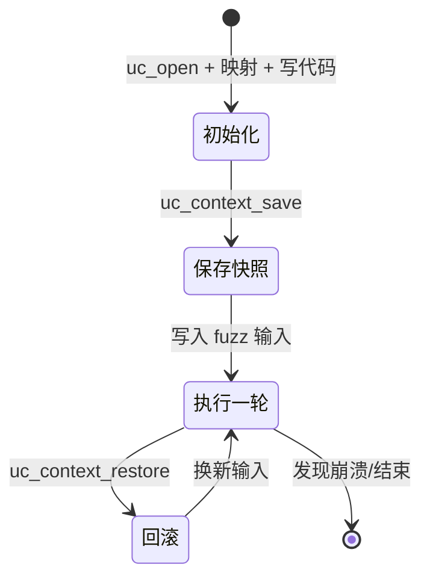
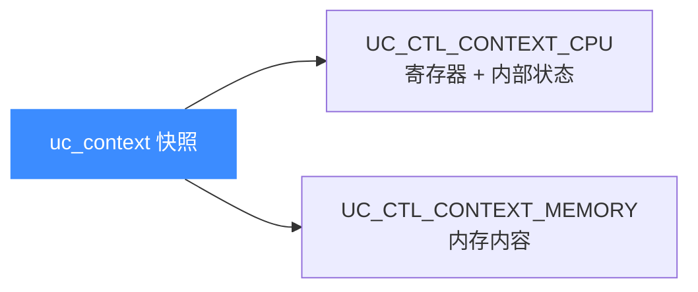
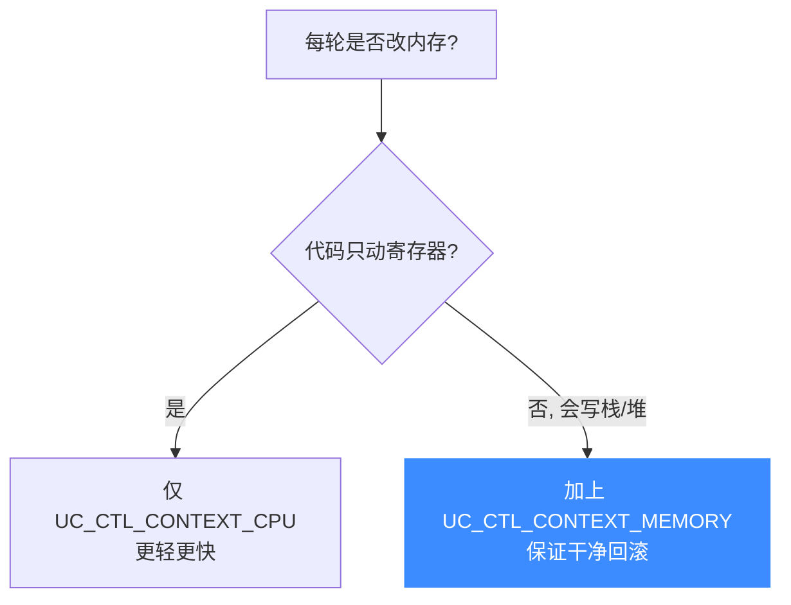

# 快照与回滚

本页讲清如何用 `uc_context` 保存/恢复 CPU 状态，再配合 `UC_CTL_CONTEXT_MEMORY` 把**内存**也纳入快照，从而实现 fuzzing 里最常见的"跑一轮、回滚、换输入重来"循环。读完你能搭出一个高效的状态回滚框架。

## 🎯 为什么需要快照

模糊测试（fuzzing）和符号执行的核心循环是：**从同一个起点，反复用不同输入跑同一段代码**。如果每轮都 `uc_open` + 重映射内存 + 重写代码，开销高到不可接受。快照让你在起点保存一次，之后每轮只需**恢复**——毫秒级回到原点。



## 🧠 两个层次：CPU 状态 vs 内存

`uc_context` 默认只保存 **CPU 状态**（寄存器 + 内部元数据）。但一轮仿真往往会**改内存**——栈、堆、全局变量。要真正"干净地回到原点"，必须让快照也覆盖内存。这由 `uc_ctl_context_mode` 控制，取值是 `uc_context_content` 位掩码（定义见 [`unicorn.h`](https://github.com/android-security-engineer/unicorn-skills/blob/master/include/unicorn/unicorn.h#L1116)）：

```c
typedef enum uc_context_content {
    UC_CTL_CONTEXT_CPU    = 1,  // 仅 CPU 状态（默认）
    UC_CTL_CONTEXT_MEMORY = 2,  // 额外纳入内存快照
} uc_context_content;
```

两者可**按位或**组合，同时保存 CPU 与内存：

```c
uc_ctl_context_mode(uc, UC_CTL_CONTEXT_CPU | UC_CTL_CONTEXT_MEMORY);
```



::: danger 内存快照绑定单个引擎
头文件警告：`UC_CTL_CONTEXT_MEMORY` 会在上下文里存放**指向引擎内部分配内存的指针**，因此这种上下文**不能跨 `uc_engine` 使用**。只保存 CPU 状态的上下文（默认）才可能在同架构/模式的引擎间迁移。
:::

## 🔧 核心 API 回顾

| API | 作用 |
|-----|------|
| `uc_context_alloc(uc, &ctx)` | 分配上下文容器 |
| `uc_context_save(uc, ctx)` | 存入当前状态（含内存，若已开启该模式） |
| `uc_context_restore(uc, ctx)` | 恢复到保存时状态 |
| `uc_context_free(ctx)` | 释放容器（**勿用** `uc_free`） |
| `uc_ctl_context_mode(uc, m)` | 设定快照内容范围 |

## 📌 完整 fuzzing 回滚循环

```c
uc_engine *uc;
uc_open(UC_ARCH_X86, UC_MODE_64, &uc);
uc_mem_map(uc, 0x1000, 0x1000, UC_PROT_ALL);  // 代码
uc_mem_map(uc, 0x2000, 0x1000, UC_PROT_ALL);  // 数据/栈
uc_mem_write(uc, 0x1000, code, code_len);

// 关键：让快照同时覆盖 CPU 与内存
uc_ctl_context_mode(uc, UC_CTL_CONTEXT_CPU | UC_CTL_CONTEXT_MEMORY);

uc_context *snap;
uc_context_alloc(uc, &snap);
uc_context_save(uc, snap);                    // 保存干净起点

for (int i = 0; i < N; i++) {
    // 1) 回滚到起点（首轮其实无需回，但统一处理更简洁）
    uc_context_restore(uc, snap);

    // 2) 注入本轮 fuzz 输入到数据区
    uc_mem_write(uc, 0x2000, inputs[i], input_len);

    // 3) 跑一轮，带超时防死循环
    uc_err err = uc_emu_start(uc, 0x1000, 0, 1 * UC_SECOND_SCALE, 0);
    if (err == UC_ERR_WRITE_UNMAPPED || err == UC_ERR_FETCH_UNMAPPED) {
        printf("[crash] input #%d 触发非法访存\n", i);
    }
}

uc_context_free(snap);
uc_close(uc);
```

::: tip 为何快照回滚快于重开引擎
`uc_context_restore` 只是把已分配好的状态拷回引擎，省去了 `uc_open` 的初始化、`uc_mem_map` 的重映射、`uc_mem_write` 的重载代码。在动辄百万次迭代的 fuzzing 里，这个差距是数量级的。
:::

## ⚖️ 只存 CPU 还是连内存一起存



::: warning 不存内存的隐蔽 bug
若代码会写内存却只用默认的 CPU 快照，回滚后**寄存器是干净的、内存却带着上一轮的脏数据**。这种"半回滚"会让 fuzzing 结果不可复现，排查极其痛苦。改内存就一定要开 `UC_CTL_CONTEXT_MEMORY`。
:::

## 📂 相关源码

| 文件 | 角色 |
|------|------|
| [`include/unicorn/unicorn.h`](https://github.com/android-security-engineer/unicorn-skills/blob/master/include/unicorn/unicorn.h#L1116) | `uc_context_content` 枚举、`UC_CTL_CONTEXT_MODE` 控制项 |
| [`uc.c`](https://github.com/android-security-engineer/unicorn-skills/blob/master/uc.c#L2277) | `uc_context_save` / `uc_context_restore` 实现 |
| [`uc.c`](https://github.com/android-security-engineer/unicorn-skills/blob/master/uc.c#L2234) | `uc_context_alloc` / `uc_context_free` 实现 |
| [`tests/benchmarks/cow/`](https://github.com/android-security-engineer/unicorn-skills/blob/master/tests/benchmarks/cow) | 写时复制快照基准测试 |

## 相关页面

- [上下文控制](/features/context) — uc_context 机制详解
- [写时复制快照](/memory/cow-snapshot) — 内存层面的快照实现
- [uc_ctl 上下文模式](/ctl/context-mode) — CONTEXT_MODE 控制项
