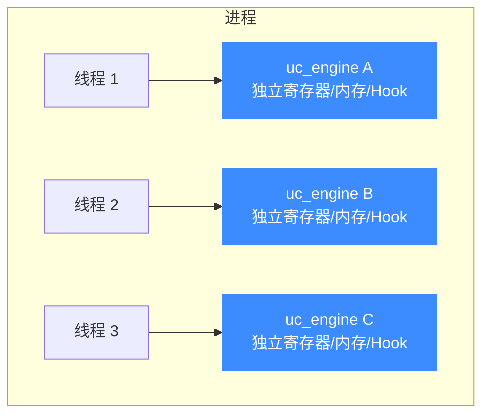
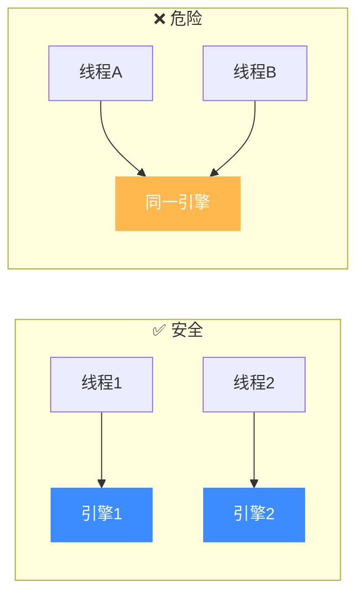

# 线程安全设计

本页讲清 Unicorn 的并发模型：为什么每个 `uc_engine` 是独立的、引擎间没有共享全局状态，以及如何用"一线程一实例"的方式安全地并发仿真。读完你能放心地在多线程 fuzzer 里横向扩展。

## 🧩 核心原则：一实例一状态

Unicorn 的设计哲学是**把所有状态封装在 `uc_engine` 句柄里**。`uc_open` 返回的 `uc_engine *` 是一个自包含的世界——它自己的寄存器、内存映射、Hook 链表、TB 缓存、上下文，都挂在这个句柄下，**不依赖进程级全局变量**。



这意味着：**不同线程各持一个独立的 `uc_engine`，就能天然并发仿真**，彼此互不干扰，无需加锁。这正是多线程 fuzzing 横向扩展的基础。

## ✅ 安全模式：每线程一个引擎

```c
#include <pthread.h>
#include <unicorn/unicorn.h>

// 每个线程独立开引擎、独立跑，互不共享句柄
static void *worker(void *arg)
{
    uc_engine *uc;
    uc_open(UC_ARCH_X86, UC_MODE_64, &uc);   // 本线程私有实例
    uc_mem_map(uc, 0x1000, 0x1000, UC_PROT_ALL);
    uc_mem_write(uc, 0x1000, code, code_len);

    uc_emu_start(uc, 0x1000, 0, 1 * UC_SECOND_SCALE, 0);

    uc_close(uc);                            // 谁开的谁关
    return NULL;
}

int main(void)
{
    pthread_t th[8];
    for (int i = 0; i < 8; i++)
        pthread_create(&th[i], NULL, worker, NULL);
    for (int i = 0; i < 8; i++)
        pthread_join(th[i], NULL);
    return 0;
}
```

::: tip 无全局状态 = 线性扩展
因为引擎之间不共享全局状态，8 个线程跑 8 个引擎，几乎可以获得接近线性的吞吐提升——这是 Unicorn 作为 fuzzing 后端广受欢迎的关键原因。
:::

## ⚠️ 真正的红线：一个引擎不要多线程同时用

线程安全的边界很清晰：**引擎之间安全，单个引擎内部不是为并发访问设计的**。



::: danger 不要跨线程共享同一个 uc_engine
让两个线程同时对**同一个** `uc_engine` 调用 API（一个在 `uc_emu_start`、另一个在 `uc_mem_write`），会产生数据竞争，行为未定义。若确实需要从另一线程干预正在运行的引擎，唯一被明确支持的操作是在**回调内**或通过精心同步来调用——最稳妥的做法仍是"一引擎一线程"。
:::

## 🔧 需要跨线程停止怎么办

常见需求：主线程想让某个 worker 引擎停下来。`uc_emu_stop` 通常在**该引擎自己的 Hook 回调里**调用最安全。若要从外部打断，更稳的方式是给仿真设置 [`timeout`](/features/timeout)，让它自己到点退出，而不是从别的线程强行操作句柄。

| 需求 | 推荐做法 |
|------|---------|
| 防止 worker 跑太久 | 用 `uc_emu_start` 的 `timeout` 参数 |
| 满足条件时停机 | 在本引擎的 `UC_HOOK_CODE` 回调里 `uc_emu_stop` |
| 多路并发仿真 | 每线程一个 `uc_open` 出来的独立引擎 |

## 📌 上下文与并发的配合

[快照/上下文](/features/context) 里只含 CPU 状态的 `uc_context` 可用于同架构/模式引擎间迁移状态；但**含内存的上下文**（`UC_CTL_CONTEXT_MEMORY`）绑定单个引擎，**不可**在线程间共享引擎的前提下混用。并发场景里，让每个线程管理自己的上下文最清晰。

## 📂 相关源码

| 文件 | 角色 |
|------|------|
| [`include/unicorn/unicorn.h`](https://github.com/android-security-engineer/unicorn-skills/blob/master/include/unicorn/unicorn.h#L735) | `uc_open` / `uc_close` 声明，引擎实例生命周期 |
| [`include/uc_priv.h`](https://github.com/android-security-engineer/unicorn-skills/blob/master/include/uc_priv.h) | `uc_struct` 把全部状态封装在句柄内 |
| [`uc.c`](https://github.com/android-security-engineer/unicorn-skills/blob/master/uc.c#L310) | `uc_open` 初始化引擎、无进程级全局可变状态 |
| [`tests/regress/threaded_emu_start.c`](https://github.com/android-security-engineer/unicorn-skills/blob/master/tests/regress/threaded_emu_start.c) | 多线程 `uc_emu_start` 回归测试 |

## 相关页面

- [uc_open](/api/open) — 创建引擎实例
- [超时与指令计数](/features/timeout) — 用超时安全打断仿真
- [上下文控制](/features/context) — 状态保存与迁移
