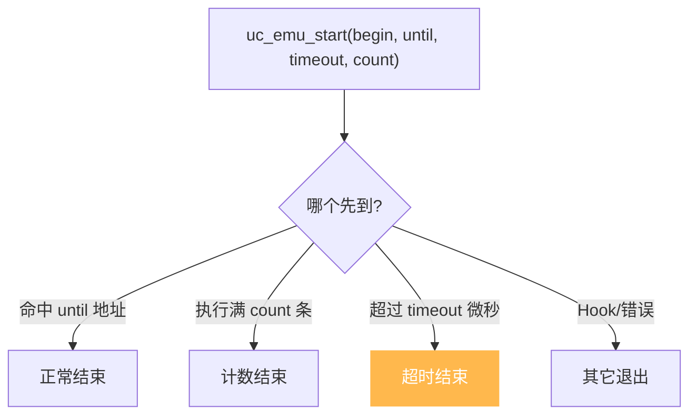
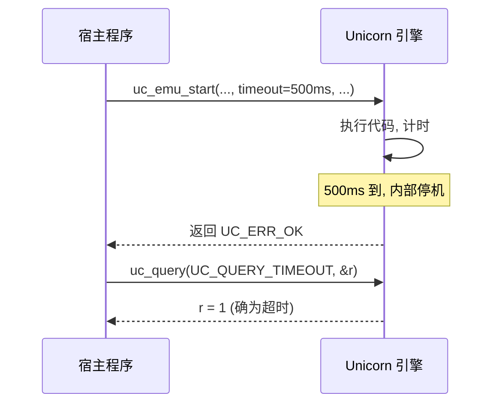

# 超时与指令计数

本页讲清 `uc_emu_start` 的两个"刹车"参数——`timeout`（微秒级超时）与 `count`（指令数上限），以及如何用 `UC_QUERY_TIMEOUT` 判断仿真到底是不是因超时而退出。读完你能安全地仿真"可能死循环"的不可信代码。

## ⏱️ 两道保险

`uc_emu_start` 的完整签名（见 [`unicorn.h`](https://github.com/android-security-engineer/unicorn-skills/blob/master/include/unicorn/unicorn.h#L1047)）：

```c
uc_err uc_emu_start(uc_engine *uc, uint64_t begin, uint64_t until,
                    uint64_t timeout, size_t count);
```

后两个参数就是防止仿真"跑飞"的保险：

| 参数 | 单位 | 含义 | 取 0 时 |
|------|------|------|---------|
| `timeout` | **微秒** | 最长仿真时长，到点即停 | 无限时长，直到代码自然结束 |
| `count` | 条 | 最多执行的指令数 | 不限指令数 |

::: warning timeout 是微秒，不是毫秒
`1` 秒 = `1000000` 微秒。头文件提供了换算常量 `UC_SECOND_SCALE`（值为 1000000）。想设 2 秒就写 `2 * UC_SECOND_SCALE`。写错单位是新手最常见的坑。
:::



## 🎯 单步与限次执行

`count` 最实用的场景是**单步**：把它设为 `1`，一次只执行一条指令，非常适合做调试器或指令级追踪的驱动循环。

```c
// 单步执行 10 条指令，每步之间读寄存器观察
uint64_t pc = 0x1000;
for (int i = 0; i < 10; i++) {
    uc_err err = uc_emu_start(uc, pc, 0, 0, 1); // count = 1
    if (err) break;
    uc_reg_read(uc, UC_X86_REG_EIP, &pc);       // 取新 PC 作下一步起点
    printf("step %d: pc=0x%" PRIx64 "\n", i, pc);
}
```

::: tip 单步 vs UC_HOOK_CODE
两种"逐指令"手段：`count=1` 循环由**宿主主导**节奏，逻辑清晰但每次重启有固定开销；[`UC_HOOK_CODE`](/features/hooks) 由**引擎主导**、在回调里观察，吞吐更高。要精确掌控每步之间的状态、按需暂停，用 `count=1`。
:::

## 🔍 判断是否超时：UC_QUERY_TIMEOUT

超时退出时，`uc_emu_start` 返回的是 `UC_ERR_OK`——因为"超时"是一种**受控的正常停止**，不是错误。那怎么区分"代码正常跑完"和"被超时打断"？用 `uc_query`：

```c
uc_err uc_query(uc_engine *uc, uc_query_type type, size_t *result);
```

传入 `UC_QUERY_TIMEOUT`，若 `result` 为真则本次是超时退出。

```c
uc_emu_start(uc, ADDRESS, 0, 500 * 1000, 0);  // 最多跑 500ms

size_t timed_out = 0;
uc_query(uc, UC_QUERY_TIMEOUT, &timed_out);
if (timed_out) {
    printf("仿真因超时被中止\n");
} else {
    printf("代码正常结束\n");
}
```



## 🧩 其它可查询项

`uc_query` 不止查超时，`uc_query_type` 枚举还包括：

| 查询类型 | 返回内容 |
|----------|---------|
| `UC_QUERY_MODE` | 当前硬件 mode（ARM 用于判断 Thumb） |
| `UC_QUERY_PAGE_SIZE` | 引擎页大小 |
| `UC_QUERY_ARCH` | 引擎架构 |
| `UC_QUERY_TIMEOUT` | 上次是否因超时退出（真/假） |

## ⚠️ 组合使用与沙箱

`timeout` 与 `count` 可**同时**设置——谁先到谁生效。仿真不可信代码时，二者叠加是常见的沙箱模式：既防"墙钟太久"，又防"指令太多"。

```c
// 沙箱：最多 1 秒、最多 100 万条指令，任一触顶即停
uc_emu_start(uc, entry, 0, 1 * UC_SECOND_SCALE, 1000000);
```

::: danger 别只靠 until 防死循环
若被仿真代码可能死循环，仅给 `until` 是不够的——它可能永远到不了那个地址。**务必**配上 `timeout` 或 `count` 作为硬性上界。
:::

## 📂 相关源码

| 文件 | 角色 |
|------|------|
| [`include/unicorn/unicorn.h`](https://github.com/android-security-engineer/unicorn-skills/blob/master/include/unicorn/unicorn.h#L1047) | `uc_emu_start` / `uc_query` 声明、`UC_QUERY_TIMEOUT` 枚举、`UC_SECOND_SCALE` 宏 |
| [`uc.c`](https://github.com/android-security-engineer/unicorn-skills/blob/master/uc.c#L1076) | `uc_emu_start` 处理 `timeout`/`count` 计时与退出 |
| [`uc.c`](https://github.com/android-security-engineer/unicorn-skills/blob/master/uc.c#L2199) | `uc_query` 实现超时标志查询 |

## 相关页面

- [uc_emu_start](/api/emu-start) — 仿真入口函数参考
- [uc_query](/api/query) — 引擎状态查询
- [多出口机制](/features/exits) — 用多个地址控制停止点
