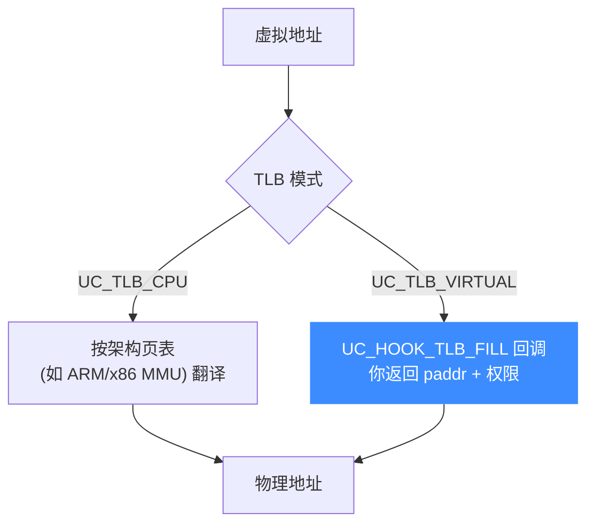
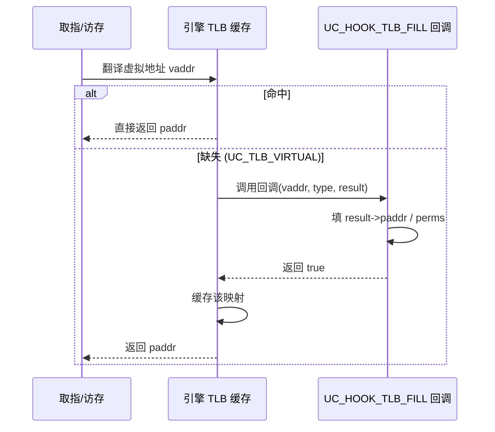

# TLB 模式

本页讲清 Unicorn 的两种 TLB（地址翻译）实现：`UC_TLB_CPU`（架构自带页表）与 `UC_TLB_VIRTUAL`（用 `UC_HOOK_TLB_FILL` 自定义翻译）。读完你能按场景选对 TLB 模式，并知道自定义虚拟内存翻译该怎么做。

## 🧩 什么是 TLB 模式

TLB（Translation Lookaside Buffer）是虚拟地址→物理地址翻译的缓存。Unicorn 允许你**选择由谁来做翻译**：交给被模拟 CPU 的架构页表机制，还是交给你自己的回调。切换用 `uc_ctl_tlb_mode`（底层 `UC_CTL_TLB_TYPE`），取值来自 `uc_tlb_type` 枚举（定义见 [`unicorn.h`](https://github.com/android-security-engineer/unicorn-skills/blob/master/include/unicorn/unicorn.h#L536)）：

```c
typedef enum uc_tlb_type {
    UC_TLB_CPU = 0,   // CPU 自带 TLB 实现，适合全系统模拟
    UC_TLB_VIRTUAL    // 默认虚拟地址==物理地址，可用 Hook 覆盖翻译
} uc_tlb_type;
```



## 📋 两种模式对比

| 维度 | `UC_TLB_CPU` | `UC_TLB_VIRTUAL` |
|------|--------------|------------------|
| 翻译来源 | 被模拟 CPU 的**架构页表 / MMU** | 你的 **`UC_HOOK_TLB_FILL` 回调** |
| 默认映射 | 依页表配置 | 虚拟地址 == 物理地址（未 Hook 时） |
| 适用场景 | **全系统模拟**：想忠实复现真实 MMU 行为 | 自定义/简化的虚拟内存，快速搭建地址空间 |
| 控制粒度 | 由 guest 页表决定 | 每次 TLB 缺失都能编程干预，粒度最细 |
| 复杂度 | 需正确设置 guest 页表 | 需自己写翻译逻辑，但更灵活 |

::: tip 默认与切换
`uc_ctl_tlb_mode(uc, UC_TLB_VIRTUAL)` 或 `uc_ctl_tlb_mode(uc, UC_TLB_CPU)` 即可切换。选 `UC_TLB_VIRTUAL` 后若不注册任何 `UC_HOOK_TLB_FILL`，翻译退化为"虚拟地址直接当物理地址用"。
:::

## 🪝 UC_TLB_VIRTUAL：自定义翻译

选虚拟模式后，注册 [`UC_HOOK_TLB_FILL`](/hooks/tlb-fill)。每当某个虚拟页在 TLB 里找不到，引擎就调用你的回调，让你**填入该页的物理地址与权限**。回调签名（见 [`unicorn.h`](https://github.com/android-security-engineer/unicorn-skills/blob/master/include/unicorn/unicorn.h#L289)）：

```c
typedef bool (*uc_cb_tlbevent_t)(uc_engine *uc, uint64_t vaddr,
                                 uc_mem_type type, uc_tlb_entry *result,
                                 void *user_data);
```

`result` 是一个 `uc_tlb_entry`，你需要填写：

```c
struct uc_tlb_entry {
    uint64_t paddr;   // 该虚拟页对应的物理地址
    uc_prot  perms;   // 允许的访问权限 (UC_PROT_READ/WRITE/EXEC)
};
```

::: warning 返回值决定成败
回调返回 `true` 表示"找到了这条映射"；若存在回调但**没有任何一个返回 true**，引擎会产生一次缺页（pagefault）。这是头文件明确规定的语义。
:::

```c
// 一个极简的"高位掩掉"翻译：把 vaddr 低 12 位保留、其余按固定基址映射
static bool tlb_fill(uc_engine *uc, uint64_t vaddr, uc_mem_type type,
                     uc_tlb_entry *result, void *user_data)
{
    result->paddr = vaddr & 0xfffff000;   // 页对齐的物理页
    result->perms = UC_PROT_READ | UC_PROT_EXEC;
    return true;                          // 表示已成功翻译
}

// 启用虚拟 TLB 并挂上翻译回调
uc_ctl_tlb_mode(uc, UC_TLB_VIRTUAL);
uc_hook h;
uc_hook_add(uc, &h, UC_HOOK_TLB_FILL, tlb_fill, NULL, 1, 0);
```

## ⏱️ 一次 TLB 缺失的时序



## 🔧 相关控制项

| 便捷宏 | 作用 |
|--------|------|
| `uc_ctl_tlb_mode(uc, mode)` | 切换 `UC_TLB_CPU` / `UC_TLB_VIRTUAL` |
| `uc_ctl_flush_tlb(uc)` | 刷新全部 TLB 缓存条目（改了映射后调用） |

::: tip 改了翻译要刷新
如果你在运行中改变了自定义翻译逻辑（比如换了页表基址），已缓存的旧映射不会自动失效，需 `uc_ctl_flush_tlb(uc)` 清掉。
:::

## 📂 相关源码

| 文件 | 角色 |
|------|------|
| [`include/unicorn/unicorn.h`](https://github.com/android-security-engineer/unicorn-skills/blob/master/include/unicorn/unicorn.h#L536) | `uc_tlb_type` 枚举、`uc_cb_tlbevent_t` 回调签名、`UC_HOOK_TLB_FILL` |
| [`include/unicorn/unicorn.h`](https://github.com/android-security-engineer/unicorn-skills/blob/master/include/unicorn/unicorn.h#L599) | `UC_CTL_TLB_TYPE` / `UC_CTL_TLB_FLUSH` 控制项 |
| [`uc.c`](https://github.com/android-security-engineer/unicorn-skills/blob/master/uc.c#L2623) | `uc_ctl` 分发 TLB 模式切换与刷新 |
| [`qemu/softmmu/`](https://github.com/android-security-engineer/unicorn-skills/blob/master/qemu/softmmu) | 软件内存管理单元、TLB 缓存实现 |

## 相关页面

- [uc_ctl_tlb_mode](/ctl/tlb-mode) — TLB 模式控制项参考
- [UC_HOOK_TLB_FILL](/hooks/tlb-fill) — TLB 填充 Hook
- [MMU 与虚拟内存](/features/mmu) — 虚拟内存整体机制
