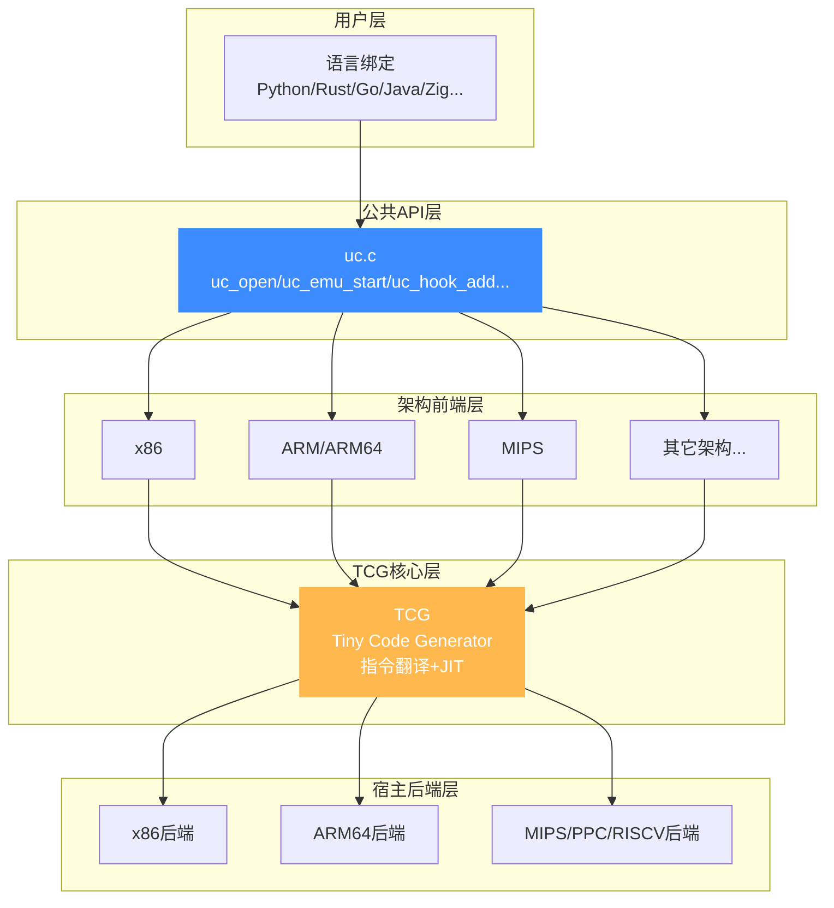
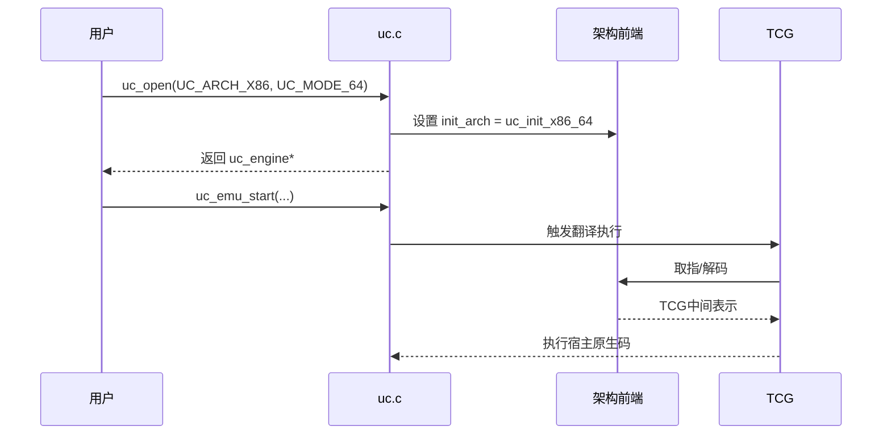
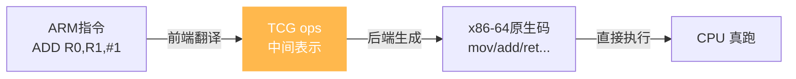
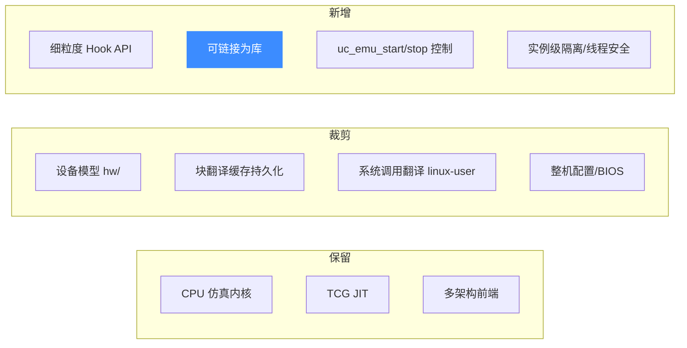
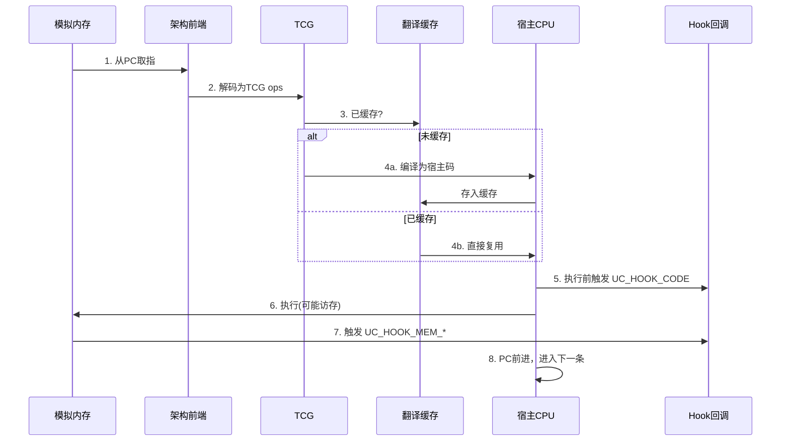
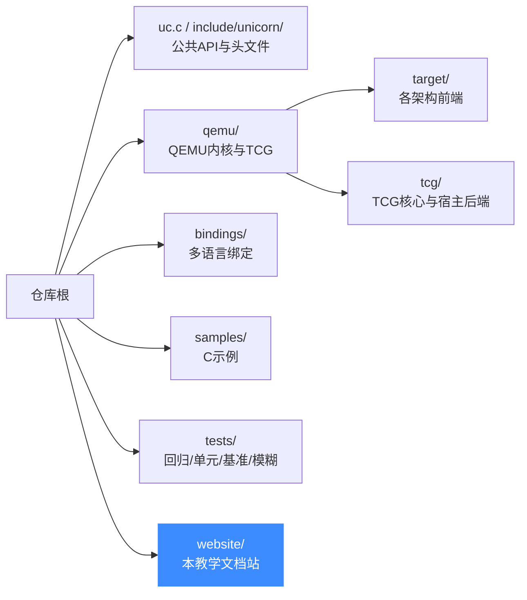

# 架构总览

本页讲 Unicorn **内部**是怎么搭起来的。理解了这张架构图，后面每个功能点的实现原理都会顺理成章。

## 分层架构

Unicorn 的代码在垂直方向上分为清晰的几层：

## 各层职责

### 1. 公共 API 层（[`uc.c`](https://github.com/android-security-engineer/unicorn-skills/blob/master/uc.c)）

这是用户直接调用的入口，与架构无关。它负责：

- **引擎生命周期**：`uc_open` / `uc_close`
- **仿真控制**：`uc_emu_start` / `uc_emu_stop`
- **内存操作**：`uc_mem_map` / `uc_mem_read` / `uc_mem_write`
- **寄存器操作**：`uc_reg_read` / `uc_reg_write`
- **Hook 管理**：`uc_hook_add` / `uc_hook_del`

`uc_open` 内部会根据你传入的 `arch`，把 `uc->init_arch` 函数指针指向对应架构的初始化函数（如 `uc_init_x86_64`），后续所有架构相关操作都通过这个分发完成。

### 2. 架构前端层（`qemu/target/*`）

每种 CPU 架构有一个"前端"，负责把**目标架构的指令**翻译成 TCG 的中间表示（TCG ops）。这部分代码直接复用自 QEMU，Unicorn 几乎没改——这也是它能快速支持这么多架构的原因。

### 3. TCG 核心层

TCG（Tiny Code Generator）是 QEMU 的 JIT 引擎，也是 Unicorn 性能的来源。它做两件事：

1. **翻译**：目标指令 → TCG ops（架构无关的中间表示）
2. **生成**：TCG ops → 宿主机原生机器码

详见 [JIT 编译（TCG）](../features/jit.md)。

### 4. 宿主后端层（`qemu/tcg/<arch>`）

把 TCG ops 翻译成**你当前机器**能跑的机器码。Unicorn 编译时会根据宿主架构选择对应后端（x86 / ARM64 / MIPS / PPC / RISCV / s390x / LoongArch）。

::: tip 目标架构 vs 宿主架构
- **目标架构**（target）：你要仿真的 CPU，由 `uc_open` 的参数决定，运行时可切换。
- **宿主架构**（host）：你编译 Unicorn 时所在的机器，编译期固定。
两者可以不同——这正是"跨架构仿真"的本质。
:::

## Unicorn 相对 QEMU 的改造

Unicorn 不是 QEMU 的简单封装，而是做了实质性的裁剪与改造：

## 数据流：一次仿真的完整旅程

把所有层串起来，看一条指令从"字节"到"执行"的全过程：

这张图是理解 Unicorn 性能特征的关键：**翻译只发生一次，后续执行命中缓存即直接跑原生码**，这就是 JIT 快的原因。

## 目录结构速查

## 📂 相关源码

| 文件/目录 | 角色 |
|------|------|
| [`uc.c`](https://github.com/android-security-engineer/unicorn-skills/blob/master/uc.c) | 公共 API 层：`uc_open`/`uc_emu_start`/`uc_hook_add` 实现 |
| [`include/unicorn/unicorn.h`](https://github.com/android-security-engineer/unicorn-skills/blob/master/include/unicorn/unicorn.h) | 公共 API 与常量声明 |
| [`include/uc_priv.h`](https://github.com/android-security-engineer/unicorn-skills/blob/master/include/uc_priv.h) | `struct uc_struct` 与函数指针后端接口 |
| [`qemu/target/`](https://github.com/android-security-engineer/unicorn-skills/blob/master/qemu/target/) | 各架构前端（指令翻译为 TCG ops） |
| [`qemu/tcg/`](https://github.com/android-security-engineer/unicorn-skills/blob/master/qemu/tcg/) | TCG 核心与宿主后端（JIT） |
| [`bindings/`](https://github.com/android-security-engineer/unicorn-skills/blob/master/bindings/) | 多语言薄封装 |

---

理解了架构，接下来按 [功能详解](../features/architectures.md) 逐层深入每个能力点的实现原理。
