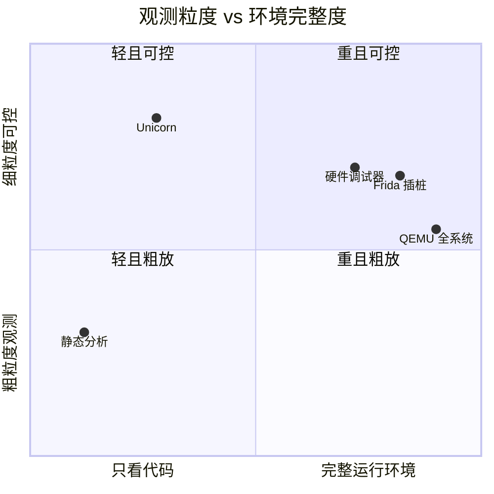
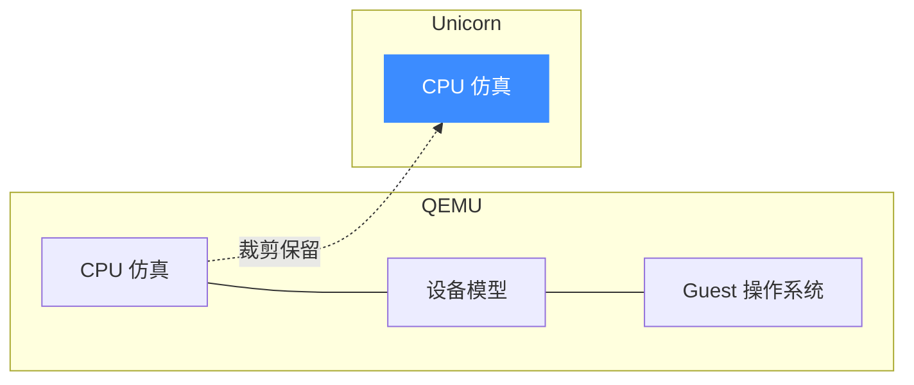
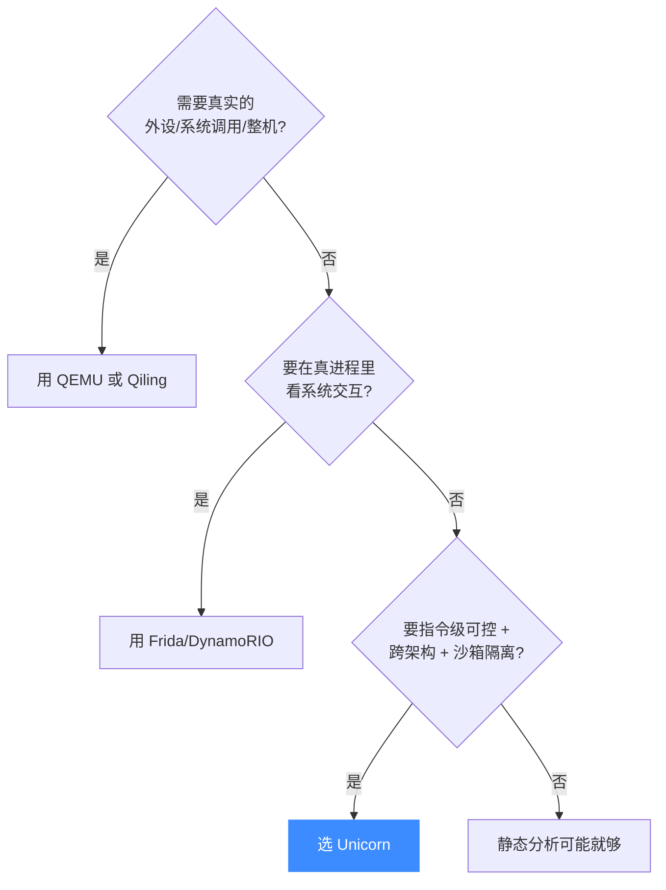

# 与其他工具对比

Unicorn 不是万金油。本页把它和几类经常被拿来比较的工具放在一起——QEMU、硬件调试器、静态分析、Frida 等动态插桩——讲清各自擅长什么、Unicorn 的边界在哪，以及**什么时候该选 Unicorn**。

## 定位象限

Unicorn 独占**"环境极轻，但指令级完全可控"**这一格：它不带操作系统与外设，却能对每一条指令、每一次访存下手。

## 逐项对比

| 维度 | Unicorn | QEMU 全系统 | 硬件调试器 | 静态分析 | Frida 动态插桩 |
|------|---------|------------|-----------|---------|---------------|
| 运行本质 | 纯 CPU 仿真 | 整机仿真 | 真实芯片执行 | 不执行，只分析 | 真实进程内插桩 |
| 需要目标 CPU | 否 | 否 | 是（真芯片） | 否 | 是（同架构进程） |
| 需要操作系统 | 否 | 是（guest OS） | 视场景 | 否 | 是（宿主 OS） |
| 外设 / 系统调用 | 无，需自己模拟 | 完整 | 真实 | 不涉及 | 真实 |
| 指令级插桩 | ✅ 原生 Hook | 较弱 | 断点有限 | ❌ | ✅ 但改的是真码 |
| 隔离/安全 | ✅ 沙箱 | ✅ 沙箱 | ❌ 真跑 | ✅ 不执行 | ❌ 真跑 |
| 跨架构 | ✅ 10 种 | ✅ 多种 | ❌ 绑定硬件 | ✅ | ❌ 同架构 |
| 可嵌入为库 | ✅ | ❌ | ❌ | 部分 | 部分 |
| 启动开销 | 极低（毫秒） | 高（秒级） | 中 | 低 | 中 |

## Unicorn vs QEMU：内核相同，目标相反

Unicorn 就是从 QEMU 里裁出来的 CPU 内核，但两者目标截然不同。

- **QEMU 全系统**：目标是"跑起一整台虚拟机"，带 BIOS、磁盘、网卡，能启动完整 Linux/Windows。适合需要真实环境的场景。
- **QEMU 用户态**：能跑单个 Linux 程序，但依赖宿主内核转发系统调用——**无法仿真裸机器码**。
- **Unicorn**：只要"执行几条指令并观察"，不背整机包袱，可被当库链接进你的程序。裁剪细节见 [它能解决什么问题](./problems.md)。

## Unicorn vs 硬件调试器（JTAG/GDB stub）

真机调试器在**真实芯片**上跑代码，行为最真实，但你受制于硬件：断点数量有限、难以并发、难以快照回滚、每次都要连板子。Unicorn 是纯软件，可以开成百上千个实例并行 fuzzing，随时 [保存/恢复上下文](/features/context)。代价是它仿真的是"标准 CPU 行为"，不含具体芯片的勘误（errata）与真实外设时序。

## Unicorn vs 静态分析

静态分析（反汇编、符号执行、数据流）**不执行代码**，因此看不到运行时才解出来的内容——加壳、自解密、间接跳转常让它失效。Unicorn 反过来，靠**真实执行**穿透这些混淆。两者互补：常见做法是静态定位可疑函数，再用 Unicorn 动态跑一遍看真实行为（见 [反混淆场景](./use-cases.md)）。

## Unicorn vs Frida / 动态插桩

Frida、DynamoRIO 这类工具在**真实进程**里插桩，能看到完整的系统交互（真实 libc、真实 syscall），但要求你能在目标同架构环境里运行该进程，且插桩改动的是真码、风险更高。Unicorn 在沙箱里仿真，**天然隔离且跨架构**，但没有真实环境——系统调用得你自己在 [`UC_HOOK_INTR`](/hooks/intr) 里模拟。

## 什么时候该选 Unicorn

::: tip 一句话总结
**要"整机"选 QEMU，要"真环境交互"选 Frida，要"不执行的分析"选静态工具；要"一段代码在受控沙箱里跨架构逐指令跑"——选 Unicorn。** 需要系统调用与加载器时，可用建立在 Unicorn 之上的 [Qiling](https://github.com/qilingframework/qiling) 补齐。
:::

## 📂 相关源码

| 文件/目录 | 角色 |
|------|------|
| [`include/unicorn/unicorn.h`](https://github.com/android-security-engineer/unicorn-skills/blob/master/include/unicorn/unicorn.h) | Unicorn 公共 API |
| [`samples/`](https://github.com/android-security-engineer/unicorn-skills/blob/master/samples/) | 可对照运行的示例 |

## 相关页面

- [项目介绍](./intro.md)
- [它能解决什么问题](./problems.md)
- [典型应用场景](./use-cases.md)
- [JIT 编译（TCG）](/features/jit)
