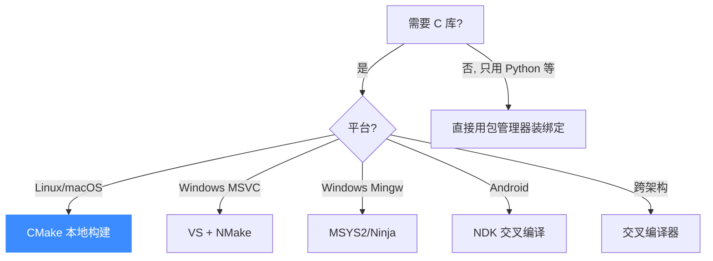
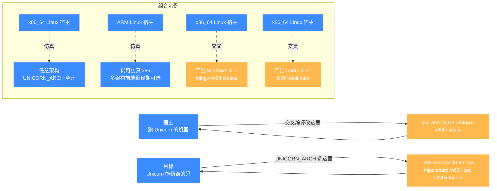

# 编译与安装

本页介绍如何从源码编译 Unicorn（C 库），以及各平台的安装方式。内容整理自官方 [`docs/COMPILE.md`](https://github.com/android-security-engineer/unicorn-skills/blob/master/docs/COMPILE.md)。

## 编译方式选择



## 宿主与目标矩阵

Unicorn 的"宿主/目标"两个维度容易混：**宿主**是跑 Unicorn 的真实机器（由交叉编译决定），**目标**是 Unicorn 能仿真的架构（由 `UNICORN_ARCH` 决定，与宿主无关）。下图把常见组合列出来，帮助快速选型。



一句话记忆：**交叉编译改宿主、`UNICORN_ARCH` 改目标**。即便把库交叉编译到 ARM 上跑，它依然能仿真 x86——多架构前端在编译期可通过开关选择是否编入，与宿主指令集无关。

## 前置依赖

```bash
# Ubuntu / Debian
sudo apt install cmake pkg-config

# macOS (含 Apple Silicon M1/M2)
brew install cmake pkg-config
```

::: tip
macOS 上若要编译 Python 绑定，同样需要上面的构建依赖。
:::

## Linux / macOS 本地构建

```bash
mkdir build && cd build
cmake .. -DCMAKE_BUILD_TYPE=Release
make
```

构建产物：默认同时生成**动态库**（`libunicorn.so` / `.dylib`）与**静态库**（`libunicorn.a`）。

安装到系统：

```bash
sudo make install
```

之后即可在 C 程序中：

```c
#include <unicorn/unicorn.h>
```

链接时：`-lunicorn`。

## Windows 构建

### 方式 A：MSVC

需 `cmake` 与 Visual Studio（≥16.8）。在 VS 命令提示符中：

```bash
mkdir build && cd build
cmake .. -G "NMake Makefiles" -DCMAKE_BUILD_TYPE=Release
nmake
```

也可用 `Visual Studio 16 2019` 生成器配合 `msbuild`。

### 方式 B：MSYS2 / Mingw

先装 MSYS2（https://www.msys2.org），再：

```bash
pacman -S mingw-w64-x86_64-toolchain mingw-w64-x86_64-cmake mingw-w64-x86_64-ninja
export PATH=/mingw64/bin:$PATH
mkdir build && cd build
/mingw64/bin/cmake .. -G "Ninja"
ninja -C .
```

::: warning
MSYS 的构建方式随时间变化，**始终使用 mingw64 自带的 cmake**。
:::

## Android 交叉编译（NDK）

适合在 Android 上跑 Unicorn（移动端逆向 / 加固检测等场景）：

```bash
mkdir build && cd build
cmake .. \
  -DCMAKE_TOOLCHAIN_FILE=$NDK/build/cmake/android.toolchain.cmake \
  -DANDROID_ABI=$ABI \
  -DANDROID_NATIVE_API_LEVEL=$MINSDKVERSION
make
```

支持的目标 ABI：`armeabi-v7a`、`arm64-v8a`、`x86`、`x86_64`。要求 cmake ≥ 3.19。

## Linux → Windows 交叉编译（Mingw）

```bash
sudo apt install mingw-w64-x86-64-dev
mkdir build && cd build
cmake .. -DCMAKE_TOOLCHAIN_FILE=../mingw64-w64.cmake
make
```

## Linux → 其它架构交叉编译

例如交叉编译到 ARM：

```bash
sudo apt install gcc-arm-linux-gnueabihf
mkdir build && cd build
cmake .. -DCMAKE_C_COMPILER=gcc-arm-linux-gnueabihf
make
```

::: tip 目标架构 vs 宿主架构
交叉编译改变的是**宿主后端**（Unicorn 跑在哪种机器上），而非**它能仿真的目标架构**。即使交叉编译到 ARM，编译出的库依然能仿真 x86——因为多架构前端在编译期可通过开关选择是否编入。详见 [多架构支持](../features/architectures.md)。
:::

## 通过 vcpkg 安装

```bash
git clone https://github.com/Microsoft/vcpkg.git
cd vcpkg
./bootstrap-vcpkg.sh
./vcpkg integrate install
./vcpkg install unicorn
```

## 关键 CMake 选项

| 选项 | 默认 | 说明 |
|------|------|------|
| `BUILD_SHARED_LIBS` | `ON` | 是否构建动态库；作为子目录嵌入时只建静态库 |
| `CMAKE_BUILD_TYPE` | — | `Release` 性能最佳 |
| `UNICORN_ARCH_*` | `ON` | 按需裁剪不用的架构，减小体积 |

## 各语言绑定安装

无需编译 C 库，直接装绑定即可（绑定内置或自动拉取 C 库）：

| 语言 | 命令 |
|------|------|
| Python | `pip install unicorn` |
| Rust | `cargo add unicorn-engine` |
| Go | `go get github.com/unicorn-engine/unicorn/bindings/go/unicorn` |
| .NET | `dotnet add package UnicornEngine` |
| Java | 见 `bindings/java` |
| Zig | 见 `bindings/zig` 与 `build.zig` |

完整列表见仓库 [`bindings/`](https://github.com/android-security-engineer/unicorn-skills/blob/master/bindings/) 目录。
## 📂 相关源码

| 文件/目录 | 角色 |
|------|------|
| [`CMakeLists.txt`](https://github.com/android-security-engineer/unicorn-skills/blob/master/CMakeLists.txt) | 主构建脚本（`UNICORN_ARCH`/`BUILD_SHARED_LIBS` 等选项） |
| [`docs/COMPILE.md`](https://github.com/android-security-engineer/unicorn-skills/blob/master/docs/COMPILE.md) | 官方编译文档（MSVC/MinGW/NDK/交叉编译） |
| [`samples/Makefile`](https://github.com/android-security-engineer/unicorn-skills/blob/master/samples/Makefile) | 示例的 legacy make 构建 |

---

下一步：[测试与基准](./testing.md) 或 [常见问题](./faq.md)。
