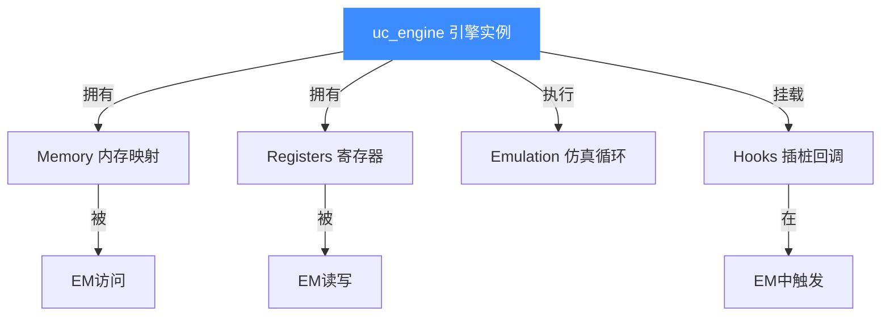
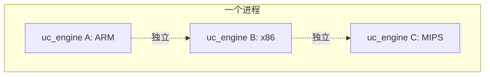
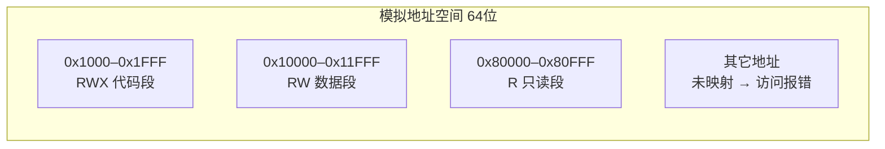
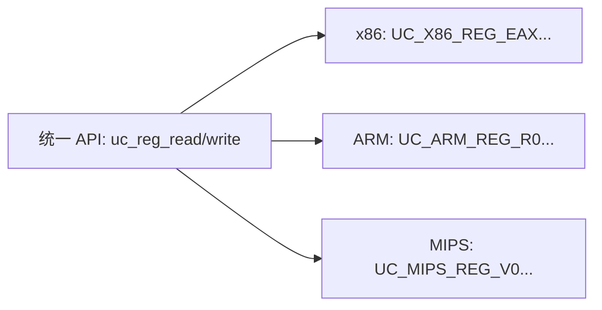
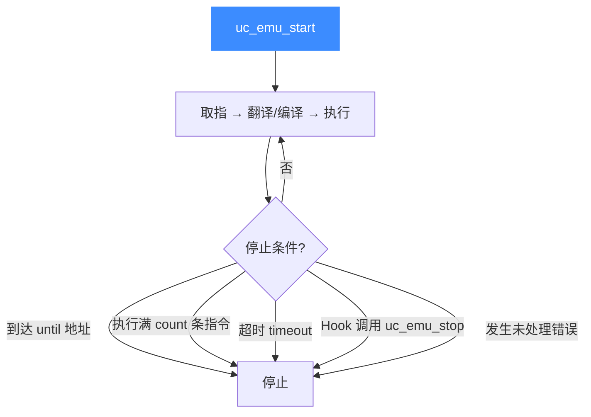
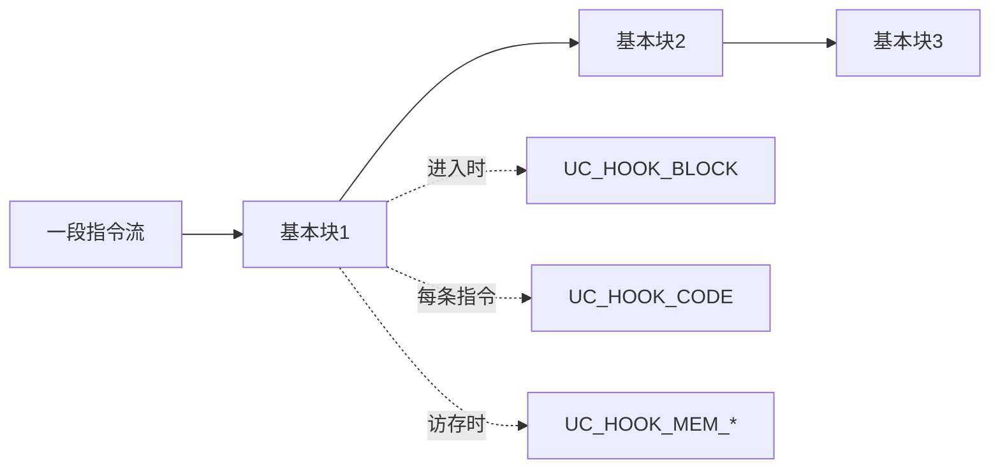
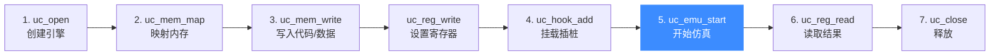

# 核心概念

本页建立理解 Unicorn 所需的**心智模型**。掌握这五个概念，后续所有 API 都会变得直观。

## 概念地图

## 1. 引擎实例（uc_engine）

`uc_engine` 是一切的根。一次 `uc_open(arch, mode, &uc)` 调用会创建一个**独立的仿真世界**。

- 每个实例有自己的内存空间、寄存器状态、Hook 列表，**互不干扰**。
- 实例之间是**线程安全**的——你可以在不同线程里同时跑多个引擎。
- 用完务必 `uc_close(uc)` 释放资源。

::: tip 心智模型
把一个 `uc_engine` 想象成**一块焊好 CPU 的裸板**：通电（`uc_open`）、上电后你往它的内存里写程序、拨寄存器、然后按"运行"键（`uc_emu_start`）。
:::

## 2. 内存映射（Memory Map）

Unicorn 的内存**不会凭空存在**——你必须先 `uc_mem_map` 显式声明："在地址 `0x1000` 处给我一块 4KB 的内存"。

- 未映射的地址访问会触发 `UC_HOOK_MEM_*_UNMAPPED`，默认会报错中止。
- 每块内存可单独设保护位：读 / 写 / 执行（`UC_PROT_*`）。
- 这模拟的是真实芯片的"物理内存"——地址就是你给它的地址。

详见 [内存映射与管理](../features/memory.md)。

## 3. 寄存器（Registers）

每种架构都有自己的寄存器集合（x86 的 EAX/RIP、ARM 的 R0/PC/CPSR 等）。Unicorn 用**统一的 `uc_reg_read` / `uc_reg_write`** 接口操作它们，差异被封装在各架构头文件的 `UC_*_REG_*` 枚举里。

::: warning 注意
PC（程序计数器）是特殊的寄存器。Unicorn 为了性能，**不会每条指令都同步 PC**——同步时机取决于你装了什么 Hook。详见 [常见问题](./faq.md)。
:::

## 4. 仿真循环（Emulation Loop）

`uc_emu_start(begin, until, timeout, count)` 启动仿真。它的语义是：**从 `begin` 地址开始执行，直到满足停止条件之一**。

四个停止条件是**或**的关系，任一满足即停。

## 5. 插桩（Hooks）

Hook 是 Unicorn 最强大的能力：它让你在仿真的**任意粒度**插入自己的逻辑。

| Hook 类型 | 触发时机 | 典型用途 |
|-----------|---------|---------|
| `UC_HOOK_CODE` | 每条指令执行前 | 断点、单步、指令追踪 |
| `UC_HOOK_BLOCK` | 进入每个基本块 | 控制流统计、覆盖率 |
| `UC_HOOK_MEM_READ/WRITE` | 内存访问时 | watchpoint、MMIO 仿真 |
| `UC_HOOK_MEM_*_UNMAPPED` | 访问未映射内存 | 动态映射、缺页处理 |
| `UC_HOOK_MEM_*_PROT` | 违反保护位 | 权限检查 |

详见 [Hook 插桩体系](../features/hooks.md)。

## 把五个概念串起来

一个完整的 Unicorn 程序，结构永远是这五步：

记住这张图，你就掌握了 Unicorn 的全部使用范式。下一页 [架构总览](./architecture.md) 会展开内部实现。

## 📂 相关源码

| 文件/目录 | 角色 |
|------|------|
| [`include/unicorn/unicorn.h`](https://github.com/android-security-engineer/unicorn-skills/blob/master/include/unicorn/unicorn.h) | `uc_arch`/`uc_mode`/`uc_err`/`uc_hook` 等核心枚举 |
| [`uc.c`](https://github.com/android-security-engineer/unicorn-skills/blob/master/uc.c) | `uc_open`/`uc_emu_start`/`uc_mem_map`/`uc_reg_read` 实现 |

