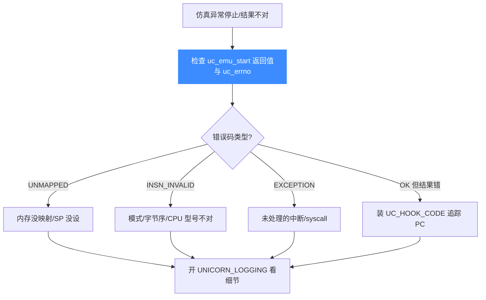
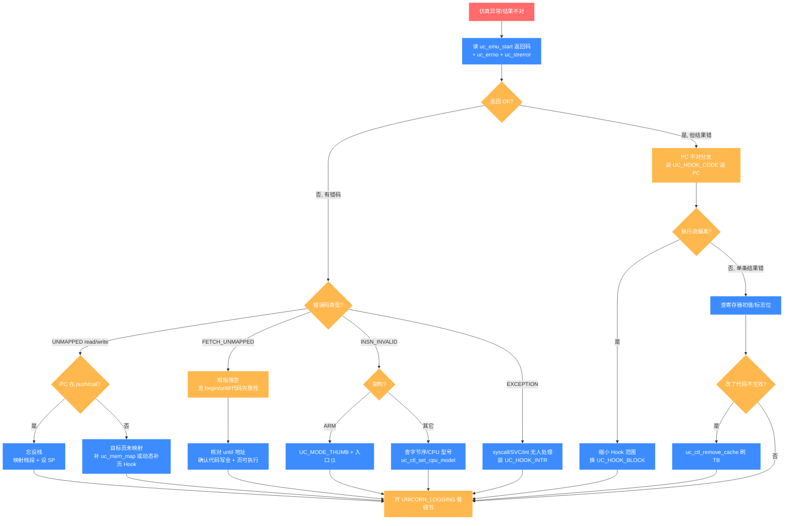

# 调试仿真问题

仿真"跑飞"、崩溃、结果不对，是每个 Unicorn 使用者都会撞上的坎。本页给出一套可复用的排查流程：用 Hook 追踪 PC、读取错误码定位失败点、对照常见错误表逐一排除，最后用 QEMU 日志深挖。读完你能把"莫名其妙停了"变成"确切知道停在哪、为什么停"。

## 排查流程



## 仿真问题分支决策树

上面的总流程给出主路径，下面这张决策树把"PC 不对 / 内存错 / 非法指令"三大类各自往下拆到具体根因与解法，方便对号入座。先读 `uc_emu_start` 返回码与 `uc_errno`，再按错误码走对应分支。



三条主分支的"头号杀手"分别是：内存类的**忘设栈**（`push` 一执行就 `WRITE_UNMAPPED`）、非法指令类的**ARM Thumb 入口没 `|1`**、PC 不对类的**改了代码没刷 TB 缓存**。先把这三类排除，再开 `UNICORN_LOGGING` 深挖，能省掉大部分定位时间。

## 第一步：永远先看返回值和 errno

`uc_emu_start` 返回一个 `uc_err`。**不要忽略它**——它是排查的起点。任何时候都可以用 [`uc_errno`](/api/errno) 取最近错误码，用 [`uc_strerror`](/api/strerror) 转成可读字符串。

```c
uc_err err = uc_emu_start(uc, ADDR, ADDR + code_size, 0, 0);
if (err != UC_ERR_OK) {
    uint64_t pc = 0;
    uc_reg_read(uc, UC_X86_REG_RIP, &pc);   // 换成你架构的 PC 寄存器
    printf("emu failed: %s (err=%u), pc=0x%" PRIx64 "\n",
           uc_strerror(err), err, pc);
}
```

::: tip 停下不一定是出错
`UC_ERR_OK` 也可能"提前"停：到达了 `until` 地址、跑满了 `count` 条指令、或某个 Hook 调了 `uc_emu_stop`。先确认是"错误停"还是"正常停"，再往下查。
:::

## 第二步：用 UC_HOOK_CODE 追踪 PC

结果不对但没报错，最有效的手段是装一个 [`UC_HOOK_CODE`](/hooks/code)，把每条指令的地址打印出来，看执行流在哪里偏离预期。

```c
static void trace(uc_engine *uc, uint64_t addr, uint32_t size, void *ud) {
    printf("PC=0x%" PRIx64 "  size=%u\n", addr, size);
}
uc_hook h;
// 范围 begin>end 表示对全地址生效
uc_hook_add(uc, &h, UC_HOOK_CODE, trace, NULL, 1, 0);
```

::: warning 追踪会拖慢仿真
`UC_HOOK_CODE` 对每条指令都回调，是最重的插桩。定位到大致范围后，换成粒度更粗的 [`UC_HOOK_BLOCK`](/hooks/block)，或把 Hook 的地址范围收窄到可疑区间。原因见 [常见问题](./faq.md)。
:::

## 第三步：对照常见错误表

新手 90% 的仿真崩溃都出自下面这几类。

| 症状 / 错误码 | 根因 | 解法 |
|---------------|------|------|
| `UC_ERR_WRITE_UNMAPPED` 且 PC 在 `push`/`call` | **忘记设置 SP**，栈指针是 0 或指向未映射区 | 先 `uc_mem_map` 一块栈，再 `uc_reg_write` 把 SP 指到栈中部 |
| [`UC_ERR_READ_UNMAPPED`](/errors/read-unmapped) / [`UC_ERR_WRITE_UNMAPPED`](/errors/write-unmapped) | 目标地址所在页**没有映射** | 补 `uc_mem_map`，或装 [`UC_HOOK_MEM_*_UNMAPPED`](/hooks/mem-unmapped) 动态补页 |
| [`UC_ERR_FETCH_UNMAPPED`](/errors/fetch-unmapped) | **取指**落到未映射地址：常因 `until` 设错、代码没写全、或跑飞 | 核对 `uc_emu_start` 的 `begin`/`until`，确认代码完整写入且页有执行权限 |
| [`UC_ERR_INSN_INVALID`](/errors/insn-invalid) 在 ARM | **THUMB 没开**或起始地址不是奇数 | 用 `UC_MODE_THUMB`，起始地址置奇（`addr | 1`） |
| `UC_ERR_INSN_INVALID` 且字节看着对 | **字节序或 CPU 型号**不符（如 THUMB2 大端） | 检查 `UC_MODE_BIG_ENDIAN`，必要时 `uc_ctl_set_cpu_model` 设 `arm_max` 等 |
| 浮点/向量指令报无效 | 架构默认**未开该扩展**（ARM 的 VFP、RISC-V 的 CSR） | 按手册在特殊寄存器里打开对应开关 |
| [`UC_ERR_EXCEPTION`](/errors/exception) | 出现 `syscall`/`SVC`/`int` 但**没人处理** | 装 [`UC_HOOK_INTR`](/hooks/intr) 模拟系统调用返回 |
| 改了内存/代码却**不生效** | 命中了 **TB 缓存**（TB chaining） | `uc_ctl_remove_cache` 刷缓存，必要时重写 PC 重启当前块 |
| `until` 地址永远到不了 | 落在了**指令中间**或该地址从未被作为块边界执行到 | `until` 要对准某条指令起始；或改用 `count` 限制指令数 |

::: danger 栈是头号杀手
"仿真一开始就崩"最常见的原因是**没设栈**。CPU 一执行 `push ebp` / `stp x29,x30` 就要写栈，若 SP 没指向已映射内存，立刻 `UC_ERR_WRITE_UNMAPPED`。养成习惯：映射代码后紧接着映射一块栈并设好 SP。
:::

## 第四步：开启 UNICORN_LOGGING 深挖

前三步定位不到时，打开 QEMU 继承来的日志看内部发生了什么。日志需**重新编译**开启：给 cmake 传 `-DUNICORN_LOGGING=yes`，再用两个环境变量控制详细程度。

```c
// 必须在执行任何 Unicorn 代码之前设置（env 只解析一次）
setenv("UNICORN_LOG_LEVEL", "0xFFFFFFFF", 1);   // 位掩码，全开=打印一切
setenv("UNICORN_LOG_DETAIL_LEVEL", "1", 1);     // 1=含完整文件名与行号
```

| 环境变量 | 含义 | 取值 |
|----------|------|------|
| `UNICORN_LOG_LEVEL` | QEMU 日志位掩码，决定"记什么" | `UINT32_MAX` 全开；`0` 关闭 |
| `UNICORN_LOG_DETAIL_LEVEL` | 文件名/行号的详细度 | `0` 不带；`1` 全路径+行号；`2` 仅文件名+行号 |

::: warning 两点提醒
一是日志**只在编译时开了 `UNICORN_LOGGING` 才有**；二是环境变量**只解析一次**，务必在跑仿真前设好。全开日志非常啰嗦，建议定位阶段临时用。文件名是编译期静态写入的，可能泄露构建机路径。
:::

## 一个最小可运行的排查骨架

```c
uc_engine *uc;
uc_open(UC_ARCH_X86, UC_MODE_64, &uc);

// 代码段 + 栈，两块都别忘
uc_mem_map(uc, 0x1000, 0x1000, UC_PROT_ALL);
uc_mem_map(uc, 0x200000, 0x10000, UC_PROT_READ | UC_PROT_WRITE);
uc_mem_write(uc, 0x1000, CODE, sizeof(CODE));

uint64_t sp = 0x208000;                 // 栈中部，别设成边界
uc_reg_write(uc, UC_X86_REG_RSP, &sp);

uc_hook h;
uc_hook_add(uc, &h, UC_HOOK_CODE, trace, NULL, 1, 0);

uc_err err = uc_emu_start(uc, 0x1000, 0x1000 + sizeof(CODE), 0, 0);
if (err) printf("failed: %s\n", uc_strerror(err));
uc_close(uc);
```

## 📂 相关源码

| 文件/目录 | 角色 |
|------|------|
| [`include/unicorn/unicorn.h`](https://github.com/android-security-engineer/unicorn-skills/blob/master/include/unicorn/unicorn.h) | `uc_err` 错误码枚举与 `uc_strerror`/`uc_errno` 声明 |
| [`uc.c`](https://github.com/android-security-engineer/unicorn-skills/blob/master/uc.c) | 错误码抛出位置 |
| [`qemu/accel/tcg/cpu-exec.c`](https://github.com/android-security-engineer/unicorn-skills/blob/master/qemu/accel/tcg/cpu-exec.c) | 仿真主循环设置 `invalid_error`/`stop_request` |
| [`docs/COMPILE.md`](https://github.com/android-security-engineer/unicorn-skills/blob/master/docs/COMPILE.md) | `UNICORN_LOGGING` 编译选项与日志级别 |

## 相关页面

- [错误码总览](/errors/)
- [UC_HOOK_CODE 指令 Hook](/hooks/code)
- [常见问题 FAQ](./faq.md)
- [未映射内存 Hook](/hooks/mem-unmapped)
