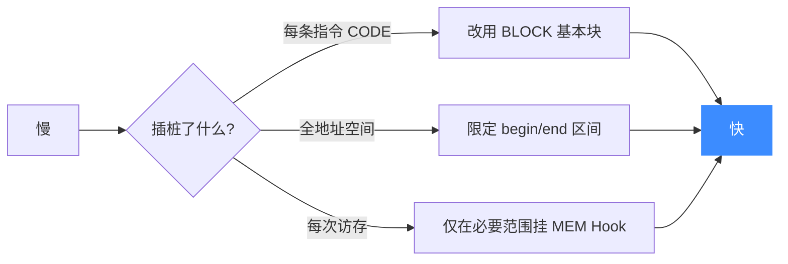
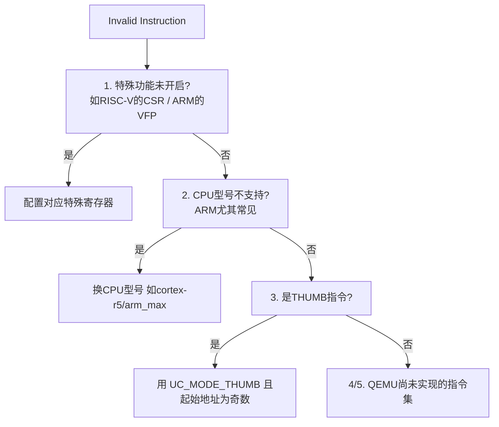
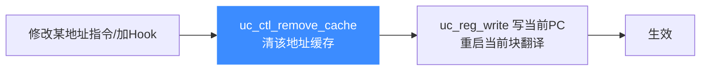

# 常见问题 FAQ

本页整理使用 Unicorn 时最常遇到的困惑，内容来自官方 [`docs/FAQ.md`](https://github.com/android-security-engineer/unicorn-skills/blob/master/docs/FAQ.md) 并配图说明。

## 为什么我的仿真这么慢？

通常原因是**插桩过多**：

- 用 `UC_HOOK_CODE` 监听了**每条指令**
- 监听了**每次内存访问**

::: tip 优化
用更粗粒度的 `UC_HOOK_BLOCK` 代替 `UC_HOOK_CODE`；给 Hook 限定地址区间（`begin`/`end`），只在关心的范围触发。
:::



## 为什么仿真停止后 PC 不对？

::: details 版本 < 2.1.4
同步 PC 是很大开销（最坏慢 10 倍），所以 PC 同步时机分情况：

- 装了 `UC_HOOK_CODE`：在 Hook 有效范围内 PC 处处同步。**注意 `uc_emu_start` 用了 `count` 参数也等价于装了 CODE Hook。**
- 装了 `UC_HOOK_MEM_READ/WRITE`：在读写事件前同步 PC。
- 仿真正常结束：PC 指向下一条指令。
- 没装上述 Hook 且异常结束：PC 同步到**基本块边界**（异常所在块的第一条指令）。

举例：异常发生在 `ldr x0,[x1]`，但 PC 可能停在它前面的 `mov x0,#1`（同块首指令）。
:::

::: details 版本 >= 2.1.4
PC 应当始终有效。若仍异常，请提 issue。
:::

## 遇到 "Unhandled CPU Exception"？

Unicorn 是**纯 CPU 模拟器**，没有为 `syscall`、`SVC` 等指令注册处理者。若你需要系统调用与用户态仿真，推荐 [qiling framework](https://github.com/qilingframework/qiling)（它在 Unicorn 之上补全了系统调用与文件系统）。


## 想插桩特定指令却报 `UC_ERR_HOOK`？

目前只有**少量指令**可被插桩。x86 上仅支持：`in` `out` `syscall` `sysenter` `cpuid`。

## 遇到 "Invalid Instruction"？

按以下顺序排查：



## 内存 Hook 对单条指令被调用多次？

可能原因：

- 该指令本就多次访存，如 x86 的 `rep stos`。
- 地址**未对齐**，MMU 仿真会把一次访问拆成多次对齐访问，最坏逐字节访问。

## 在 Hook 里返回 `true` 仍无法从 unmapped 读写恢复？

这是 Unicorn1 → Unicorn2 的行为变化。**v2 要求：在 Hook 里返回 `true` 之前，必须先把那块内存映射好**（`uc_mem_map`）。否则引擎不知道接下来该怎么办。

详见 [第一个模拟程序](./first-program.md) 中的动态映射示例。

## 仿真出现奇怪的读写错误 / CPU 异常

- **MIPS**：地址可能落在 `kseg` 段，此时 MMU 被旁路，须确保对应**物理内存**已映射。
- **ARM**：地址可能落在不可执行段（如 m-class 的某些区域）。

## `KeyboardInterrupt` 在 `emu_start` 期间不生效？

这是预期行为。Python 信号处理在 C 长计算期间不会中断，要等计算结束才回调。**变通办法：把仿真放到另一个线程里跑。**

## 修改指令不生效 / 仿真中新增的 Hook 不触发？

Unicorn 继承自 QEMU 的 **TB chaining（翻译块缓存）**机制：每个基本块翻译后会被缓存复用。对已缓存地址的修改不会立即生效，除非调用 `uc_ctl_remove_cache`。



::: warning 注意
这**不**意味着你要操心自修改代码（SMC）——仿真**执行期间**的读写 QEMU 会自动处理。只有你**从外部**改内存时才需要手动清缓存。
:::

## 如何仿真中断 / 时钟？

纯 CPU 模拟器没有真实时钟，两种方式：

- 用 `uc_emu_start` 的 `timeout` 参数（时间到停止）
- 用 `count` 参数（执行 N 条后停止）

停止后检查状态，再 `emu_start` 续跑。对 cortex-m 的 `exec_return`，Unicorn 有一个中断号为 8 的软件异常，可挂 Hook 处理。

## 能否关闭 softmmu 加速？

可以，但这不是 Unicorn 的目标，也没有简单开关。2.0.2 起 Unicorn 会按架构启用真实 MMU，带来能力也带来约束：

- `uc_mem_map` 处理**物理地址**，而 `uc_emu_start` 接受**虚拟地址**。
- 须检查架构特定寄存器确认 MMU 状态。

若你想要旧的 `paddr == vaddr` 简单映射，可启用实验性 MMU：

```c
uc_ctl_tlb_mode(uc, UC_TLB_VIRTUAL);
```

并可挂 `UC_HOOK_TLB_FILL` 管理 TLB，用 `uc_ctl_flush_tlb` 刷新。理论上跳过 MMU 细节会更快。详见 [MMU 与虚拟内存](../features/mmu.md)。

## 想深入调试？

重新编译时开启日志：

```bash
cmake .. -DUNICORN_LOGGING=yes
```

用环境变量控制级别（须在调用 Unicorn 前设置）：

```python
import os
os.environ['UNICORN_LOG_LEVEL'] = "0xFFFFFFFF"        # 全量日志
os.environ['UNICORN_LOG_DETAIL_LEVEL'] = "1"          # 含文件名行号
```

## 支持 ARM PAC（指针认证）？

支持，但默认关闭，启用需配置 `SCR_EL3` 等系统寄存器，详见 [issue #1789](https://github.com/unicorn-engine/unicorn/issues/1789)。

## 为何不直接跟进上游 QEMU？

为了给终端用户提供简单 API，Unicorn 在 QEMU 代码里做了大量 hack，这使得无痛同步上游变得困难。这是"易用性"与"可维护性"的权衡。
## 📂 相关源码

| 文件/目录 | 角色 |
|------|------|
| [`uc.c`](https://github.com/android-security-engineer/unicorn-skills/blob/master/uc.c) | `uc_emu_start`/`uc_ctl_*`/`uc_hook_add` 实现 |
| [`include/unicorn/unicorn.h`](https://github.com/android-security-engineer/unicorn-skills/blob/master/include/unicorn/unicorn.h) | `UC_HOOK_*`/`UC_TLB_*` 等常量 |
| [`docs/FAQ.md`](https://github.com/android-security-engineer/unicorn-skills/blob/master/docs/FAQ.md) | 官方 FAQ 原文 |

---

未覆盖的问题可查阅官方 [FAQ 原文](https://github.com/android-security-engineer/unicorn-skills/blob/master/docs/FAQ.md) 或提 issue。
