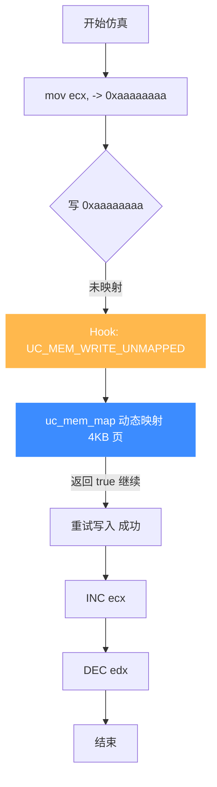
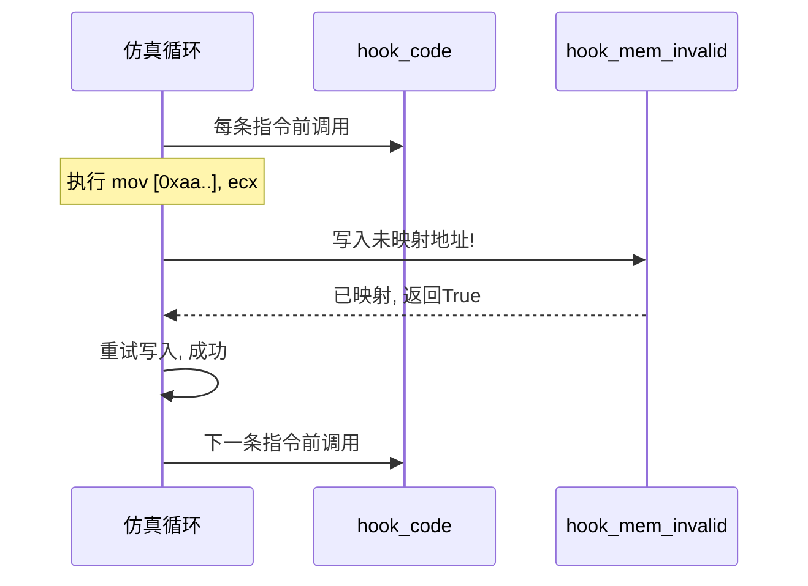

# 第一个模拟程序

本页在 [快速开始](./quickstart.md) 的基础上，加入**插桩（Hook）**——这是 Unicorn 真正强大的地方。我们将追踪每条指令的执行、捕获未映射内存访问并动态补映射。

## 这个程序做什么

模拟执行一段会**访问未映射内存**的 x86 代码：

- 机器码：`mov [0xaaaaaaaa], ecx; INC ecx; DEC edx`
- 我们**故意不映射** `0xaaaaaaaa` 这块内存。
- 当代码尝试写入时，Unicorn 会触发 `UC_HOOK_MEM_WRITE_UNMAPPED`，我们在回调里**动态映射**这块内存，让执行继续。



## 完整代码（Python）

```python
from unicorn import *
from unicorn.x86_const import *

# mov [0xaaaaaaaa], ecx; INC ecx; DEC edx
CODE = b"\x89\x0D\xAA\xAA\xAA\xAA\x41\x4a"
ADDRESS = 0x1000000

# ① 指令 Hook: 每条指令执行前打印地址
def hook_code(uc, address, size, user_data):
    print(f"  >>> 指令 @ 0x{address:x} (size={size})")

# ② 内存非法访问 Hook: 捕获未映射写入
def hook_mem_invalid(uc, access, address, size, value, user_data):
    if access == UC_MEM_WRITE_UNMAPPED:
        print(f"  ⚠️ 写入未映射内存 0x{address:x}, value=0x{value:x}")
        page_size = 0x1000
        page = address & ~(page_size - 1)
        print(f"     → 动态映射 4KB 页 @ 0x{page:x}")
        uc.mem_map(page, page_size, UC_PROT_ALL)
        return True   # 返回 True: 已处理, 继续执行
    return False      # 返回 False: 中止

mu = Uc(UC_ARCH_X86, UC_MODE_32)
mu.mem_map(ADDRESS, 2 * 1024 * 1024)          # 只映射代码段
mu.mem_write(ADDRESS, CODE)

mu.reg_write(UC_X86_REG_ECX, 0x42)
mu.reg_write(UC_X86_REG_EDX, 0x20)

# ③ 注册 Hook
mu.hook_add(UC_HOOK_CODE, hook_code)
mu.hook_add(UC_HOOK_MEM_WRITE_UNMAPPED, hook_mem_invalid)

print("=== 开始仿真 ===")
mu.emu_start(ADDRESS, ADDRESS + len(CODE))
print("=== 仿真结束 ===")

print(f"ECX = 0x{mu.reg_read(UC_X86_REG_ECX):x}")   # 0x42 + 1 = 0x43
print(f"EDX = 0x{mu.reg_read(UC_X86_REG_EDX):x}")
# 验证: 0xaaaaaaaa 处确实被写入了 ecx 的旧值 0x42
val = mu.mem_read(0xaaaaaaaa, 4)
print(f"[0xaaaaaaaa] = 0x{int.from_bytes(val, 'little'):x}")  # 0x42
```

## 预期输出

```
=== 开始仿真 ===
  >>> 指令 @ 0x1000000 (size=6)
  ⚠️ 写入未映射内存 0xaaaaaaaa, value=0x42
     → 动态映射 4KB 页 @ 0xaaaaa000
  >>> 指令 @ 0x1000006 (size=1)
  >>> 指令 @ 0x1000007 (size=1)
=== 仿真结束 ===
ECX = 0x43
EDX = 0x1f
[0xaaaaaaaa] = 0x42
```

## 发生了什么

逐步拆解这个程序揭示的核心机制：

### Hook 是"在仿真循环里插入你的代码"



### 动态映射 = 模拟"按需分页"

真实操作系统的 demand paging 是"访问到才分配物理页"。Unicorn 的 `UC_HOOK_MEM_*_UNMAPPED` 让你能复刻这一行为——这正是它适合仿真带 MMU 的复杂系统的原因之一。详见 [MMU 与虚拟内存](../features/mmu.md)。

### Hook 返回值的语义

| Hook 类型 | 返回 True | 返回 False |
|-----------|----------|-----------|
| `UC_HOOK_MEM_*_UNMAPPED` | 已处理，**继续执行** | 中止仿真 |
| `UC_HOOK_MEM_*_PROT` | 已处理，继续 | 中止 |
| `UC_HOOK_CODE` | （返回值无意义，用 `uc_emu_stop` 停止） | — |

## C 版本

仓库自带的 [`samples/sample_x86.c`](https://github.com/android-security-engineer/unicorn-skills/blob/master/samples/sample_x86.c) 含完整 C 版本，核心回调签名如下（供对照）：

```c
// 指令 Hook 回调签名
static void hook_code(uc_engine *uc, uint64_t address, uint32_t size,
                      void *user_data);

// 内存非法访问回调签名 (返回 bool)
static bool hook_mem_invalid(uc_engine *uc, uc_mem_type type, uint64_t address,
                             int size, int64_t value, void *user_data);

// 注册
uc_hook hh;
uc_hook_add(uc, &hh, UC_HOOK_CODE, hook_code, NULL, 1, 0);
uc_hook_add(uc, &hh, UC_HOOK_MEM_WRITE_UNMAPPED, hook_mem_invalid, NULL, 1, 0);
```

::: tip 范围参数
`uc_hook_add` 的最后两个参数是 `begin` / `end`，限定 Hook 只在某个地址区间内触发。传 `1, 0` 表示"全地址空间生效"。这是性能优化的关键——详见 [Hook 插桩体系](../features/hooks.md)。
:::

## 你已经掌握了

到这里，你已经会用 Unicorn 完成：创建引擎、映射内存、写代码、设寄存器、挂 Hook、动态处理缺页、读结果。这是 90% 实际场景所需的全部能力。

接下来可以选择：
- 深入原理 → [功能详解](../features/hooks.md)
- 编译 C 版 → [编译与安装](./compile.md)
- 避坑指南 → [常见问题 FAQ](./faq.md)

## 📂 相关源码

| 文件/目录 | 角色 |
|------|------|
| [`include/unicorn/unicorn.h`](https://github.com/android-security-engineer/unicorn-skills/blob/master/include/unicorn/unicorn.h) | `uc_open`/`uc_mem_map`/`uc_hook_add` 声明 |
| [`uc.c`](https://github.com/android-security-engineer/unicorn-skills/blob/master/uc.c) | 上述 API 实现 |
| [`samples/sample_x86.c`](https://github.com/android-security-engineer/unicorn-skills/blob/master/samples/sample_x86.c) | 完整 C 示例（含 Hook 回调签名） |
