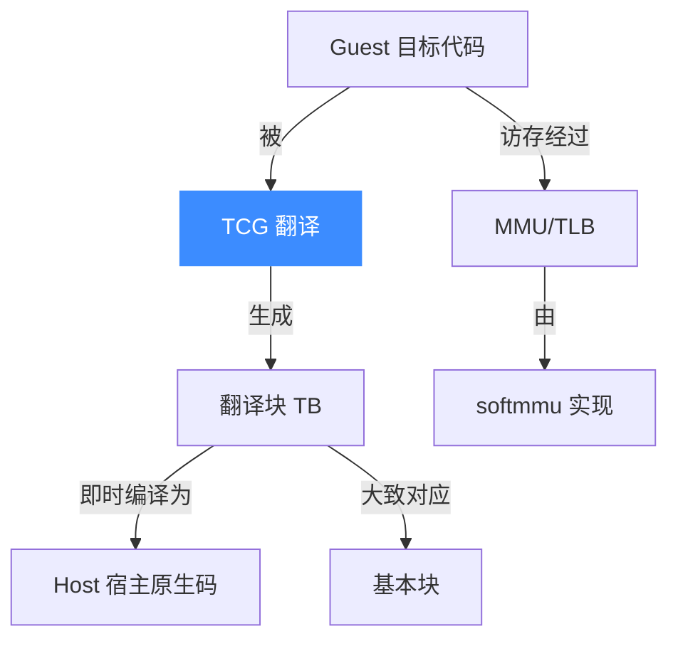
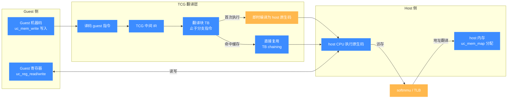

# 术语表

本页汇总阅读本站与理解 Unicorn 源码时会反复遇到的核心术语。每条给一句话解释，并指向讲得更深的页面。建议先扫一遍建立词汇表，遇到不熟的词再回来查。

## 术语关系图

## host / guest / TCG / TB 四者关系

上图的术语关系图给的是顶层轮廓，下面这张把仿真执行链路里四者如何协作拆得更细：guest 机器码进 TCG 译成 TB，TB 缓存复用，运行时即时编译为 host 原生码，访存再经 softmmu/TLB 落到 host 内存。理解这条链路是读懂 Unicorn 性能与"改代码不生效"类问题的前提。

两个易混点：**TB 不等于基本块**——TB 还会因页边界或缓存策略提前截断，一个基本块偶尔被切成多个 TB；**`uc_mem_map` 分配的是 host 内存，但它代表 guest 地址空间**——开启 MMU 后 `uc_emu_start` 传的是 guest 虚拟地址，经 TLB 翻译到 host 物理地址。改了 guest 机器码却没刷 TB 时，走的仍是 `CACHE` 这条边，于是看到"旧指令"——这正是 `uc_ctl_remove_cache` 的用武之地。

## 核心术语

| 术语 | 一句话解释 | 详解 |
|------|-----------|------|
| **emulation / 仿真** | 用软件模拟一颗 CPU 执行指令的过程；Unicorn 只仿真 CPU，不仿真整机。 | [项目介绍](./intro.md) |
| **host vs guest / 宿主 vs 目标** | host 是运行 Unicorn 的真实机器（如 x86 Linux），guest 是被仿真的架构（如 ARM）。 | [架构总览](./architecture.md) |
| **JIT（即时编译）** | 在运行时把 guest 指令编译成 host 原生指令，比逐条解释快一个数量级。 | [JIT 编译](/features/jit) |
| **TCG（Tiny Code Generator）** | QEMU 的可移植后端，先把 guest 指令翻译成中间 IR，再编译成 host 码，是 Unicorn 性能的来源。 | [JIT 编译](/features/jit) |
| **TB（Translation Block，翻译块）** | TCG 一次翻译并缓存的最小指令序列，通常止于一条分支指令；执行后被缓存复用。 | [JIT 编译](/features/jit) |
| **basic block / 基本块** | 单入口单出口的顺序指令序列，是控制流分析的基本单元；TB 大致对应一个基本块。 | [基本块 Hook](/hooks/block) |
| **Hook / 插桩** | 在仿真的特定事件（每条指令、每次访存、每个块）挂上你的回调，实现追踪、断点、模拟。 | [Hook 体系](/features/hooks) |
| **MMIO** | Memory-Mapped I/O，把外设寄存器映射到内存地址；Unicorn 用 `uc_mmio_map` 让读写触发回调而非真实存储。 | [MMIO 内存](/memory/mmio) |
| **MMU / TLB** | 内存管理单元 / 地址转换缓存，负责把虚拟地址翻译成物理地址；Unicorn 2.x 按架构仿真真实 MMU。 | [MMU 与地址转换](/features/mmu) |
| **softmmu** | QEMU 用纯软件实现的 MMU 层，处理每次访存的地址转换与权限检查，Unicorn 继承之。 | [MMU 与地址转换](/features/mmu) |
| **context / 上下文** | 一份完整的 CPU 状态（寄存器等）快照，可保存与恢复，用于分叉、回滚、fuzzing。 | [上下文控制](/features/context) |
| **mode / 模式** | `uc_open` 的第二个参数，指定位宽与指令集变体（如 `UC_MODE_32`、`UC_MODE_THUMB`、字节序）。 | [uc_open](/api/open) |
| **arch / 架构** | `uc_open` 的第一个参数，指定 CPU 家族（`UC_ARCH_X86`、`UC_ARCH_ARM` 等），共 10 种。 | [支持架构](/features/architectures) |
| **PC（程序计数器）** | 指向下一条待执行指令的寄存器；Unicorn 为性能不总是实时同步 PC，同步时机取决于所装 Hook。 | [常见问题](./faq.md) |
| **SP（栈指针）** | 指向当前栈顶的寄存器；仿真前若不手动设置，执行 `push`/`call` 会访问未映射内存而报错。 | [调试仿真问题](./debugging.md) |
| **TB chaining / 块链接** | QEMU 把相邻 TB 直接串联以省去调度开销的优化；也是"修改已缓存代码不立即生效"的原因。 | [常见问题](./faq.md) |
| **self-modifying code / 自修改代码** | 运行时改写自身指令的代码；Unicorn 内的写入由 QEMU 处理，但外部修改需 `uc_ctl_remove_cache` 刷新缓存。 | [移除缓存](/ctl/remove-cache) |
| **snapshot / 快照** | 把 CPU 上下文加内存状态一起存下的可回滚保存点，fuzzing 与分叉执行的基础。 | [写时复制快照](/memory/cow-snapshot) |
| **uc_engine / 引擎实例** | 一次 `uc_open` 创建的独立仿真世界，拥有自己的内存、寄存器与 Hook，实例间线程安全。 | [核心概念](./concepts.md) |
| **binding / 语言绑定** | 在 C 核心之上封装的其他语言接口（Python、Rust、Go 等），API 语义与 C 一致。 | [项目介绍](./intro.md) |

## 容易混淆的几组

::: tip TB 与基本块的区别
两者常被混用。**基本块**是编译原理概念（单入口单出口）；**TB** 是 QEMU 的实现单位。多数情况 TB = 基本块，但 TB 还可能因页边界、缓存策略等被提前截断，所以一个基本块偶尔会被切成多个 TB。
:::

::: tip host / guest 的一句话记忆
**你在谁上面跑 = host，你在仿真谁 = guest。** 例如在 x86_64 笔记本上仿真 ARM64 固件：host 是 x86_64，guest 是 ARM64。`uc_mem_map` 分配的是 host 内存，但它代表的是 guest 的地址空间。
:::

::: warning 物理地址 vs 虚拟地址
开启 MMU 后，`uc_mem_map` 操作的是 **guest 物理地址**，而 `uc_emu_start` 传入的是 **guest 虚拟地址**，两者经 MMU/TLB 转换。若想回到简单的 `paddr = vaddr`，可用 `uc_ctl_tlb_mode(uc, UC_TLB_VIRTUAL)`。详见 [TLB 模式](/ctl/tlb-mode)。
:::

## 📂 相关源码

| 文件/目录 | 角色 |
|------|------|
| [`include/unicorn/unicorn.h`](https://github.com/android-security-engineer/unicorn-skills/blob/master/include/unicorn/unicorn.h) | 枚举与 API 声明（术语对应的源码出处） |
| [`include/uc_priv.h`](https://github.com/android-security-engineer/unicorn-skills/blob/master/include/uc_priv.h) | `struct uc_struct` 等内部结构 |

## 相关页面

- [核心概念](./concepts.md)
- [JIT 编译（TCG）](/features/jit)
- [MMU 与地址转换](/features/mmu)
- [Hook 插桩体系](/features/hooks)
