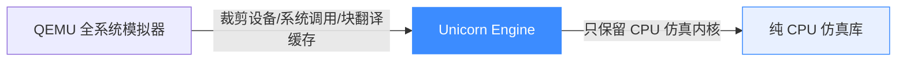
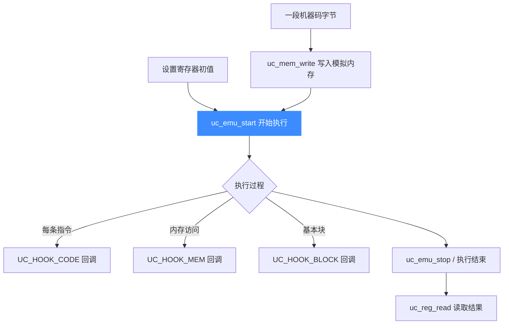
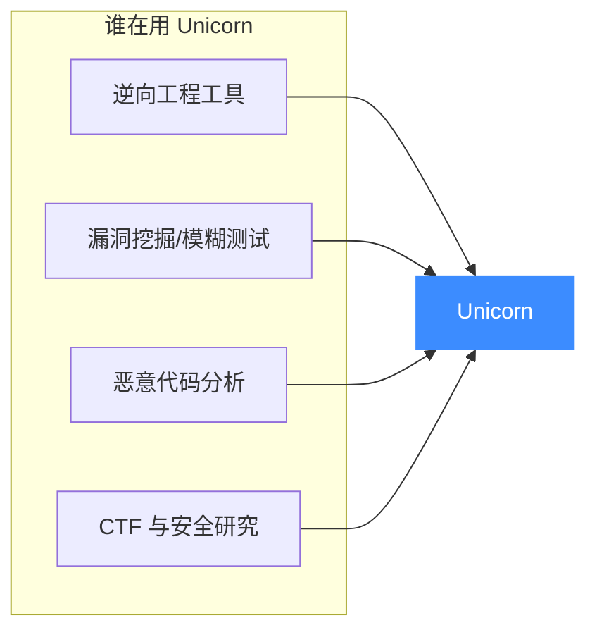

# 项目介绍

## 一句话定义

**Unicorn Engine** 是一个轻量级、多平台、多架构的 **CPU 模拟器框架**（CPU emulator framework），它基于 QEMU，但去掉了 QEMU 中所有与"整机仿真"无关的部分（设备模型、系统调用、二进制翻译的磁盘镜像等），只保留了最核心的 **CPU 仿真内核**。

## 它能做什么

Unicorn 能把一段**任意架构的机器码**，在你当前的操作系统上"跑起来"——不需要真实的对应 CPU，也不需要完整的操作系统镜像。

典型能力：

- **执行任意机器码**：把一段 ARM / x86 / MIPS 等字节码加载进内存，让它逐条执行。
- **读写寄存器与内存**：在执行前设置初始状态，执行后读取结果。
- **插桩（Hook）**：在每条指令、每个基本块、每次内存访问处挂载回调，实现断点、追踪、统计。
- **多架构通吃**：一套 C API，切换架构只需改两个枚举参数。

## 它解决了什么问题

在没有 Unicorn 之前，如果你要分析一段**非本机架构**的代码（比如在 x86 电脑上分析手机里的 ARM 代码），选择很有限：

| 方案 | 痛点 |
|------|------|
| 真机 / 真开发板 | 成本高、不可批量、难以自动化 |
| QEMU 全系统模式 | 太重，要带整个操作系统镜像，启动慢 |
| QEMU 用户态模式 | 依赖宿主系统调用，不能纯仿真裸代码 |
| 自己写解释器 | 多架构工作量大，性能差 |

Unicorn 的定位正是填这个空：**一个能被当作库链接进任意程序、专注 CPU 仿真、即开即用的轻量引擎**。详见 [它能解决什么问题](./problems.md)。

## 它解决得如何

经过多年迭代（目前为 2.x 版本），Unicorn 已成为业界事实标准：

- **覆盖面广**：支持 10 大 CPU 架构，16 种语言绑定。
- **性能可观**：基于 TCG 即时编译，比纯解释执行快一个数量级。
- **被广泛采用**：逆向工程（IDA、radare2）、漏洞挖掘（oss-fuzz 持续模糊测试）、恶意代码分析、CTF、游戏外挂检测等领域都在用。
- **质量稳定**：有完整的回归测试、单元测试与基准测试套件，并由 oss-fuzz 持续守护。

## 谁应该读这个文档站

本站是一个**教学站点**，目标读者是：

- 想理解 CPU 仿真原理的开发者
- 逆向 / 安全研究人员
- 需要在程序中嵌入"执行任意机器码"能力的人
- 对 QEMU TCG 内部机制好奇的学习者

读完本站，你将**完全理解 Unicorn 是做什么的、怎么做成的、以及如何使用它**。

> 📌 **阅读建议**：先看 [核心概念](./concepts.md) 建立心智模型，再按 [功能详解](../features/architectures.md) 逐个深入。本站遵循「一图抵前言」原则，每个概念都尽量配图说明。

## 📂 相关源码

| 文件/目录 | 角色 |
|------|------|
| [`include/unicorn/unicorn.h`](https://github.com/android-security-engineer/unicorn-skills/blob/master/include/unicorn/unicorn.h) | 公共 C API 声明 |
| [`uc.c`](https://github.com/android-security-engineer/unicorn-skills/blob/master/uc.c) | 公共 API 实现（`uc_open`/`uc_emu_start` 等） |
| [`samples/`](https://github.com/android-security-engineer/unicorn-skills/blob/master/samples/) | 各架构最小可运行示例 |

