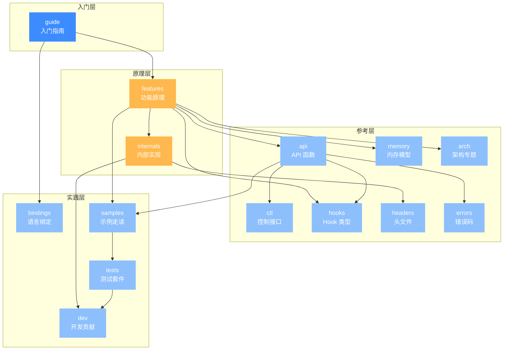

# 学习路径与知识地图

本站收录了 319 篇文档，散落在 14 个分区目录里——从入门概念到 API 参考、从内部实现到各架构专题。如果你刚进来不知道从哪读起、各主题如何衔接，这一页就是你的导航中枢：先用一张总览图看清全站结构，再按分区定位你想深入的领域，最后从 4 条推荐路线里挑一条顺着读下去。

## 🗺️ 全站知识地图

下图把 14 个分区按「入门层 → 原理层 → 参考层 → 实践层」四层组织，箭头表达推荐阅读依赖：先建立概念，再理解原理，查参考手册，最后落到实践。

颜色含义：主色蓝（`#3c8cff`）= 入门起点；辅色橙（`#ffb84d`）= 原理深挖；浅蓝（`#8dbffc`）= 参考与实践层。

## 📚 各分区导览

| 分区 | 入口链接 | 一句话定位 | 页数 |
|------|---------|-----------|------|
| 入门指南 | [/guide/intro](/guide/intro) | 从零认识 Unicorn，建立心智模型 | 13 |
| 功能详解 | [/features/architectures](/features/architectures) | 每个能力点的实现原理与设计取舍 | 16 |
| API 参考 | [/api/](/api/) | `unicorn.h` 中每个可调用函数逐页详解 | 40 |
| 控制接口 | [/ctl/](/ctl/) | `uc_ctl_*` 便捷宏，运行时动态调参 | 21 |
| Hook 类型 | [/hooks/](/hooks/) | 每种 `UC_HOOK_*` 触发点一页 | 22 |
| 内存模型 | [/memory/overview](/memory/overview) | 映射、保护位、MMIO、页大小等机制 | 13 |
| 架构专题 | [/arch/x86/](/arch/x86/) | 各架构寄存器/模式/指令/CPU 型号参考 | 70 |
| 内部实现 | [/internals/overview](/internals/overview) | uc.c 分发、TCG 流水线、softmmu 等内核机制 | 26 |
| 头文件参考 | [/headers/unicorn-h](/headers/unicorn-h) | 核心 `.h` 文件逐页拆解 | 5 |
| 语言绑定 | [/bindings/overview](/bindings/overview) | Python/Rust/Go/Java 等 12 种绑定的差异 | 14 |
| 示例走读 | [/samples/overview](/samples/overview) | `samples/*.c` 逐行讲解 | 16 |
| 测试套件 | [/tests/](/tests/) | 每个架构/横切测试套件的结构与用例 | 13 |
| 错误码 | [/errors/](/errors/) | 每个 `UC_ERR_*` 的触发场景与处理建议 | 22 |
| 开发贡献 | [/dev/](/dev/) | 回归/模糊/基准测试、CMake/MSVC 等基础设施 | 7 |

## 🛤️ 推荐阅读路线

根据你的目标挑一条，按编号顺序读下去即可。每条路线前都附一张流程图，方便你一眼看清步骤串联。

### 路线一：零基础入门路线

适合完全没接触过 CPU 仿真的读者，目标是让你在 30 分钟内跑通第一个程序并理解它做了什么。

1. 读 [项目介绍](/guide/intro) 了解 Unicorn 是什么、能做什么。
2. 读 [它能解决什么问题](/guide/problems) 确认它契合你的场景。
3. 跟着 [快速开始](/guide/quickstart) 装好环境。
4. 敲一遍 [第一个模拟程序](/guide/first-program) 跑通最小例子。
5. 读 [核心概念](/guide/concepts) 建立引擎/内存/寄存器/Hook 的心智模型。
6. 读 [架构总览](/guide/architecture) 理解内部怎么分层。
7. 遇到术语随时查 [术语表](/guide/glossary)。

### 路线二：逆向 / 漏洞分析者路线

适合做恶意代码分析、shellcode 解析、漏洞复现的读者，目标是掌握"把一段二进制丢进 Unicorn 单步执行并观察行为"的全部技能。

1. 快速过 [项目介绍](/guide/intro) 与 [架构总览](/guide/architecture)。
2. 精读 [Hook 插桩体系](/features/hooks)，掌握指令/内存/未映射三类回调。
3. 读 [内存映射与管理](/features/memory) 理解如何为 shellcode 布局地址空间。
4. 通读 [Hook 类型参考](/hooks/) 每个触发点的语义，重点看 `UC_HOOK_CODE`、`UC_HOOK_MEM_*_UNMAPPED`。
5. 走读 [sample_x86.c](/samples/sample-x86) 看全功能样板怎么挂钩。
6. 进阶读 [MMU 与虚拟内存](/features/mmu) 处理带页表的样本。
7. 实战中遇到地址访问异常，回查 [错误码](/errors/)。

### 路线三：框架开发者路线

适合打算基于 Unicorn 二次开发、写封装库或贡献代码的读者，目标是看懂从 `uc_open` 到 CPU 执行的完整调用链。

1. 先读 [架构总览](/guide/architecture) 建立分层视图。
2. 进 [内部实现总览](/internals/overview) 看代码组织。
3. 读 [uc.c 分发层](/internals/uc-dispatch) 理解函数指针后端如何分发。
4. 读 [TCG 翻译流水线](/internals/tcg-pipeline) 看指令如何变 TCG ops。
5. 读 [cpu-exec 执行循环](/internals/cpu-exec) 看翻译块如何被执行。
6. 对照 [unicorn.h 头文件](/headers/unicorn-h) 梳理公共 API 契约。
7. 最后看 [开发基础设施](/dev/) 了解构建、测试、模糊测试如何运作。

### 路线四：插桩 / 动态分析者路线

适合做动态二进制插桩、覆盖率采集、fuzzer 集成的读者，目标是把 Unicorn 当作可编程的 CPU 监控引擎。

1. 精读 [Hook 插桩体系](/features/hooks) 理解回调粒度与性能代价。
2. 通读全部 [Hook 类型参考](/hooks/)，重点关注 `UC_HOOK_BLOCK`、`UC_HOOK_EDGE_GENERATED`、`UC_HOOK_TCG_OPCODE`。
3. 读 [寄存器读写](/features/registers) 掌握 v2 的带宽度变体与批量 API。
4. 查 [API 寄存器读写分组](/api/) 里 `uc_reg_read_batch`、`uc_reg_write_batch` 的精确签名。
5. 读 [上下文控制](/features/context) 学会保存/恢复状态做快照式插桩。
6. 通读 [uc_ctl 控制接口](/ctl/) 学会运行时刷 TB 缓存、切 TLB 模式、管理多出口。

## 🔗 快速入口

::: tip 最常用的几个入口
- 跑起来：[快速开始](/guide/quickstart) · [第一个模拟程序](/guide/first-program)
- 查 API：[API 参考](/api/) · [uc_ctl 控制接口](/ctl/) · [错误码](/errors/)
- 用 Hook：[Hook 插桩体系](/features/hooks) · [Hook 类型参考](/hooks/)
- 看实现：[架构总览](/guide/architecture) · [内部实现总览](/internals/overview)
- 抄代码：[示例总览](/samples/overview) · [sample_x86.c](/samples/sample-x86)
- 选架构：[X86](/arch/x86/) · [ARM](/arch/arm/) · [ARM64](/arch/arm64/) · [MIPS](/arch/mips/)
:::

## 相关页面

- [项目介绍](/guide/intro)
- [架构总览](/guide/architecture)
- [核心概念](/guide/concepts)
- [术语表](/guide/glossary)
