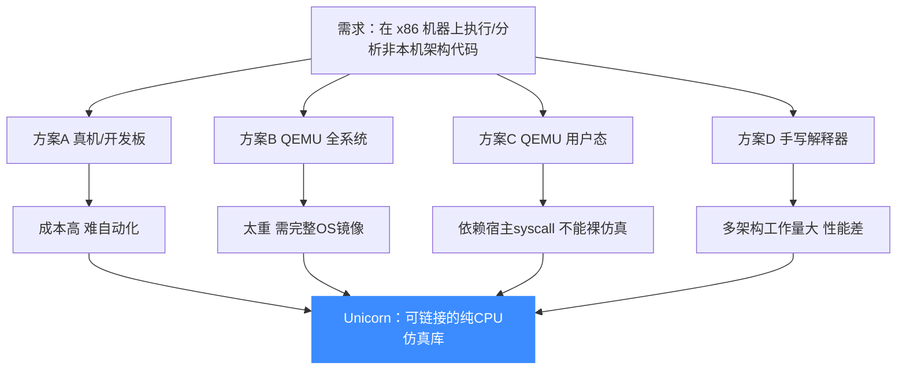
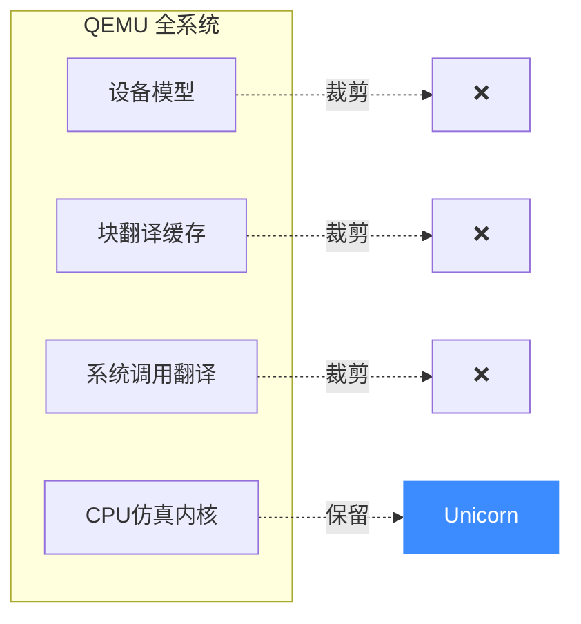

# 它能解决什么问题

理解一个工具，最好的方式是先理解**没有它会怎样**。本页梳理 Unicorn 出现之前，CPU 仿真领域的几类典型痛点，以及 Unicorn 是如何针对性解决的。

## 痛点全景

## 逐项对照

### 1. 真机 / 开发板方案

你想分析一段 ARM 固件，最直接的办法是找一台 ARM 设备跑起来。

- **痛点**：硬件成本、采购周期长；难以并发批量分析（安全研究常需一次跑成千上万个样本）；环境难以复现与快照。
- **Unicorn 的解法**：纯软件仿真，一个进程可创建**任意多个独立的引擎实例**并发执行，天然支持大规模自动化。

### 2. QEMU 全系统模式

QEMU 的 system 模式可以仿真一整台机器，连 BIOS、网卡、磁盘都有。

- **痛点**：太"重"——你得准备一个完整的操作系统镜像才能跑起来；启动一个 guest 要几秒到几十秒；设备模型与你的"只分析几条指令"目标无关，却占用了大量代码与开销。
- **Unicorn 的解法**：**只裁剪保留 QEMU 的 CPU 仿真内核**，砍掉所有设备模型、块翻译缓存持久化、系统调用翻译。结果是：一个可被 `dlopen` / 链接的库，瞬时即可开始执行第一条指令。

### 3. QEMU 用户态模式

QEMU 的 user 模式能把一个 ARM Linux 程序跑在 x86 Linux 上，把它的系统调用转发给宿主内核。

- **痛点**：它**依赖宿主操作系统**——程序执行到 `read()`、`mmap()` 时，需要宿主内核配合。这意味着你**无法用它仿真一段裸机器码**（比如 shellcode、固件里的中断处理），因为那段代码根本不发起系统调用，或发起的是另一种操作系统的调用。
- **Unicorn 的解法**：完全不依赖宿主系统调用。它仿真的是 CPU 本身，内存是你手动 `uc_mem_map` 出来的几块，执行到访存就触发你的 Hook。**它仿真的是"芯片"，不是"机器里的程序"**。

### 4. 手写解释器

自己写一个把 ARM 指令逐条翻译成 C 函数的解释器。

- **痛点**：单架构就要处理成百上千条指令、各种寻址模式与标志位；要多架构则工作量乘 N；解释执行**性能差**（每条指令都要查表分发），跑大段代码很慢。
- **Unicorn 的解法**：复用 QEMU 成熟的多架构前端（已覆盖 10 大架构），并用 **TCG 即时编译**把目标指令编译成宿主机原生代码，性能远超解释器。

## Unicorn 的核心定位

把上面四点收束成一句话：

> **Unicorn = QEMU 的 CPU 内核，被改造成一个可链接、可并发、可插桩、零系统依赖的库。**

它不试图仿真整机，也不试图运行完整操作系统——它只做一件事：**忠实地、高性能地、可观测地仿真 CPU 执行指令**。

## 它不适合做什么

诚实地说，Unicorn 也有边界：

- ❌ **不能仿真外设**：没有磁盘、网卡、GPU 模型。需要外设交互的场景请用 QEMU system 模式。
- ❌ **不能直接跑操作系统**：没有 BIOS、没有中断控制器的高级抽象（虽有基础中断支持）。
- ❌ **不负责二进制加载**：它只认"内存里的字节"，ELF/PE 的解析、加载地址计算需要你自己做。

这些边界恰恰是它**轻量**的代价与来源。认清边界，才能用对工具。
## 📂 相关源码

| 文件/目录 | 角色 |
|------|------|
| [`include/unicorn/unicorn.h`](https://github.com/android-security-engineer/unicorn-skills/blob/master/include/unicorn/unicorn.h) | Unicorn 能力边界的 API 声明 |
| [`samples/`](https://github.com/android-security-engineer/unicorn-skills/blob/master/samples/) | 可运行示例 |

---

下一步，看 [快速开始](./quickstart.md) 动手跑起第一个模拟程序。
