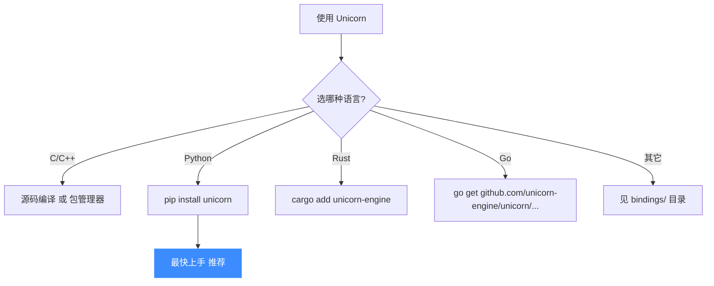
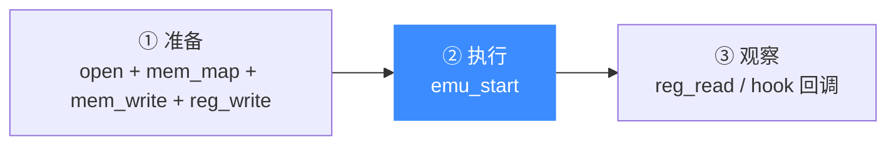

# 快速开始

本页用最短的路径，让你在 5 分钟内跑通第一个 Unicorn 程序。

## 安装方式总览



## 方式一：Python（最快上手）

无需编译，一行装好：

```bash
pip install unicorn
```

下面这段代码模拟执行一段 x86-32 机器码（`INC ecx; DEC edx`），并打印执行后的寄存器值：

```python
from unicorn import *
from unicorn.x86_const import *

# 要模拟的机器码: INC ecx; DEC edx
X86_CODE32 = b"\x41\x4a"

# 模拟内存地址
ADDRESS = 0x1000000

print("=== Unicorn x86 仿真演示 ===")

# 1. 创建引擎: 架构=x86, 模式=32位
mu = Uc(UC_ARCH_X86, UC_MODE_32)

# 2. 映射内存: 在 ADDRESS 处映射 2MB, 权限=全开(RWX)
mu.mem_map(ADDRESS, 2 * 1024 * 1024)

# 3. 写入机器码到内存
mu.mem_write(ADDRESS, X86_CODE32)

# 4. (可选)设置寄存器初值
mu.reg_write(UC_X86_REG_ECX, 0x10)
mu.reg_write(UC_X86_REG_EDX, 0x20)

# 5. 开始仿真: 从 ADDRESS 执行, 直到 ADDRESS+len(CODE)
mu.emu_start(ADDRESS, ADDRESS + len(X86_CODE32))

# 6. 读取执行后的寄存器
ecx = mu.reg_read(UC_X86_REG_ECX)  # 0x10 + 1 = 0x11
edx = mu.reg_read(UC_X86_REG_EDX)  # 0x20 - 1 = 0x1f
print(f"ECX = 0x{ecx:x}")  # 输出: ECX = 0x11
print(f"EDX = 0x{edx:x}")  # 输出: EDX = 0x1f
```

运行后你会看到 `ECX` 从 `0x10` 变成 `0x11`（`INC`），`EDX` 从 `0x20` 变成 `0x1f`（`DEC`）。CPU 就这样被"假装"跑起来了。

## 方式二：C（贴近底层）

如果你要用 C，最稳妥的是源码编译。详见 [编译与安装](./compile.md)。装好后，等价的 C 程序如下（精简自 [`samples/sample_x86.c`](https://github.com/android-security-engineer/unicorn-skills/blob/master/samples/sample_x86.c)）：

```c
#include <stdio.h>
#include <unicorn/unicorn.h>

#define X86_CODE32 "\x41\x4a"  // INC ecx; DEC edx
#define ADDRESS    0x1000000

int main(void)
{
    uc_engine *uc;
    uc_err err;
    int r_ecx, r_edx;

    // 1. 创建引擎
    err = uc_open(UC_ARCH_X86, UC_MODE_32, &uc);
    if (err) {
        printf("uc_open 失败: %s\n", uc_strerror(err));
        return 1;
    }

    // 2. 映射内存
    uc_mem_map(uc, ADDRESS, 2 * 1024 * 1024, UC_PROT_ALL);

    // 3. 写入机器码
    uc_mem_write(uc, ADDRESS, X86_CODE32, sizeof(X86_CODE32) - 1);

    // 4. 设置寄存器
    r_ecx = 0x10;
    r_edx = 0x20;
    uc_reg_write(uc, UC_X86_REG_ECX, &r_ecx);
    uc_reg_write(uc, UC_X86_REG_EDX, &r_edx);

    // 5. 仿真
    uc_emu_start(uc, ADDRESS, ADDRESS + sizeof(X86_CODE32) - 1, 0, 0);

    // 6. 读取结果
    uc_reg_read(uc, UC_X86_REG_ECX, &r_ecx);
    uc_reg_read(uc, UC_X86_REG_EDX, &r_edx);
    printf("ECX = 0x%x\n", r_ecx);  // 0x11
    printf("EDX = 0x%x\n", r_edx);  // 0x1f

    // 7. 释放
    uc_close(uc);
    return 0;
}
```

## 三步心智模型

无论哪种语言，Unicorn 程序永远是这三步：



## 📂 相关源码

| 文件/目录 | 角色 |
|------|------|
| [`include/unicorn/unicorn.h`](https://github.com/android-security-engineer/unicorn-skills/blob/master/include/unicorn/unicorn.h) | `uc_open`/`uc_emu_start`/`uc_reg_read` 声明 |
| [`uc.c`](https://github.com/android-security-engineer/unicorn-skills/blob/master/uc.c) | 上述 API 实现 |
| [`samples/sample_x86.c`](https://github.com/android-security-engineer/unicorn-skills/blob/master/samples/sample_x86.c) | 完整 x86 C 示例 |

## 下一步

- 想看带 Hook 的完整示例？→ [第一个模拟程序](./first-program.md)
- 想理解每一步背后的原理？→ [核心概念](./concepts.md)
- 想编译 C 版本？→ [编译与安装](./compile.md)
