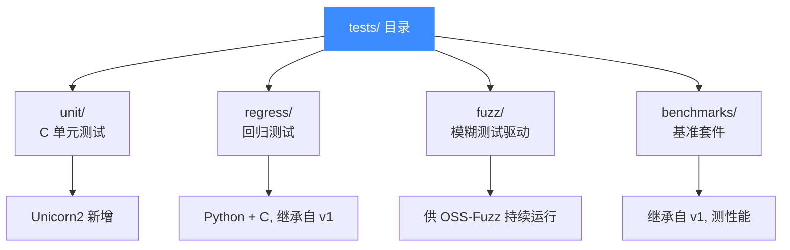
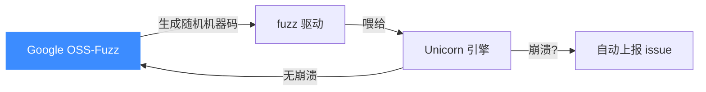
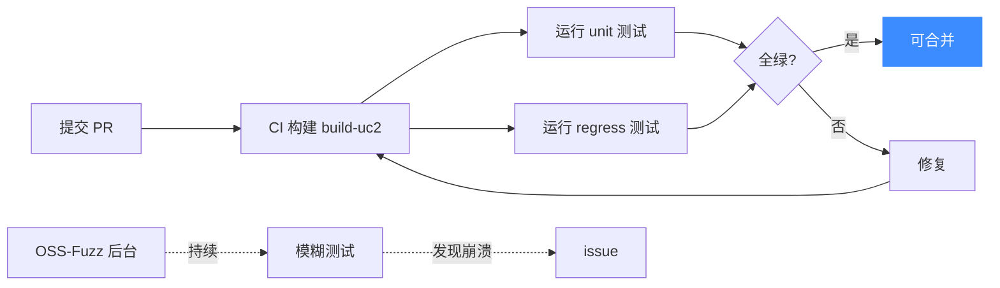

# 测试与基准

Unicorn 高度重视测试，这也是它质量稳定的原因。本页介绍 `tests/` 目录的结构与各测试的作用。

## 测试体系总览

## 各目录职责

### `unit/` — C 单元测试

Unicorn 2 引入的、用 C 编写的单元测试。**新功能应优先在此添加测试**。聚焦于单个 API 或行为的细粒度验证。

### `regress/` — 回归测试

从 Unicorn 1 继承而来，用 Python 和 C 编写。每个测试通常对应一个曾经出现过的 bug，确保它不会复活。修 bug 时配套加一条回归测试是良好实践。

### `fuzz/` — 模糊测试

模糊测试驱动，供 [OSS-Fuzz](https://github.com/google/oss-fuzz) 持续运行。Unicorn 的 fuzzing 状态徽章在 README 顶部可见——这意味着它在持续被随机输入"攻击"，发现崩溃即上报。

### `benchmarks/` — 基准测试

从 Unicorn 1 继承的性能基准套件，用于衡量仿真吞吐量，对比不同版本、不同 Hook 配置下的性能差异。

## 测试与质量保障流程

## 贡献指南

官方建议：**每次提 PR 都应附带测试**，且优先放入 `unit/`。这既是质量保障，也便于 reviewer 验证你的改动。
## 📂 相关源码

| 文件/目录 | 角色 |
|------|------|
| [`tests/unit/`](https://github.com/android-security-engineer/unicorn-skills/blob/master/tests/unit/) | 单元测试（`acutest` 框架，每架构一个 `test_<arch>.c`） |
| [`tests/regress/`](https://github.com/android-security-engineer/unicorn-skills/blob/master/tests/regress/) | 回归测试（Python + C，来自 v1） |
| [`tests/fuzz/`](https://github.com/android-security-engineer/unicorn-skills/blob/master/tests/fuzz/) | OSS-Fuzz 驱动 |
| [`tests/benchmarks/`](https://github.com/android-security-engineer/unicorn-skills/blob/master/tests/benchmarks/) | 性能基准 |
| [`docs/Testing.md`](https://github.com/android-security-engineer/unicorn-skills/blob/master/docs/Testing.md) | 测试体系说明 |

---

下一步：[常见问题 FAQ](./faq.md)。
