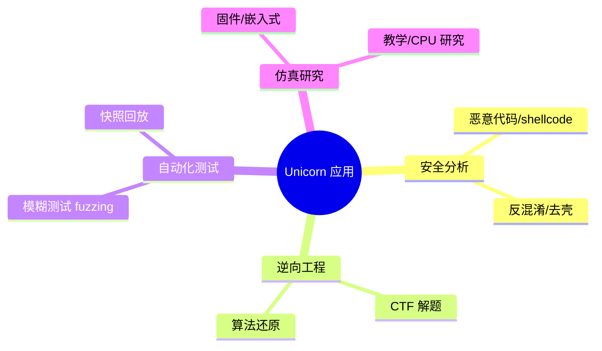
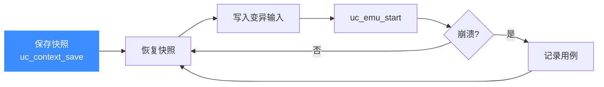

# 典型应用场景

本页盘点 Unicorn 在真实工作中最常见的六类用途。每一类都回答三个问题：**为什么用 Unicorn**、**怎么用**、以及**关联哪些功能页**。读完你能判断自己的需求是否适合用 Unicorn，以及从哪个功能入手。

## 场景全景图



Unicorn 是"纯 CPU 仿真库"这一定位，决定了它的用武之地：凡是需要**可控地、可观测地、跨架构地执行机器码**，又不想背上整机仿真包袱的场景，它都合适。

## 🦠 场景一：恶意代码 / shellcode 分析

**为什么用**：恶意样本常是一段位置无关的 shellcode，或是解密后才现身的 payload。直接在真机上运行有风险，静态反汇编又看不到运行时解出来的真实指令。Unicorn 把这段字节码放进一块沙箱内存里逐条执行，既隔离又能全程观测。

**怎么用**：映射一块 RWX 内存写入 shellcode，装一个 [`UC_HOOK_CODE`](/hooks/code) 追踪每条指令，再用 [`UC_HOOK_MEM_WRITE`](/hooks/mem-write) 观察它往哪里写、写了什么——自解密循环执行完，内存里就是脱壳后的明文。遇到 `syscall` / `int 0x80` 用 [`UC_HOOK_INTR`](/hooks/intr) 拦截并模拟返回值。

```c
// 追踪 shellcode 每条指令的地址与长度
static void trace_code(uc_engine *uc, uint64_t addr, uint32_t size, void *ud) {
    printf("exec 0x%" PRIx64 ", size=%u\n", addr, size);
}
uc_hook h;
uc_hook_add(uc, &h, UC_HOOK_CODE, trace_code, NULL, 1, 0);
```

**关联功能**：[Hook 体系](/features/hooks)、[中断 Hook](/hooks/intr)、[内存权限](/memory/permissions)。

## 🎯 场景二：CTF 与逆向

**为什么用**：CTF 逆向题里常有一段验证算法（check flag）。与其手工把汇编翻译成 Python，不如直接把那段函数字节 copy 进 Unicorn，喂不同输入观察输出——把仿真器当"可编程的 CPU 单元测试床"。

**怎么用**：只映射目标函数所在的代码页 + 一块栈内存，设好 SP 与参数寄存器，用 `uc_emu_start(begin, end, ...)` 让它从函数入口跑到 `ret` 处停下，再 [`uc_reg_read`](/api/reg-read) 读返回值。配合 [批量寄存器 API](/features/batch-api) 可一次性布置参数。

**关联功能**：[快速开始](./quickstart.md)、[寄存器读写](/features/registers)、[uc_emu_start](/api/emu-start)。

## 🧪 场景三：模糊测试（fuzzing）

**为什么用**：fuzzing 的瓶颈是"每个测试用例都要重新初始化目标"。Unicorn 可以把目标函数的初始状态存成快照，每喂一个输入就从快照恢复、执行、观察崩溃，跳过昂贵的重建过程——这正是 AFL-Unicorn 等工具的核心思路。

**怎么用**：先跑到目标函数入口，用 [`uc_context_save`](/api/context-save) 连同 [内存快照](/memory/cow-snapshot) 存下状态；此后循环：`uc_context_restore` 恢复 → 写入新输入 → `uc_emu_start` → 通过 [`UC_HOOK_MEM_*_UNMAPPED`](/hooks/mem-unmapped) 捕获非法访存当作 crash 信号。



**关联功能**：[上下文控制](/features/context)、[写时复制快照](/memory/cow-snapshot)、[非法内存 Hook](/hooks/mem-unmapped)。

## 🔌 场景四：固件 / 嵌入式仿真

**为什么用**：分析 IoT / MCU 固件时往往没有真实开发板，或想批量跑。Unicorn 能把固件中某段驱动、加解密例程单独抽出来仿真，不必启动整个 RTOS。

**怎么用**：按固件的内存布局 [`uc_mem_map`](/api/mem-map) 出 Flash / SRAM 区域并写入固件镜像；外设寄存器用 [MMIO 映射](/memory/mmio) 挂上回调，模拟"读某地址返回状态位"。ARM Cortex-M 固件注意用 `UC_MODE_THUMB`，并处理 `exec_return` 魔法异常（中断号 8）。

**关联功能**：[MMIO 内存](/memory/mmio)、[内存映射](/features/memory)、[支持架构](/features/architectures)。

## 🎓 场景五：教学与 CPU 研究

**为什么用**：想直观演示"一条指令如何改变寄存器和标志位"，Unicorn 是极佳的教具——单步执行、随时 dump 状态，跨 10 种架构对比同一算法的不同实现。

**怎么用**：装 [`UC_HOOK_CODE`](/hooks/code) 做单步，每步用 [批量读寄存器](/api/reg-read-batch) 打印完整上下文；切换架构只需改 `uc_open` 的两个枚举参数，即可对比 x86 与 ARM 的执行差异。

**关联功能**：[核心概念](./concepts.md)、[JIT 编译原理](/features/jit)、[架构总览](./architecture.md)。

## 🧩 场景六：反混淆 / 去壳

**为什么用**：加壳程序在运行时才把真实代码解到内存；控制流平坦化混淆则要靠实际执行才能看清跳转去向。Unicorn 让你"运行到解壳完成"再 dump 内存，或在仿真中记录真实的执行路径来还原控制流。

**怎么用**：仿真解壳 stub，用 [`UC_HOOK_MEM_WRITE`](/hooks/mem-write) 记录写入代码段的区域，当 PC 跳进新写入区域时 dump 出 OEP 附近内存；对平坦化混淆，用 [`UC_HOOK_BLOCK`](/hooks/block) 记录基本块访问顺序还原真实控制流。必要时用 [`uc_ctl_remove_cache`](/ctl/remove-cache) 处理自修改代码的缓存问题。

**关联功能**：[基本块 Hook](/hooks/block)、[内存写 Hook](/hooks/mem-write)、[缓存控制](/ctl/remove-cache)。

::: tip 选型直觉
一句话判断是否该用 Unicorn：**你手上有一段机器码，想在受控环境里跑它并观察每一步**——如果是，Unicorn 几乎总是最轻的选择；如果你需要外设、文件系统、完整操作系统，请转向 QEMU 或 [Qiling](https://github.com/qilingframework/qiling)。
:::

::: warning 注意边界
Unicorn 不做二进制加载（ELF/PE 解析靠你）、不做系统调用（要自己在 `UC_HOOK_INTR` 里模拟）、不提供外设模型。认清这些边界见 [它能解决什么问题](./problems.md)。
:::

## 📂 相关源码

| 文件/目录 | 角色 |
|------|------|
| [`include/unicorn/unicorn.h`](https://github.com/android-security-engineer/unicorn-skills/blob/master/include/unicorn/unicorn.h) | API 声明 |
| [`samples/`](https://github.com/android-security-engineer/unicorn-skills/blob/master/samples/) | 各场景示例 |

## 相关页面

- [它能解决什么问题](./problems.md)
- [Hook 插桩体系](/features/hooks)
- [上下文控制与快照](/features/context)
- [写时复制快照](/memory/cow-snapshot)
