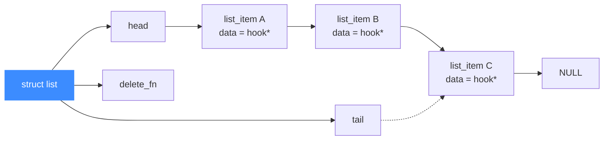

# list.h 链表工具头文件

> 🔗 [`include/list.h`](https://github.com/android-security-engineer/unicorn-skills/blob/master/include/list.h) 是 Unicorn 自研的一份**极简单向链表**的头文件，定义了 `struct list` / `struct list_item` 两个结构与六个链表操作函数原型。读完你会清楚它定义了哪些类型、谁该 include 它，以及它为什么只服务于内部 Hook 链表而刻意不依赖 glib。

## 📌 概述

`list.h` 是 **内部工具头文件**，不在公开 API 表面（公开 API 是 `include/unicorn/unicorn.h`）。它只定义了最小可用的单链表容器，专门用来承载 `uc_struct` 里的各类 Hook 链表与延迟删除队列。整份头文件不到 40 行，刻意不引入 glib，追求最小开销与可预测的遍历顺序。

**谁应该 include 它：**

- Unicorn **核心 C 实现**（`list.c` 是它的实现）
- 内部头 `include/uc_priv.h`（它把 `struct list` 嵌进 `uc_struct.hook[]` 与 `hooks_to_del`）

**谁不应该 include 它：**

- 语言绑定的最终使用者（Python/Rust/Go/… 用户）——应只用 `unicorn/unicorn.h`
- 只想读寄存器、映射内存、加 Hook 的应用代码

::: warning uc_priv.h 与 qemu.h 是内部头
`list.h` 自身是工具头，但它被 `uc_priv.h` 间接包含，而 `uc_priv.h` 与它 include 的 `qemu.h` 都属于**内部头文件**，其内容随版本可能变动。**绑定使用者不应直接 include 这两个头**，应只依赖 `include/unicorn/unicorn.h` 暴露的稳定 API。直接依赖内部结构体会让你绑死在某一版的字段布局上。
:::

## 🧩 它定义了什么

| 类别 | 代表符号 | 用途 |
| --- | --- | --- |
| 函数指针 typedef | `delete_fn` | 节点析构回调，在 `list_clear` / `list_remove` 时调用 |
| 结构体 | `struct list_item` | 链表节点，持有一个 `void *data` 与 `next` |
| 结构体 | `struct list` | 表头，持有 `head` / `tail` / `delete_fn` |
| 函数原型 | `list_new` / `list_clear` / `list_insert` / `list_append` / `list_remove` / `list_exists` | 创建、清空、头插、尾插、按值删除、按值查询 |

头文件唯一的外部依赖是 `unicorn/platform.h`（提供 `bool` 等基础类型），不拉入任何 QEMU 类型。

## 🔢 关键类型与函数原型

| 符号 | 声明 | 含义 |
| --- | --- | --- |
| `delete_fn` | `typedef void (*delete_fn)(void *data);` | 节点析构回调签名 |
| `struct list_item` | `{ struct list_item *next; void *data; }` | 单链表节点 |
| `struct list` | `{ struct list_item *head, *tail; delete_fn delete_fn; }` | 同时带头尾指针的表头 |
| `list_new` | `struct list *list_new(void);` | `calloc` 一个空表，返回 NULL 失败 |
| `list_clear` | `void list_clear(struct list *list);` | 摘除全部节点；对每个 data 调 `delete_fn`（若有） |
| `list_insert` | `void *list_insert(struct list *list, void *data);` | 头插，返回生成的节点指针，NULL 失败 |
| `list_append` | `void *list_append(struct list *list, void *data);` | 尾插，返回生成的节点指针，NULL 失败 |
| `list_remove` | `bool list_remove(struct list *list, void *data);` | 按数据**指针**查找并摘除，命中调 `delete_fn` 并返回 true |
| `list_exists` | `bool list_exists(struct list *list, void *data);` | 是否存在该数据指针 |

::: tip 按指针比较，不是按值
`list_remove` / `list_exists` 都是用 `cur->data == data` 做指针相等判断，**不解引用 data、不调用任何比较函数**。因此传入的 `data` 必须是当初插入时的同一个指针。对 Hook 系统来说这正好够用——每条记录都是独一无二的 `struct hook *`。
:::

## 🧱 结构体字段说明

```c
// include/list.h
typedef void (*delete_fn)(void *data);

struct list_item {
    struct list_item *next;   // 下一个节点，末节点为 NULL
    void *data;               // 节点载荷（不归链表所有，由 delete_fn 负责释放）
};

struct list {
    struct list_item *head, *tail;  // 首尾指针；空表时两者皆 NULL
    delete_fn delete_fn;            // 可选析构回调；NULL 表示不释放 data
};
```

它是**单向链表**（只有 `next`），但同时保存 `head` 和 `tail`，所以头插和尾插都是 O(1)；代价是 `list_remove` / `list_exists` 需要 O(n) 顺序扫描。



## 💻 用法示例

`uc.c` 在注册 Hook 时就是直接调用这些原型。下面贴源码里的真实用法（节选自 `uc.c`）：

```c
// uc.c —— 头插：必须最先执行的 Hook（如指令计数 count_hook）
void *item = list_insert(l, (void *)h);

// uc.c —— 尾插：默认 uc_hook_add 走的就是 append
void *item = list_append(l, (void *)h);

// uc.c —— 关闭引擎时清空每条 Hook 链表与延迟删除队列
for (int i = 0; i < UC_HOOK_MAX; i++) {
    list_clear(&uc->hook[i]);
}
list_clear(&uc->hooks_to_del);

// uc.c —— uc_hook_del 时按 hook 指针摘除
if (list_remove(&uc->hook[i], (void *)hook)) {
    // 命中并已释放
}

// uc.c —— 检查某 hook 是否还在链表里
if (list_exists(&uc->hook[i], (void *)hook)) { ... }
```

对应的表头在 `uc_priv.h` 中是这样声明的：

```c
// include/uc_priv.h —— uc_struct 内部
struct list hook[UC_HOOK_MAX];   // 每种 Hook 类型一条链表
struct list hooks_to_del;        // 延迟删除队列
```

## 🔧 实现要点

实现全部在 `list.c`，没有单独的 `.c` 给到后端，几个值得注意的细节：

- **`list_new` 用 `calloc`**：表头字段（`head` / `tail` / `delete_fn`）清零，等价于一个「空表无析构」的初始状态。
- **`list_insert` 维护 `tail`**：当原表为空（`tail == NULL`）时，新节点既是 head 也是 tail；否则只动 `head`。
- **`list_append` 维护 `head`**：当原表为空（`head == NULL`）时，新节点既是 head 也是 tail；否则接到 `tail->next` 后再前移 `tail`。
- **`list_remove` 处理边界**：被删节点恰好是 `head` 或 `tail` 时要分别前移 `head` / 回退 `tail`（回退到前驱 `prev`）。
- **`list_clear` 只清节点，不管 `data` 的归属**：是否释放 `data` 完全取决于 `delete_fn` 是否设置——若为 `NULL`，则 `data` 的内存由调用方自行管理。

::: details list_clear vs 单纯 free 节点
`list_clear` 的语义是「摘除所有节点」，注释写明了它 *does not free their content*——但只要 `list->delete_fn` 非空，它就会对每个 `data` 调一次。也就是说「是否释放内容」被推迟到 `delete_fn` 决定。Hook 系统里 `hook` 节点的真正释放在 `hooks_to_del` 链表上做，因此主链表的 `delete_fn` 通常保持 NULL，避免双重释放。
:::

## ⚠️ 注意

- `list.h` 是内部工具头，**没有对外版本契约**：结构体字段、函数签名都可能在版本间变动。
- 它只支持单链表，**没有prev 指针、没有迭代器抽象**；遍历靠裸 `for (cur = head; cur; cur = cur->next)`，或上层宏（如 `uc_priv.h` 的 `HOOK_FOREACH`）。
- `list_remove` / `list_exists` 是 O(n) 线性扫描；Hook 链表通常很短，但若你拿来装大数据集，性能会差——那种场景请走 vendored QEMU 的 `glib_compat` 链表或哈希表。
- 节点的 `data` 内存归属由调用方决定：要么设置 `delete_fn` 让链表在清理时释放，要么调用方自己持有并管理。

## 📖 参考

- 源码头文件：[`include/list.h`](https://github.com/android-security-engineer/unicorn-skills/blob/master/include/list.h)
- 实现：[`list.c`](https://github.com/android-security-engineer/unicorn-skills/blob/master/list.c)
- 嵌入点：[`include/uc_priv.h`](https://github.com/android-security-engineer/unicorn-skills/blob/master/include/uc_priv.h)（把 `struct list` 用作 `uc_struct.hook[]` 与 `hooks_to_del`）
- 调用点：[`uc.c`](https://github.com/android-security-engineer/unicorn-skills/blob/master/uc.c)（`uc_hook_add` / `uc_hook_del` / `uc_close` 等）

## 📂 相关源码

| 文件 | 角色 |
|------|------|
| [`include/list.h`](https://github.com/android-security-engineer/unicorn-skills/blob/master/include/list.h) | 本页所述链表工具头，定义 `struct list` / `struct list_item` 与操作函数原型 |
| [`list.c`](https://github.com/android-security-engineer/unicorn-skills/blob/master/list.c) | 链表操作函数实现 |
| [`include/uc_priv.h`](https://github.com/android-security-engineer/unicorn-skills/blob/master/include/uc_priv.h) | 把 `struct list` 嵌入为 `uc_struct.hook[]` 与 `hooks_to_del` |
| [`uc.c`](https://github.com/android-security-engineer/unicorn-skills/blob/master/uc.c) | 在 `uc_hook_add` / `uc_hook_del` / `uc_close` 中调用链表操作 |

## 相关页面

- [list.c 链表工具](/internals/list)
- [公开 API](/api/)
- [struct uc_struct 结构](/internals/uc-struct)
- [uc.c 分发层](/internals/uc-dispatch)
- [uc_priv.h 内部私有头文件](/headers/uc-priv-h)
