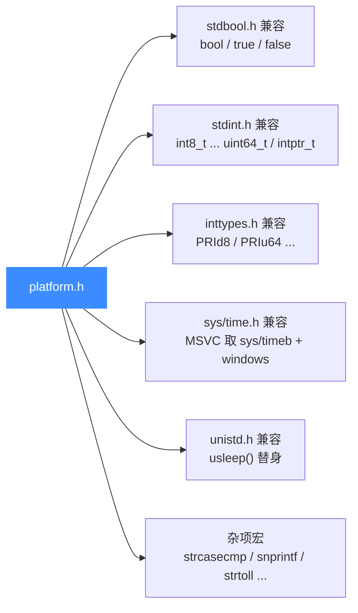
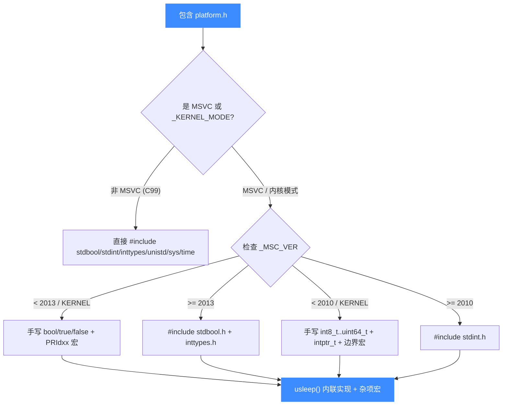

# platform.h 平台抽象

> 🔧 本页讲 [`include/unicorn/platform.h`](https://github.com/android-security-engineer/unicorn-skills/blob/master/include/unicorn/platform.h)：它不是 Unicorn 的业务 API，而是一层「编译器/系统兼容垫片」，用来补齐 MSVC、内核模式等非标准环境里缺失的 `stdbool.h` / `stdint.h` / `inttypes.h` / `unistd.h` / `sys/time.h`。读完你会知道这个头文件为谁而存在、定义了哪些类型与宏，以及为什么绑定开发者通常**不需要**直接关心它。

## 📌 概述

`platform.h` 是一个**内部公共头**：被 `include/unicorn/unicorn.h` 以及 QEMU 后端的 C 源文件包含，用来抹平不同工具链之间的 C 标准库差异。它的全部工作可以用一句话概括——「在缺失标准头的地方，提供等价的类型与宏；在标准头齐全的地方，直接 `#include` 它们」。

它解决三类痛点：

- MSVC 2010 之前没有 `stdint.h`，2013 之前没有 `inttypes.h` / `stdbool.h`；
- Windows 内核模式（`_KERNEL_MODE`）连这些 C99 头一并缺席；
- POSIX 的 `unistd.h` / `sys/time.h` 在 Windows 上不存在，而 Unicorn 代码里用了 `usleep` 等接口。



## 💡 谁该 include 它

- **C 源文件维护者**：在写或改 Unicorn 内部 C 代码（含 `qemu/` 下的 glue 文件）时，若需要 `uint32_t`、`PRIx64`、`usleep` 这类符号，应让 `platform.h` 先被包含（通常已被 `unicorn.h` 间接包含）。
- **绑定开发者**：一般**不直接** `#include <unicorn/platform.h>`，绑定面向的是 `unicorn.h`，平台兼容由该头在编译期自动处理。
- **Windows / 内核模式移植者**：这是你重点关心的文件——新增的类型、宏、函数替身都加在这里。

::: tip 头文件性质
`platform.h` 是**公共头**（与 `unicorn.h` 同目录、对外可见），但它面向的是「让代码能在各种工具链下编译」这一目标，而不是给用户调用功能的 API。你可以把它理解为 Unicorn 自带的迷你 `compat/`。
:::

## 🧩 关键宏：MSVC 版本号

文件开头定义了一组 `_MSC_VER` 数值常量，用于在预处理期判断 MSVC 版本，决定走「自带标准头」还是「手写替代」分支。

| 宏 | 值 | 对应 MSVC / Visual Studio |
| --- | --- | --- |
| `MSC_VER_VS2003` | `1310` | MSVC++ 7.1 / VS 2003 |
| `MSC_VER_VS2005` | `1400` | MSVC++ 8.0 / VS 2005 |
| `MSC_VER_VS2008` | `1500` | MSVC++ 9.0 / VS 2008 |
| `MSC_VER_VS2010` | `1600` | MSVC++ 10.0 / VS 2010（开始有 `stdint.h`） |
| `MSC_VER_VS2012` | `1700` | MSVC++ 11.0 / VS 2012 |
| `MSC_VER_VS2013` | `1800` | MSVC++ 12.0 / VS 2013（开始有 `inttypes.h`/`stdbool.h`） |
| `MSC_VER_VS2015` | `1900` | MSVC++ 14.0 / VS 2015（开始有 `snprintf`） |

判定逻辑的边界用这些宏表达：

- `_MSC_VER < MSC_VER_VS2013` → 没有 `stdbool.h`；
- `_MSC_VER < MSC_VER_VS2010` 或 `_KERNEL_MODE` → 没有 `stdint.h`；
- `_MSC_VER < MSC_VER_VS2013` 或 `_KERNEL_MODE` → 没有 `inttypes.h`；
- `_MSC_VER < MSC_VER_VS2015` → `snprintf` 不可用，映射到 `_snprintf`。

## 📦 stdint.h 兼容：定宽整数类型

在缺 `stdint.h` 的环境（MSVC < 2010 或 `_KERNEL_MODE`）下，`platform.h` 手工 `typedef` 出全套定宽整数与快速整数类型，并定义对应的 `INTxx_MAX` / `INTxx_MIN` / `UINTxx_MAX` 边界宏。

| 定宽类型 | 等价定义 | 快速类型 | 等价定义 |
| --- | --- | --- | --- |
| `int8_t` | `signed char` | `int_fast8_t` | `signed char` |
| `int16_t` | `signed short` | `int_fast16_t` | `int` |
| `int32_t` | `signed int` | `int_fast32_t` | `int` |
| `int64_t` | `signed long long` | `int_fast64_t` | `long long` |
| `uint8_t` | `unsigned char` | `uint_fast8_t` | `unsigned char` |
| `uint16_t` | `unsigned short` | `uint_fast16_t` | `unsigned int` |
| `uint32_t` | `unsigned int` | `uint_fast32_t` | `unsigned int` |
| `uint64_t` | `unsigned long long` | `uint_fast64_t` | `unsigned long long` |

指针宽类型按 `_WIN64` 区分：

```c
#ifdef _WIN64
typedef long long          intptr_t;
typedef unsigned long long uintptr_t;
#else
typedef _W64 int           intptr_t;
typedef _W64 unsigned int  uintptr_t;
#endif
```

`_W64` 是 MSVC 在 32 位上标记「将来 64 位指针」的注解，非 MSVC 环境下被本文件前置定义为空：

```c
#if !defined(_W64)
#if !defined(__midl) && (defined(_X86_) || defined(_M_IX86)) && _MSC_VER >= 1300
#define _W64 __w64
#else
#define _W64
#endif
#endif
```

边界宏采用 MSVC 的字面量后缀写法（`127i8`、`0xffffffffui32` 等），并派生出 `INT_FASTxx_*` 与 `INTPTR_*` / `UINTPTR_MAX`。

## 🔤 inttypes.h 兼容：格式化串

缺 `inttypes.h` 时，`platform.h` 自行定义 `PRId8`/`PRIu16`/`PRIx64`/`PRIX64` 等 `printf` 格式说明符。核心是两个长度修饰符：

```c
#define __PRI_8_LENGTH_MODIFIER__  "hh"
#define __PRI_64_LENGTH_MODIFIER__ "ll"
```

由此拼出 8 位与 64 位格式串；16 位固定 `"h"`，32 位因平台而异。

| 类型 | MSVC ≤ 2012 | 其它（OSX 等） |
| --- | --- | --- |
| `PRId32` | `"ld"` | `"d"` |
| `PRIu32` | `"lu"` | `"u"` |
| `PRIx32` | `"lx"` | `"x"` |
| `PRIX32` | `"lX"` | `"X"` |

此外还顺手重定义了 `cstool` 用到的几个字符串转换函数：

```c
#if defined(_MSC_VER) && (_MSC_VER <= MSC_VER_VS2012)
#define strtoull _strtoui64
#endif
```

::: details 为什么 32 位格式串要分平台？
老版 MSVC 把 32 位整数的 `%d` 当作 32 位，而 C99 标准里 `int32_t` 不一定是 `int`，长度修饰需更谨慎。其它平台（如 OSX）的 `inttypes.h` 直接给 `"d"`。MSVC ≤ 2012 没有 `inttypes.h`，这里保守地用 `"l"`。新平台直接 `#include <inttypes.h>` 由系统头兜底。
:::

## 🧮 stdbool.h 兼容

`stdbool.h` 的判定窗口很窄：仅当「MSVC 且 `_MSC_VER < 2013`」或 `_KERNEL_MODE` 时才缺失。此时在 C 模式下 `typedef unsigned char bool;` 并定义 `true`/`false`；C++ 模式下 `bool` 是关键字，跳过 typedef。

```c
#if (_MSC_VER < MSC_VER_VS2013) || defined(_KERNEL_MODE)
#ifndef __cplusplus
typedef unsigned char bool;
#define false 0
#define true 1
#endif
#else
#include <stdbool.h>   // VS2013+ 或非 MSVC
#endif
```

判定还排除了 Cygwin / MinGW（它们自带 `stdbool.h`），避免重复定义。

## ⏱️ sys/time.h 与 unistd.h 兼容

POSIX 头在 Windows 上不存在，`platform.h` 做了两件事：

**1. `sys/time.h` 替代**——MSVC 下改为引入 `<sys/types.h>` + `<sys/timeb.h>` + `<windows.h>`，否则直接 `#include <sys/time.h>`。

**2. `usleep()` 替身**——MSVC 下用可等待计时器实现微秒级睡眠，作为 `static` 内联函数直接放在头里：

```c
#if defined(_MSC_VER)
static int usleep(uint32_t usec)
{
    HANDLE timer;
    LARGE_INTEGER due;

    timer = CreateWaitableTimer(NULL, TRUE, NULL);
    if (!timer)
        return -1;

    due.QuadPart = (-((int64_t)usec)) * 10LL;   // 负值 = 相对到期
    if (!SetWaitableTimer(timer, &due, 0, NULL, NULL, 0)) {
        CloseHandle(timer);
        return -1;
    }
    WaitForSingleObject(timer, INFINITE);
    CloseHandle(timer);

    return 0;
}
#else
#include <unistd.h>
#endif
```

::: warning 非标函数
`usleep` 在这里以 `static` 函数形式出现在头文件中，每包含一次就生成一份。它仅供 Unicorn 内部使用，**不属于稳定 ABI**，绑定层不要依赖此符号。
:::

`due.QuadPart` 的单位是 100 ns，所以 `usec * 10` 得到微秒对应的 100 ns 计数，取负表示「从现在起相对到期」。

## 🛠️ 杂项兼容宏

最后一组是为 MSVC 的命名差异打补丁：

| 宏 / 类型 | 替换为 | 触发条件 |
| --- | --- | --- |
| `ssize_t` | `signed __int64`（64 位）/ `_W64 signed int`（32 位） | `defined(_MSC_VER)` |
| `va_copy(d, s)` | `((d) = (s))` | 未定义时 |
| `strcasecmp` | `_stricmp` | MSVC |
| `snprintf` | `_snprintf` | MSVC < 2015 |
| `strtoll` | `_strtoi64` | MSVC ≤ 2013 |

其中 `snprintf` 的映射在 VS2015 之后取消——因为 VS2015 终于提供了符合 C99 的 `snprintf`。

## 🔁 总体决策流程

下面的 mermaid 图概括了 `platform.h` 对每个兼容模块「用标准头 or 自己造」的判断路径：



## ⚠️ 注意事项

::: warning uc_priv.h 与 qemu.h 是内部头
`platform.h` 是公共头（可被外部包含），但 Unicorn 里另有两类头**绝不**应被绑定使用者直接 include：

- `include/uc_priv.h` —— 定义 `struct uc_struct`、Hook 类型与函数指针 typedef，是引擎内部状态，**仅限 C 实现**使用，结构布局随版本变化；
- `qemu/` 内的各 `qemu*.h` / `target/*/*.h` —— 来自魔改 QEMU 的内部头，符号未对外稳定。

绑定开发者只需 `#include <unicorn/unicorn.h>`（必要时再加 `unicorn/<arch>.h`）。平台差异由 `platform.h` 在编译期透明处理，无需手动包含。
:::

::: tip 不要在头里扩张业务类型
新增的对外类型应放进 `unicorn.h` 或 `unicorn/<arch>.h`。`platform.h` 只收「让代码跨工具链编译」所需的类型与宏，混入业务类型会污染所有包含它的翻译单元。
:::

## 📖 参考

- 源文件：[`include/unicorn/platform.h`](https://github.com/android-security-engineer/unicorn-skills/blob/master/include/unicorn/platform.h)（LGPL2）
- 标准参考：C99 的 `<stdbool.h>` / `<stdint.h>` / `<inttypes.h>`，POSIX 的 `<unistd.h>` / `<sys/time.h>`
- MSVC 版本号：[_MSC_VER 历史表](https://learn.microsoft.com/cpp/preprocessor/predefined-macros)

## 📂 相关源码

| 文件 | 角色 |
|------|------|
| [`include/unicorn/platform.h`](https://github.com/android-security-engineer/unicorn-skills/blob/master/include/unicorn/platform.h) | 本页所述平台抽象头，纯头文件无对应 .c 实现 |
| [`include/unicorn/unicorn.h`](https://github.com/android-security-engineer/unicorn-skills/blob/master/include/unicorn/unicorn.h) | 间接包含本头以获得跨工具链类型垫片 |

## 相关页面

- [C API 参考](/api/) —— 公共函数签名，本文件为它们提供编译期类型垫片
- [struct uc_struct 结构](/internals/uc-struct) —— 内部头 `uc_priv.h` 的核心结构（不应被绑定直接包含）
- [uc.c 分发层](/internals/uc-dispatch) —— 公共 API 如何转调后端，本文件保障其在 MSVC 下可编译
