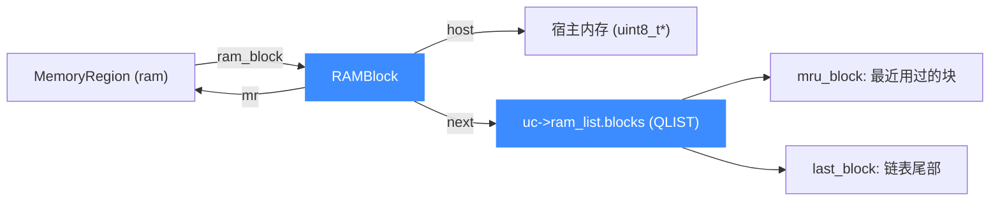

# qemu.h — QEMU 桥接头文件

> 🔧 [`include/qemu.h`](https://github.com/android-security-engineer/unicorn-skills/blob/master/include/qemu.h) 是 Unicorn 内部用来「缝合」精简版 QEMU 的桥头：它前向声明 `uc_struct`，再 include 一组 QEMU 内部头，并定义 `RAMBlock`、`RAMList`、`BounceBuffer` 三个核心运行时结构。读完你会清楚谁该 include 它、它把哪些 QEMU 类型带进了 `uc_struct`，以及为什么它和 `uc_priv.h` 同属「内部头」。

## 📌 概述

`qemu.h` 既不是公共 API 头（不含 `uc_*` 函数原型），也不属于 `qemu/` 树——它躺在 `include/` 顶层，作用是给 `uc_priv.h` 提供 QEMU 侧的类型定义。它的存在主要是**解决循环包含**：`RAMBlock` 本来住在 `qemu/include/exec/ramblock.h`，`RAMList` 住在 `qemu/include/exec/ramlist.h`，但因为它们和 `MemoryRegion`、`AddressSpace` 互相引用，Unicorn 把这两个结构临时挪到这里，并在文件头注明：

```c
// include/qemu.h
// This struct is originally from qemu/include/exec/ramblock.h
// Temporarily moved here since there is circular inclusion.
```

它只做四件事：

1. 前向声明 `struct uc_struct;`（避免与 `uc_priv.h` 互引打环）。
2. 定义 `OPC_BUF_SIZE` 宏。
3. include 一摞 QEMU 内部头：`sysemu/sysemu.h`、`sysemu/cpus.h`、`exec/cpu-common.h`、`exec/memory.h`、`qemu/thread.h`、`hw/core/cpu.h`、`vl.h`。
4. 定义 `struct RAMBlock`、`BounceBuffer`、`RAMList`。

::: warning 内部头，绑定使用者勿直接 include
`qemu.h` 与 [`uc_priv.h`](/internals/uc-struct) 都是 Unicorn 的内部实现头，二者都不属于 `<unicorn/unicorn.h>` 暴露的公共接口。绑定（Python/Rust/Go/…）和上层应用只应 include `include/unicorn/unicorn.h` 及 `include/unicorn/<arch>.h`。直接 include `qemu.h` 会把大量 QEMU 内部符号拖进你的编译单元，且这些结构字段在不同版本间不保证稳定，升级时极易破坏调用方。
:::

## 📥 谁该 include 它

只有 Unicorn 自身的 C 源码（`uc.c`、`qemu/exec.c`、各 `qemu/target/*` 后端）和需要触及 QEMU 内部类型的目标端代码需要它。它**被 `uc_priv.h` 间接拉入**——所以一旦你 include 了 `uc_priv.h`，`RAMBlock`/`RAMList`/`BounceBuffer` 就已经可见，无需再显式 include `qemu.h`。

```c
// 典型的内部源码开头（例如 qemu/exec.c 或后端 .c）
#include "uc_priv.h"   // 里面 #include "qemu.h"，于是 RAMBlock / RAMList 可见

// 之后即可使用：
//   uc->ram_list.blocks
//   uc->bounce.buffer
//   RAMBlock *block = uc->ram_list.mru_block;
```

## 🔑 关键定义速查

| 名称 | 类别 | 定义位置 | 用途 |
| --- | --- | --- | --- |
| `struct uc_struct;` | 前向声明 | `qemu.h:7` | 打破与 `uc_priv.h` 的循环包含 |
| `OPC_BUF_SIZE` | 宏（`=640`） | `qemu.h:9` | 操作码缓冲区大小；当前源码树已无引用，属历史遗留 |
| `struct RAMBlock` | 结构体 | `qemu.h:23` | 一段已分配的 guest 物理内存块（RAM） |
| `BounceBuffer` | typedef 结构体 | `qemu.h:35` | MMIO 临时中转缓冲（非直连内存的 map/unmap） |
| `RAMList` | typedef 结构体 | `qemu.h:43` | 全局 RAM 块链表与缓存指针，挂在 `uc->ram_list` |

## 🧱 RAMBlock：一块 guest RAM

`RAMBlock` 描述一段连续的、由宿主侧 `mmap`/`malloc` 支撑的 guest 物理内存。每个 RAM 型 `MemoryRegion` 持有一个 `ram_block`。Unicorn 在 `qemu/exec.c` 里用 `qemu_ram_alloc*` 创建、`qemu_ram_free` 释放，并通过 `QLIST` 串成链表挂在 `uc->ram_list.blocks` 上。

```c
// include/qemu.h（节选）
struct RAMBlock {
    struct MemoryRegion *mr;   // 所属的内存区域
    uint8_t *host;             // 宿主侧起始指针（GPA→HVA 的 HVA）
    ram_addr_t offset;         // 在 ram_list 地址空间里的偏移
    ram_addr_t used_length;    // 实际使用长度
    ram_addr_t max_length;     // 分配的最大长度
    uint32_t flags;
    QLIST_ENTRY(RAMBlock) next;  // RCU 链表节点，受 ram_list 锁保护
    size_t page_size;          // 宿主页大小（= uc->qemu_real_host_page_size）
};
```



字段含义：

| 字段 | 类型 | 含义 |
| --- | --- | --- |
| `mr` | `MemoryRegion *` | 反向指向所属区域；`qemu/exec.c` 用它把宿主指针翻回 `MemoryRegion` |
| `host` | `uint8_t *` | guest 物理内存对应的宿主虚拟地址，softmmu 访存的落点 |
| `offset` | `ram_addr_t` | 在统一 RAM 地址空间里的偏移，`find_ram_offset` 分配 |
| `used_length` / `max_length` | `ram_addr_t` | 当前已用 / 容量上限，`qemu_ram_get_used_length` 读它 |
| `flags` | `uint32_t` | 共享等标志，`qemu_ram_is_shared` 检测 |
| `next` | `QLIST_ENTRY` | RCU 链表节点；增删走 `QLIST_INSERT_*_RCU` / `QLIST_REMOVE_RCU` |
| `page_size` | `size_t` | 宿主页大小，`qemu_ram_pagesize` 返回，用于对齐校验 |

::: tip mru_block 是性能缓存
`uc->ram_list.mru_block` 缓存「最近一次按地址查到的块」。`qemu_get_ram_block`（`qemu/exec.c:785`）先查它，命中就免去遍历链表；未命中则遍历 `blocks` 并更新它。`ram_block_add`/`qemu_ram_free` 会把它置 `NULL` 使缓存失效。
:::

## 🧾 RAMList：全局 RAM 链表

`RAMList` 是挂在 `uc_struct` 上的唯一实例（`uc->ram_list`，见 [`uc_priv.h`](/internals/uc-struct) 第 331 行），管理所有 `RAMBlock`。

```c
// include/qemu.h
typedef struct RAMList {
    bool freed;                 // 是否已发生过块释放（改变分配策略）
    RAMBlock *mru_block;        // 最近用过的块（缓存）
    RAMBlock *last_block;       // 链表最后一个元素（追加用）
    QLIST_HEAD(, RAMBlock) blocks;  // 块链表头
} RAMList;
```

| 字段 | 类型 | 含义 |
| --- | --- | --- |
| `freed` | `bool` | 一旦有过 `qemu_ram_free` 就置 `true`，之后 `find_ram_offset` 改走「遍历找空隙」而非「追加在尾部」 |
| `mru_block` | `RAMBlock *` | 最近使用缓存，访存热路径用 |
| `last_block` | `RAMBlock *` | 链表尾指针，`ram_block_add` 用它 `QLIST_INSERT_AFTER_RCU` 追加新块 |
| `blocks` | `QLIST_HEAD` | 真正的块链表，`RAMBLOCK_FOREACH` 宏遍历它 |

`freed` 的设计动机：没有块被释放过时，新块直接接在尾部（`find_ram_offset_last`，O(1)）；一旦释放过，地址空间出现空洞，就必须扫描整个链表找合适的 gap（O(n)），避免地址复用冲突。

## 🔄 BounceBuffer：MMIO 的中转站

当 `address_space_map` 要映射一段**非直连内存**（即 MMIO 区域，没有 `host` 指针）时，无法直接返回宿主指针。Unicorn 退化为：分配一块临时宿主缓冲，把数据拷进/拷出。这块临时缓冲就是 `BounceBuffer`，挂在 `uc->bounce`（[`uc_priv.h`](/internals/uc-struct) 第 338 行）。

```c
// include/qemu.h
typedef struct {
    MemoryRegion *mr;   // 触发 bounce 的区域
    void *buffer;       // 临时宿主缓冲（qemu_memalign 分配）
    hwaddr addr;        // guest 物理地址
    hwaddr len;         // 缓冲长度
} BounceBuffer;
```

生命周期（`qemu/exec.c:1900-1953`）：

```mermaid
sequenceDiagram
    participant Caller as 调用方
    participant AS as address_space_map
    participant BB as uc->bounce
    participant MR as MemoryRegion (MMIO)
    Caller->>AS: address_space_map(addr, len, is_write)
    AS->>MR: flatview_translate -> MMIO 区域
    AS->>BB: qemu_memalign(TARGET_PAGE_SIZE, l)
    AS->>BB: 记录 mr/addr/len
    Note over AS,BB: 读方向: flatview_read 填充 buffer
    AS-->>Caller: 返回 buffer 指针
    Caller->>Caller: 读写 buffer
    Caller->>AS: address_space_unmap(buffer, ...)
    alt 是 bounce buffer
        AS->>MR: 写方向: address_space_write 回写
        AS->>BB: qemu_vfree(buffer); buffer=NULL
    else 直连 RAM
        AS->>MR: invalidate_and_set_dirty
    end
```

::: warning 同一时刻只有一个 BounceBuffer
`uc->bounce` 是单例，意味着 `address_space_map` 在 bounce 状态下**不可重入**——上一个 bounce 未 `address_space_unmap` 之前不能再 map 第二个 MMIO 区段。这是从 QEMU 继承的限制。
:::

## ⚠️ 注意事项

- **不要 include 它**。它是内部头，绑定与上层应用只 include `<unicorn/unicorn.h>` / `<unicorn/<arch>.h>`。需要 QEMU 类型时，内部源码通过 `uc_priv.h` 间接获得。
- **字段不保证稳定**。`RAMBlock`/`RAMList`/`BounceBuffer` 的字段布局随上游 QEMU fork 演进，跨版本可能变动；不要在绑定里硬编码偏移。
- **`OPC_BUF_SIZE` 已是死代码**。当前源码树中除定义处外无任何引用，保留只是历史包袱，新代码不应依赖它。
- **循环包含是有意的**。`RAMBlock`/`RAMList` 从原 QEMU 头文件挪到此处是为打破 `MemoryRegion ↔ RAMBlock` 的互相 include，改动它们的位置需谨慎。
- **`uc_priv.h` 与 `qemu.h` 都是内部头**。前者定义 `uc_struct` 全貌，后者提供 QEMU 桥接类型；二者共同构成 Unicorn 的内部实现契约，公共 ABI 仅以 `unicorn.h` 为准。

## 📖 参考

- 原始结构来源：[`qemu/include/exec/ramblock.h`](https://github.com/android-security-engineer/unicorn-skills/blob/master/qemu/include/exec/ramblock.h)、[`qemu/include/exec/ramlist.h`](https://github.com/android-security-engineer/unicorn-skills/blob/master/qemu/include/exec/ramlist.h)（Unicorn 因循环包含临时迁移）。
- 运行时使用：[`qemu/exec.c`](https://github.com/android-security-engineer/unicorn-skills/blob/master/qemu/exec.c)（`qemu_get_ram_block`、`ram_block_add`、`qemu_ram_free`、`address_space_map`/`unmap`）。
- 挂载点：[`include/uc_priv.h`](https://github.com/android-security-engineer/unicorn-skills/blob/master/include/uc_priv.h#L331) 第 331、338 行（`ram_list`、`bounce` 字段）。

## 📂 相关源码

| 文件 | 角色 |
|------|------|
| [`include/qemu.h`](https://github.com/android-security-engineer/unicorn-skills/blob/master/include/qemu.h) | 本页所述 QEMU 桥接头，定义 `RAMBlock`/`RAMList`/`BounceBuffer` |
| [`qemu/exec.c`](https://github.com/android-security-engineer/unicorn-skills/blob/master/qemu/exec.c) | 运行时使用上述结构（`qemu_get_ram_block` / `ram_block_add` / `address_space_map` 等） |
| [`include/uc_priv.h`](https://github.com/android-security-engineer/unicorn-skills/blob/master/include/uc_priv.h#L331) | 挂载 `ram_list` / `bounce` 字段的宿主结构 `uc_struct` |
| [`qemu/include/exec/ramblock.h`](https://github.com/android-security-engineer/unicorn-skills/blob/master/qemu/include/exec/ramblock.h) | `RAMBlock` 的原始 QEMU 定义来源（迁移后此头保留） |

## 相关页面

- [uc_struct 结构](/internals/uc-struct) — `ram_list` / `bounce` 的挂载宿主
- [uc.c 分发层](/internals/uc-dispatch) — 公共 API 如何转调后端
- [MemoryRegion / FlatView](/internals/memory-api) — `RAMBlock` 与 `MemoryRegion` 的关系
- [softmmu 软件 MMU](/internals/softmmu) — GPA→HVA 翻译如何用到 `RAMBlock.host`
- [快照与 COW 实现](/internals/snapshot-impl) — `RAMBlock` 在 COW 里的角色
- [公共 API 总览](/api/) — `<unicorn/unicorn.h>` 暴露的稳定接口
